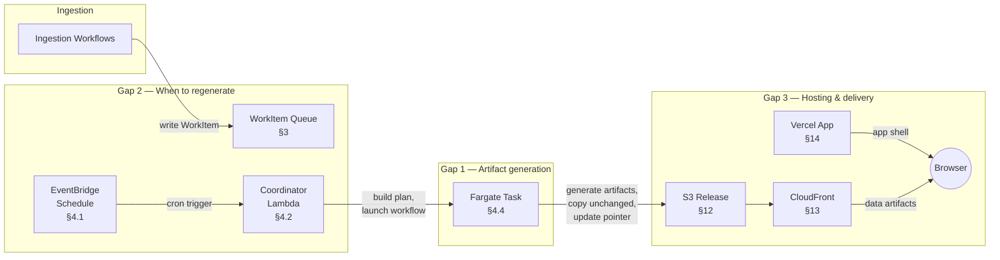
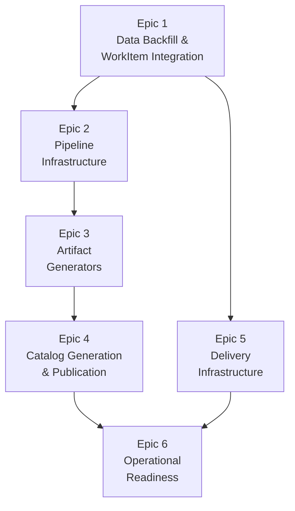

# DESIGN-003: Artifact Regeneration Pipeline

_Status: Drafting_
_Date: 2026-03-29_

---

## 1. Problem Statement

Nova Cat's backend and frontend are independently functional but disconnected. The
ingestion pipeline (spectra: operational; photometry: ticket-driven path partially
implemented) writes scientific data to DynamoDB and S3. The frontend (feature-complete
MVP) consumes pre-built static JSON artifacts conforming to the ADR-014 schemas. During
development, the frontend reads mock fixtures from `frontend/public/data/`. In
production, it expects to read from an S3 bucket via CloudFront.

Nothing exists between these two systems. Three gaps, identified in
`current-architecture.md` §8.7 and open since ADR-011, block the path from "data
ingested" to "data visible on the website":

**Gap 1 — Artifact generation pipeline.** No code exists to read internal DDB/S3 state
and produce the seven published artifacts defined in ADR-014: `catalog.json`,
`nova.json`, `references.json`, `spectra.json`, `photometry.json`, `sparkline.svg`, and
`bundle.zip`. Each artifact has distinct input sources, computation requirements (flux
normalization, subsampling, offset calculation, SVG rendering, ZIP assembly), and output
contracts. This is the largest gap by volume of work.

**Gap 2 — Publication gate.** No mechanism exists to determine *when* artifacts should be
regenerated or to trigger that regeneration. Ingestion workflows write data to DDB/S3 and
terminate — they have no awareness of downstream publication. The system needs a way to
flag stale artifacts and a trigger to initiate regeneration.

**Gap 3 — Hosting and delivery.** No infrastructure exists to serve published artifacts to
the production frontend. The Vercel-hosted Next.js application needs to resolve artifact
URLs against an S3-backed origin, with appropriate CORS headers, cache behavior, and a
path from "artifact written to S3" to "browser receives current data." This includes the
CloudFront distribution, origin access controls, and the Vercel environment configuration
that connects the app to the data layer.

This document designs the complete solution spanning all three gaps — the "middle end"
that connects the backend persistence layer to the frontend presentation layer. It is
scoped to MVP: single-operator, modest dataset (<1000 novae), no real-time freshness
requirements.

**Out of scope:** This document does not cover incremental or differential artifact
updates (full regeneration per nova on every sweep), multi-operator concurrency controls,
CDN-level A/B testing or blue/green artifact deployments, programmatic API access to
artifact data (deferred to post-MVP per ADR-011), or changes to the ADR-014 artifact
schemas themselves. The heuristic photometry ingestion path (Layers 0–4) is also out of
scope; the artifact generators are agnostic to which ingestion path produced the
underlying data.

---

## 2. Solution Overview

The regeneration pipeline connects NovaCat's backend (DynamoDB + S3) to its frontend
(Vercel + browser) through three mechanisms: a work queue that tracks what changed, a
sweep process that generates artifacts, and an immutable release model that delivers
them.



### How changes are detected (§3)

Ingestion workflows (`ingest_ticket`, `acquire_and_validate_spectra`,
`refresh_references`) write a **WorkItem** to a dedicated DynamoDB partition after
persisting scientific data. Each WorkItem names the nova and what changed (`spectra`,
`photometry`, or `references`). A dependency matrix (§3.4) maps dirty types to the
artifacts that need regeneration.

### How artifacts are generated (§4–§11)

An **EventBridge scheduled rule** invokes a **Coordinator Lambda** on a regular
cadence. The coordinator reads the work queue, groups WorkItems by nova, builds a
regeneration plan, and launches a **single Fargate task** (§4.4) wrapped in a Step
Functions workflow.

The Fargate task processes novae sequentially, generating up to seven artifacts per
nova in dependency order:

```
references.json → spectra.json → photometry.json → sparkline.svg → nova.json → bundle.zip
```

Each generator (§5–§10) reads from DynamoDB and S3, applies all computation
(normalization, subsampling, offset calculation, coordinate formatting), and produces
a frontend-ready artifact conforming to the ADR-014 schemas. After all per-nova
artifacts are complete, `catalog.json` (§11) is generated from a DDB Scan of all
ACTIVE novae merged with in-memory counts from the current sweep.

### How artifacts are published (§12)

The pipeline uses an **immutable release model**. Each sweep writes all artifacts —
freshly generated and unchanged — to a new S3 prefix
(`releases/<YYYYMMDD-HHMMSS>/`). Unchanged novae's artifacts are copied forward from
the previous release via `s3.copy_object()`. After all writes succeed, a pointer file
(`current.json`) at the bucket root is updated to reference the new release. This is
the atomic switchover — users see either the old complete release or the new complete
release, never a mix.

A 7-day S3 lifecycle rule cleans up old releases automatically. Rollback is a single
pointer update.

### How artifacts reach the browser (§13–§14)

A **CloudFront distribution** serves the S3 bucket via Origin Access Control. Two
cache behaviors handle the two content types: the pointer file (`current.json`, 60s
TTL) and release content (`releases/*`, 7-day TTL). Because each release produces new
URL paths, no cache invalidation is needed under normal operations.

The **Vercel-hosted Next.js app** fetches `current.json` on each page load to discover
the active release, then constructs artifact URLs relative to the release prefix. A
single environment variable (`NEXT_PUBLIC_DATA_URL`) connects the app to the
CloudFront domain. In development, the same data client falls back to local mock
fixtures.

### Cost profile

The entire pipeline — S3 storage, copy operations, CloudFront delivery, DynamoDB
reads, and Fargate compute — is estimated at under **$2/month** at MVP scale (~200
novae, ~100 daily users). Vercel hosting is free. See §12.12, §13.12, §14.11, and
§15.8 for detailed breakdowns.

### Operational model (§15)

The system is designed for a solo operator. Sweeps run automatically; failures are
self-healing (WorkItems are retained and retried on the next sweep). Two CloudWatch
alarms cover the failure modes that matter: "a sweep failed" and "no sweep has run."
Manual intervention recipes (§15.5) cover force-regeneration, full rebuilds, and
rollback.

---

## 3. Invalidation Model

### 3.1 Design Approach

The regeneration pipeline needs to answer two questions: *which novae have changed?* and
*what changed about them?* The answer to both determines which artifacts need to be
regenerated.

Nova Cat uses an **additive work item model** rather than boolean dirty flags on the Nova
entity. Each ingestion event writes a discrete `WorkItem` to the main DynamoDB table. The
coordinator (§4) consumes these items to build a per-nova regeneration manifest, then
deletes them on successful artifact generation.

This approach is consistent with Nova Cat's existing preference for explicit, item-per-
event operational records (JobRun, Attempt). It handles bulk ingestion sessions cleanly —
30 photometry tickets for one nova produce 30 WorkItems, the coordinator regenerates
once, and all 30 are consumed — without losing the audit trail of what changed and why.

### 3.2 WorkItem Entity

WorkItems are work orders for the regeneration pipeline, not nova domain state. They live
in a dedicated global partition, separate from per-nova partitions.

**Key structure:**

```
PK = "WORKQUEUE"
SK = "<nova_id>#<dirty_type>#<created_at>"
```

The sort key is ordered nova → dirty_type → timestamp. This means all items for a given
nova are contiguous, and within a nova, all items of the same dirty_type are contiguous.
The coordinator can derive the per-nova regeneration manifest directly from the sort key
structure without an additional grouping pass.

**Fields:**

| Field | Type | Description |
|---|---|---|
| `nova_id` | UUID string | Which nova needs regeneration |
| `dirty_type` | string | `spectra`, `photometry`, or `references` |
| `source_workflow` | string | Workflow that produced this item (e.g. `ingest_ticket`, `acquire_and_validate_spectra`, `refresh_references`) |
| `job_run_id` | UUID string | Audit trail back to the specific ingestion JobRun |
| `correlation_id` | string | Cross-workflow tracing identifier |
| `created_at` | string | ISO 8601 UTC timestamp |
| `ttl` | number | DynamoDB TTL attribute (Unix epoch seconds). Set to 30 days from `created_at`. |

`job_run_id` is the universal audit pointer. From any WorkItem, an operator can trace
back to the JobRun record to see exactly what was ingested, by which workflow, with full
operational context. This is consistent across all dirty types — unlike a
`data_product_id`, which only applies to spectra.

### 3.3 Who Writes WorkItems

Ingestion workflows write WorkItems as a final side effect before job finalization. The
write is best-effort — a failed WorkItem write should not fail the ingestion itself,
since the data is already persisted and a manual operator-triggered regeneration can
always recover.

| Workflow | Trigger | dirty_type |
|---|---|---|
| `ingest_ticket` (photometry branch) | Successful `IngestPhotometry` task | `photometry` |
| `ingest_ticket` (spectra branch) | Successful `IngestSpectra` task | `spectra` |
| `acquire_and_validate_spectra` | Successful validation (VALID outcome) | `spectra` |
| `refresh_references` | Successful reference upsert | `references` |
| `ingest_photometry` (heuristic path, future) | Successful photometry ingestion | `photometry` |

The write happens after the scientific data is persisted but before
`FinalizeJobRunSuccess`. This ensures a WorkItem is only created when actual data has
landed.

### 3.4 Dirty Type → Artifact Dependency Matrix

The coordinator uses the set of dirty types present for a given nova to determine which
artifacts to regenerate. The matrix:

| dirty_type | `spectra.json` | `photometry.json` | `sparkline.svg` | `references.json` | `nova.json` | `bundle.zip` | `catalog.json` |
|---|---|---|---|---|---|---|---|
| `spectra` | ✓ | | | | ✓ | ✓ | ✓ |
| `photometry` | | ✓ | ✓ | | ✓ | ✓ | ✓ |
| `references` | | | | ✓ | ✓ | ✓ | ✓ |

Three invariants govern the matrix:

- **`nova.json` regenerates on any change.** It carries metadata (spectra_count,
  photometry_count, references_count) that reflects the current state of all data
  products.
- **`bundle.zip` regenerates on any change.** The bundle is the complete research-grade
  data package for a nova — observational data files, photometry tables, and
  bibliographic references. Any change to the nova's data or metadata makes the bundle
  stale.
- **`catalog.json` regenerates on any change to any nova.** It is a global artifact that
  aggregates counts and metadata across all novae. It must run *after* all per-nova
  artifacts for the current sweep are complete.

### 3.5 WorkItem Lifecycle

1. **Created** by an ingestion workflow after data is persisted. A `ttl` attribute is set
   to 30 days from `created_at`.
2. **Read** by the coordinator during the cron sweep (§4). The coordinator queries
   `PK=WORKQUEUE` and derives the per-nova regeneration manifest from the sort keys.
3. **Deleted** after the corresponding nova's artifacts are successfully regenerated.
   Deletion is per-item — the coordinator deletes only the WorkItems that were present
   when it built the manifest, not any that arrived during execution.
4. **Retained on failure** — if artifact generation fails for a nova, its WorkItems
   remain in the queue and will be picked up by the next sweep. No signal is lost.
5. **TTL expiry** — if a WorkItem has not been consumed within 30 days, DynamoDB
   automatically deletes it. No data is lost (the underlying scientific data remains in
   DDB/S3), but the stale artifact will not be regenerated until the operator
   investigates and either resolves the underlying failure or triggers a manual rebuild.

### 3.6 Stuck WorkItem Mitigation

WorkItems that survive repeated sweep cycles indicate a persistent failure in artifact
generation for that nova — typically a generator bug or a corrupt data state rather than
a problem with the WorkItem itself.

The mitigation strategy has two layers:

**Early warning:** The coordinator logs a warning when it encounters any WorkItem older
than 7 days (configurable via Lambda environment variable
`WORKITEM_STALE_THRESHOLD_DAYS`). This gives the operator time to investigate while the
WorkItem is still active.

**Automatic cleanup:** The DynamoDB TTL attribute (set to 30 days at creation) provides a
hard ceiling. WorkItems that cannot be successfully consumed within the TTL window are
automatically removed. The underlying data is unaffected — the nova's DDB items and S3
files remain intact. The operator can create fresh WorkItems or trigger a full rebuild
once the root cause is resolved.

This approach avoids custom retry-counting logic in the coordinator, uses a DynamoDB
built-in for the cleanup mechanism, and degrades gracefully — the worst case is
"artifacts for one nova remain stale until the operator notices the warnings."

### 3.7 Future: Color Dirty Type

When color ingestion lands (ADR-022 / `ingest_color`), a `color` dirty type will be
added. Its artifact dependencies will be: `photometry.json` (colors are rendered in the
photometry panel), `nova.json`, `bundle.zip`, and `catalog.json`. The sparkline is not
affected — it renders magnitude vs. time only, not color indices. The WorkItem schema
requires no structural changes; `color` is simply a new `dirty_type` value.

---

## 4. Sweep Trigger and Coordinator

### 4.1 Trigger Mechanism

An **EventBridge scheduled rule** invokes the coordinator Lambda on a fixed cadence. The
default schedule is every 6 hours (configurable via CDK parameter). This cadence reflects
the operational reality that Nova Cat has no real-time freshness requirement — artifacts
that are a few hours stale are acceptable, and bulk ingestion sessions typically complete
well within one sweep interval.

The operator can also invoke the coordinator Lambda manually (via the AWS console, CLI, or
a future operator script) at any time. A manual invocation behaves identically to a
scheduled one — there is no distinction in the coordinator's logic.

### 4.2 Coordinator Lambda

The coordinator is a single Lambda function (`artifact_coordinator`) whose job is to read
the work queue, build a per-nova regeneration plan, and launch execution. It is a
planning and dispatch step, not an execution step — it does not generate artifacts itself.

**Input:** None (the EventBridge rule invokes with an empty or minimal event). The
coordinator reads all of its input from the `WORKQUEUE` partition.

**Execution steps:**

1. **Query the work queue.** Paginated Query against `PK=WORKQUEUE`. Returns all pending
   WorkItems across all novae.

2. **Check for stale plan.** If a `RegenBatchPlan` item exists in `PENDING` state from a
   previous sweep (§4.3), the coordinator abandons it — sets its status to `ABANDONED`
   and proceeds. The WorkItems backing that plan were never deleted (deletion happens
   only on success), so they are still in the queue and will be included in the new plan.
   This is the "abandon and rebuild" strategy: always create a fresh plan from current
   state.

3. **Build per-nova manifests.** Group WorkItems by `nova_id`. For each nova, derive the
   set of distinct `dirty_type` values present, then apply the dependency matrix (§3.4)
   to produce the list of artifacts that need regeneration. This is the **nova
   regeneration manifest** — a per-nova record of which artifacts to generate.

4. **Emit stale WorkItem warnings.** For any WorkItem older than
   `WORKITEM_STALE_THRESHOLD_DAYS` (default 7), log a structured warning with the
   `nova_id`, `dirty_type`, `created_at`, and `job_run_id`. This provides the operator
   early notice of stuck items before the TTL fires.

5. **Persist the batch plan.** Write a `RegenBatchPlan` item (§4.3) to DynamoDB with
   status `PENDING` and the full set of nova manifests. This makes the plan inspectable —
   the operator can query it to see exactly what the coordinator decided.

6. **Launch execution.** Start the `regenerate_artifacts` Step Functions workflow (§4.5),
   passing the batch plan ID. The coordinator's job is done — artifact generation is the
   workflow's responsibility.

If the work queue is empty (no WorkItems), the coordinator exits immediately with no
side effects. No batch plan is created, no workflow is launched.

### 4.3 RegenBatchPlan Item

The batch plan is a DynamoDB item that records the coordinator's decisions for
auditability and recovery.

**Key structure:**

```
PK = "REGEN_PLAN"
SK = "<created_at>#<plan_id>"
```

**Fields:**

| Field | Type | Description |
|---|---|---|
| `plan_id` | UUID string | Unique identifier for this batch plan |
| `status` | string | `PENDING`, `IN_PROGRESS`, `COMPLETED`, `FAILED`, `ABANDONED` |
| `nova_manifests` | map | Per-nova regeneration manifests: `{ nova_id: { dirty_types: [...], artifacts: [...] } }` |
| `nova_count` | number | Count of novae in this plan |
| `workitem_sks` | list of string | Sort keys of all WorkItems consumed by this plan (for deletion on success) |
| `created_at` | string | ISO 8601 UTC timestamp |
| `completed_at` | string or null | Set on terminal status |
| `execution_arn` | string or null | Step Functions execution ARN, set after launch |
| `ttl` | number | DynamoDB TTL, 7 days from creation |

The `workitem_sks` list is the coordinator's snapshot of which WorkItems existed at plan
creation time. This is critical for correct cleanup: only these items are deleted on
success, not any WorkItems that arrived while the workflow was executing.

The TTL on the plan itself is short (7 days) — plans are ephemeral operational records,
not long-term audit artifacts. The JobRun records from the regeneration workflow provide
the durable audit trail.

### 4.4 Execution Model: Single Fargate Task

Artifact generation is performed by a **single Fargate task** that processes the entire
batch plan sequentially. This is a deliberate architectural choice driven by three
concerns:

**Memory and runtime constraints.** Bundle generation (§10) requires reading potentially
gigabytes of FITS files and assembling large ZIP archives — a workload that exceeds
Lambda's 10 GB memory ceiling and 15-minute timeout for novae with extensive spectral
datasets.

**Cost efficiency.** One Fargate task cycling through 50 novae in sequence is dramatically
cheaper than 50 independent invocations. There is no cold-start overhead per nova, no
parallel billing, and the task can be right-sized to the actual workload (e.g., 2 vCPU /
8 GB for MVP).

**State continuity.** The Fargate task maintains execution state across novae — running
totals for `catalog.json` aggregation, a success/failure ledger for cleanup, and
in-memory data that can be reused across artifacts for the same nova (e.g., photometry
data loaded once, used for both `photometry.json` and the bundle).

The Fargate task receives the `plan_id`, loads the batch plan from DynamoDB, and
processes novae sequentially:

1. For each nova in the plan, generate all artifacts specified in its manifest, in
   dependency order: `references.json` → `spectra.json` → `photometry.json` →
   `sparkline.svg` → `nova.json` → `bundle.zip`. The bundle is generated last because
   it may include the freshly generated artifacts.
2. Write each artifact to S3 as it is produced (§12).
3. Track per-nova success/failure and accumulate catalog-level aggregates. For each
   successful nova, record the observation counts computed during artifact generation
   (`spectra_count`, `photometry_count`, `references_count`) in the per-nova result
   payload.
4. After all novae are processed, generate `catalog.json` from the accumulated
   aggregates.
5. Report results as task output: success count, failure count, and per-nova status
   including computed observation counts for successful novae.

A single nova's failure does not abort the batch. The task logs the failure, skips to the
next nova, and continues. This ensures that one corrupt nova doesn't block regeneration
for the entire catalog.

### 4.5 Workflow: regenerate_artifacts

A thin **Standard Step Functions workflow** wraps the Fargate task. It provides timeout
handling, failure capture, and execution history without adding orchestration complexity.

**States:**

1. **UpdatePlanInProgress** (Task → Lambda) — Sets the `RegenBatchPlan` status to
   `IN_PROGRESS` and records the `execution_arn`.
2. **RunArtifactGenerator** (Task → ECS RunTask `.sync`) — Launches the Fargate task and
   waits for completion. Standard Workflows can wait up to one year at zero cost (billed
   per state transition, not per wall-clock second). The `.sync` integration pattern
   means Step Functions polls ECS on your behalf until the task reaches a terminal state.
3. **Finalize** (Task → Lambda) — Performs the atomic commit sequence for each
   successfully regenerated nova. This is the point at which the system commits to the
   new artifacts — no state is mutated until artifacts have been successfully published
   to S3 by the Fargate task. The Finalize Lambda:
   - Reads the Fargate task's per-nova result payload (including computed observation
     counts).
   - For each nova that **succeeded**: deletes the consumed WorkItems (using the
     `workitem_sks` snapshot from the plan, filtered to the successful nova's items),
     and writes `spectra_count` and `photometry_count` to the Nova DDB item
     (`PK=<nova_id>`, `SK=NOVA`).
   - For each nova that **failed**: leaves its WorkItems in the queue for the next sweep.
     No counts are updated.
   - Updates the `RegenBatchPlan` status to `COMPLETED` (all novae succeeded) or
     `FAILED` (at least one nova failed).
4. **FailHandler** (Task → Lambda) — If the Fargate task itself fails (OOM, crash,
   timeout): updates the `RegenBatchPlan` status to `FAILED`. All WorkItems are
   retained — nothing is lost, and the next sweep will rebuild.

The observation counts written by Finalize serve a dual purpose: they are the
authoritative record on the Nova item and they are read during `catalog.json` generation
(§11), which runs at the end of the Fargate task before Finalize executes. Because
`catalog.json` is generated from the same in-memory counts that Finalize will
subsequently persist, the published catalog and the DDB state are consistent by
construction.

This gives the regeneration pipeline the same operational visibility as every other
workflow in the system — execution history in the SFn console, structured failure
capture, and a clear audit trail — while keeping the actual architecture minimal: four
state transitions per sweep.

### 4.6 Concurrency

Only one coordinator invocation should be active at a time. If the EventBridge rule fires
while a previous sweep's workflow is still executing, the coordinator will find a
`PENDING` or `IN_PROGRESS` batch plan. The handling:

- **`PENDING` plan** (coordinator crashed before launching workflow): abandon and rebuild,
  as described in §4.2.
- **`IN_PROGRESS` plan** (workflow still executing): the coordinator exits immediately
  with a log message. The in-flight workflow will complete and clean up its own
  WorkItems. Any new WorkItems that arrived since the plan was created will be picked up
  by the next sweep.

This avoids concurrent artifact generation for the same nova without requiring a
distributed lock — the batch plan status serves as the coordination mechanism.

---

## 5. Artifact Generation: nova.json

### 5.1 Purpose

`nova.json` is a per-nova metadata artifact powering the header region of the nova detail
page. It carries core object properties and observation counts. References are
intentionally excluded (delivered separately in `references.json` per ADR-014's minimal
redundancy principle) to allow independent generation and lazy loading.

### 5.2 Input Sources

The generator reads from a single DynamoDB table and requires no S3 access.

**Main table — Nova item:**

```
GetItem: PK = "<nova_id>", SK = "NOVA"
```

Fields consumed: `nova_id`, `primary_name`, `aliases`, `ra_deg`, `dec_deg`,
`discovery_date`, `status`.

The Nova item is the sole input. Observation counts (`spectra_count`,
`photometry_count`) are *not* read from DDB at generation time — they are computed as
byproducts of the `spectra.json` and `photometry.json` generators (§7, §8) during the
same Fargate run and passed to the `nova.json` generator in memory. See §5.4 for
details.

### 5.3 Computation

The `nova.json` generator performs three transformations. All other fields are direct
pass-throughs from the Nova item.

**Coordinate formatting.** `ra_deg` (float, ICRS decimal degrees) is converted to
sexagesimal `HH:MM:SS.ss` format. `dec_deg` (float, ICRS decimal degrees) is converted
to `±DD:MM:SS.s` format. The conversion uses `astropy.coordinates.SkyCoord` with
`to_string(style='hmsdms')` and appropriate precision parameters. RA/DEC are required
fields on ACTIVE Nova items (see §5.8, prerequisite P-1); the generator does not handle
a nullable coordinate case.

**Discovery date pass-through.** The `discovery_date` field on the Nova item is stored
as a string in `YYYY-MM-DD` format with the `00` convention for missing precision (per
ADR-005 Amendment), which is exactly the format ADR-014 specifies. This is a direct
pass-through. When `discovery_date` is `None` on the Nova item (no references resolved
yet), the artifact emits `null`.

**Nova type.** The Nova item does not currently carry a `nova_type` field. The
generator emits `null`. This is noted as a post-MVP enrichment task, likely paired with
discovery date refinement (see §16, Open Questions).

### 5.4 Observation Counts

`spectra_count` and `photometry_count` are not independently computed by the
`nova.json` generator. They are produced as side effects of the `spectra.json` generator
(§7) and the `photometry.json` generator (§8) respectively, during the same Fargate
execution.

The Fargate task processes per-nova artifacts in dependency order (§4.4):
`references.json` → `spectra.json` → `photometry.json` → `sparkline.svg` → `nova.json`
→ `bundle.zip`. By the time `nova.json` runs, both counts are available in the
in-process nova context.

These counts are the authoritative values for the published artifact. They reflect what
is actually packaged in the published data products — not a raw DDB query count. If a
FITS file is marked VALID in DDB but fails to process during generation, it is excluded
from the published artifact and the count reflects that exclusion. The three per-nova
data artifacts (`spectra.json`, `photometry.json`, `bundle.zip`) are consistent by
construction because they share a single Fargate execution context reading from the same
DDB state.

The counts are also written back to the Nova DDB item — but not by the Fargate task
itself. The Fargate task emits the counts in its per-nova result payload. The **Finalize
Lambda** (§4.5, state 3) writes them to the Nova item as part of the atomic commit
sequence: delete consumed WorkItems, update observation counts, mark the
`RegenBatchPlan` as completed. This ensures counts are only persisted after artifacts
have been successfully published to S3.

The counts written to the Nova item serve a second purpose: they are read during
`catalog.json` generation (§11). Because `catalog.json` is generated after all per-nova
artifacts in the sweep, the in-memory counts from the current run are used directly. The
Nova item writes by Finalize ensure the DDB state is consistent for subsequent sweeps
that may only regenerate a subset of novae.

**Spectra count definition:** The number of spectra successfully included in the
published `spectra.json` artifact for this nova. This is determined by the `spectra.json`
generator (§7), which reads `PRODUCT#SPECTRA#*` items with `validation_status == "VALID"`
and includes only those it can successfully process. The count reflects what is published,
not what exists in DDB.

**Photometry count definition:** The number of photometric observations successfully
included in the published `photometry.json` artifact for this nova. This is determined by
the `photometry.json` generator (§8), which reads `PHOT#*` items from the dedicated
photometry table and includes only those it can successfully process.

### 5.5 Output Mapping

| ADR-014 field | Source | Transformation |
|---|---|---|
| `schema_version` | Constant | `"1.1"` |
| `generated_at` | Runtime | ISO 8601 UTC timestamp at generation time (shared utility) |
| `nova_id` | Nova item `.nova_id` | Direct |
| `primary_name` | Nova item `.primary_name` | Direct |
| `aliases` | Nova item `.aliases` | Direct (list of strings) |
| `ra` | Nova item `.ra_deg` | Decimal degrees → `HH:MM:SS.ss` (shared utility) |
| `dec` | Nova item `.dec_deg` | Decimal degrees → `±DD:MM:SS.s` (shared utility) |
| `discovery_date` | Nova item `.discovery_date` | Direct pass-through; `None` → `null` |
| `nova_type` | Not persisted | `null` (post-MVP enrichment) |
| `spectra_count` | In-process context | Computed by `spectra.json` generator |
| `photometry_count` | In-process context | Computed by `photometry.json` generator |

### 5.6 Edge Cases and Error Handling

**Missing coordinates.** RA/DEC are required for all ACTIVE Nova items. A Nova item
lacking `ra_deg` or `dec_deg` indicates a data integrity issue upstream. The generator
logs an error, skips the nova, and records it as a failure in the Fargate task's
per-nova result ledger. The nova's WorkItems are retained for the next sweep.

**Missing discovery date.** `discovery_date` may legitimately be `None` — the
`refresh_references` workflow may not have run, or ADS may have returned no results.
The generator emits `null`. This is not an error condition.

**Nova status filter.** The generator only processes novae with `status == "ACTIVE"`.
Novae in QUARANTINED, MERGED, or DEPRECATED states are skipped. If a WorkItem exists
for a non-ACTIVE nova, the generator logs a warning and skips it; the WorkItem will
expire via TTL (§3.6).

**Empty aliases.** If `aliases` is an empty list or not present on the Nova item, the
generator emits an empty array `[]`.

### 5.7 ADR-014 Amendment Note

Two minor amendments to ADR-014 are required based on design decisions made in this
document:

1. **`discovery_date`** — change type from `string` to `string | null`. The `null`
   value indicates the discovery date has not been resolved.
2. **`nova_type`** — change type from `string` to `string | null`. The `null` value
   indicates nova classification has not been determined.

### 5.8 Prerequisites

**P-1: RA/DEC required on ACTIVE Nova items.** Verify that `initialize_nova` always
writes `ra_deg` and `dec_deg` before a Nova item reaches ACTIVE status. Update
`dynamodb-item-model.md` to document these fields as required (not optional) on ACTIVE
items. Update the Nova entity section in `current-architecture.md` accordingly.

---

## 6. Artifact Generation: references.json

### 6.1 Purpose

`references.json` is a per-nova file powering the references table on the nova detail
page. It is fetched independently of `nova.json` to allow the metadata region to render
before the references table is populated. This separation also allows the references
pipeline (`refresh_references`) to trigger regeneration of `references.json` without
touching `nova.json`.

### 6.2 Input Sources

The generator reads from the main DynamoDB table only. No S3 access is required.

**Main table — NovaReference link items:**

```
Query: PK = "<nova_id>", SK begins_with "NOVAREF#"
```

Returns all NovaReference items for the nova. Each item carries a `bibcode` field that
serves as the foreign key to the global Reference entity. No filtering by `role` is
applied — all linked references are included regardless of role (DISCOVERY,
SPECTRA_SOURCE, PHOTOMETRY_SOURCE, OTHER). At MVP scale, per-nova reference lists are
modest (tens of items) and a researcher visiting the nova page benefits from the
complete bibliographic picture.

**Main table — Reference global items (batch fetch):**

```
BatchGetItem: PK = "REFERENCE#<bibcode>", SK = "METADATA"
    (for each bibcode returned by the NovaReference query)
```

Fields consumed from each Reference item: `bibcode`, `title`, `authors`, `year`,
`doi`, `arxiv_id`.

`BatchGetItem` is used rather than individual `GetItem` calls because the bibcode list
is known upfront from the NovaReference query. DynamoDB's `BatchGetItem` accepts up to
100 keys per call; for novae with more than 100 references (unlikely at MVP scale), the
generator pages through multiple batch requests.

### 6.3 Computation

The generator performs two transformations. All other fields are direct pass-throughs
from the Reference items.

**ADS URL derivation.** The `ads_url` field is not stored on the Reference DDB item —
it is always derivable as `https://ui.adsabs.harvard.edu/abs/<bibcode>`. The generator
constructs this URL from the bibcode. This is consistent with the design decision in
`dynamodb-item-model.md` §6 to avoid storing derivable URLs.

**Sort order.** The output `references` array is sorted chronologically: ascending by
`year`, with lexicographically smallest `bibcode` as tiebreaker for references
published in the same year. This gives a natural reading order for a scientific
audience — earliest publications first, matching the convention in most astronomical
review papers.

### 6.4 Output Mapping

| ADR-014 field | Source | Transformation |
|---|---|---|
| `schema_version` | Constant | `"1.0"` |
| `generated_at` | Runtime | ISO 8601 UTC timestamp at generation time (shared utility) |
| `nova_id` | Nova context | Direct (passed from the Fargate per-nova loop) |
| `references[].bibcode` | Reference item `.bibcode` | Direct |
| `references[].title` | Reference item `.title` | Direct |
| `references[].authors` | Reference item `.authors` | Direct (list of strings) |
| `references[].year` | Reference item `.year` | Direct |
| `references[].doi` | Reference item `.doi` | Direct; `null` if absent |
| `references[].arxiv_id` | Reference item `.arxiv_id` | Direct; `null` if absent |
| `references[].ads_url` | Reference item `.bibcode` | Derived: `https://ui.adsabs.harvard.edu/abs/<bibcode>` |

### 6.5 Edge Cases and Error Handling

**No references.** If the NovaReference query returns zero items, the generator emits a
valid `references.json` with an empty `references` array `[]`. This is not an error —
a nova may be ingested before `refresh_references` has run. The nova page renders a
graceful empty state for the references table.

**Orphaned NovaReference.** If a NovaReference item references a bibcode for which no
`REFERENCE#<bibcode>` global item exists (a `BatchGetItem` miss), this indicates a data
integrity issue — the link was created but the reference entity was not. The generator
logs a warning with the `nova_id` and orphaned `bibcode`, and omits that reference from
the output array. It does not fail the nova.

**Missing optional fields on Reference items.** The `title`, `authors`, `doi`, and
`arxiv_id` fields on Reference items may be absent or null (e.g., an ADS entry with
incomplete metadata). The generator passes these through as-is: `null` for missing
string fields, `[]` for missing author lists. The `year` field is expected to always be
present on a well-formed Reference item; if it is missing, the generator logs a warning
and sorts the reference to the end of the array (treated as year `9999` for sort
purposes).

**References count for catalog.json.** The count of references for this nova
(`references_count` in `catalog.json`) is the length of the output `references` array
— i.e., the number of references that were successfully included in the published
artifact, excluding orphaned entries. This count is passed forward in the per-nova
context for use by `catalog.json` generation (§11), following the same "count what we
publish" principle established for spectra and photometry counts in §5.4.

---

## 7. Artifact Generation: spectra.json

### 7.1 Purpose

`spectra.json` is a per-nova file consumed exclusively by the spectra viewer component.
It carries all data required to render the waterfall plot as defined in ADR-013, with no
computation deferred to the frontend. This is the most data-intensive per-nova JSON
artifact — each spectrum record carries parallel wavelength and normalized flux arrays.

### 7.2 Input Sources

The generator reads from two sources: DynamoDB for metadata and S3 for spectral data.

**Main table — Spectra DataProduct items:**
```
Query: PK = "<nova_id>", SK begins_with "PRODUCT#SPECTRA#"
    FilterExpression: validation_status = "VALID"
```

Returns all validated spectra DataProduct items for the nova. Each item provides:
`data_product_id`, `provider`, `instrument`, `telescope`, `observation_date_mjd`.

The `instrument` and `telescope` fields are prerequisites added by the DataProduct field
enrichment (see §7.9, prerequisite P-2). `observation_date_mjd` is likewise a
prerequisite (P-3). These fields must be present on the DataProduct item; the generator
does not fall back to reading FITS headers.

**S3 — Web-ready CSV files (private bucket):**
```
derived/spectra/<nova_id>/<data_product_id>/web_ready.csv
```

One file per validated spectrum. Each CSV contains two columns: `wavelength_nm` and
`flux`. Wavelengths are pre-converted to nanometres and the array is pre-downsampled
to ≤2,000 data points. These files are written by the ingestion pipeline at validation
time (see §7.9, prerequisite P-4) and are not modified by the artifact generator.

**Per-nova context — Outburst MJD:**

The `outburst_mjd` value and `outburst_mjd_is_estimated` flag are computed by the
Fargate per-nova loop (shared utility, §7.6) and passed to the generator. The
generator does not compute these values itself.

### 7.3 Computation

The generator performs four operations per spectrum and one top-level computation.

**Flux normalization.** Each spectrum's flux array is divided by its peak flux value.
The peak is the maximum absolute value in the flux array. The result is a normalized
array where the tallest feature reaches 1.0 (or -1.0 for absorption-dominated
spectra, though this is rare for novae). The peak value is recorded as
`normalization_scale` in the output, enabling the frontend to reconstruct original
flux values for tooltip display.

Both peak and median normalization implementations are maintained in the generator
codebase, selectable via a configuration constant. Peak is the default for MVP, chosen
because it guarantees no spectrum feature exceeds the waterfall lane boundary. See
ADR-013 (Flux Normalization) for rationale. This is noted as an ADR-014 amendment:
`normalization_scale` is the peak flux value, correcting ADR-014's original
description of "median."

**Wavelength range extraction.** `wavelength_min` and `wavelength_max` are read
directly from the first and last elements of the wavelength array in the web-ready CSV
(which is monotonically ordered by wavelength).

**Days since outburst.** For each spectrum: `days_since_outburst = observation_date_mjd
- outburst_mjd`. When `outburst_mjd` is `null` (no discovery date and no observations
— should not occur for a nova with spectra, but handled defensively),
`days_since_outburst` is `null`.

**Flux unit extraction.** The original flux unit (prior to normalization) is needed for
tooltip display. This value is not currently stored on the DataProduct item or in the
web-ready CSV. Two options: (a) add `flux_unit` to the DataProduct item as part of the
field enrichment prerequisite, or (b) read it from the raw FITS header. Option (a) is
preferred for consistency with the other metadata fields. Added to the prerequisite
list as P-5.

### 7.4 Output Mapping

**Top-level fields:**

| ADR-014 field | Source | Transformation |
|---|---|---|
| `schema_version` | Constant | `"1.1"` (reflects `outburst_mjd_is_estimated` addition) |
| `generated_at` | Runtime | ISO 8601 UTC timestamp (shared utility) |
| `nova_id` | Nova context | Direct |
| `outburst_mjd` | Per-nova context | Shared utility output; `null` if unresolved |
| `outburst_mjd_is_estimated` | Per-nova context | Shared utility output; `true` when derived from earliest observation |
| `wavelength_unit` | Constant | `"nm"` (per ADR-013) |
| `spectra` | Generated | Array of spectrum records, ordered by `epoch_mjd` ascending |

**Per-spectrum fields:**

| ADR-014 field | Source | Transformation |
|---|---|---|
| `spectrum_id` | DataProduct `.data_product_id` | Direct (ADR-014 amendment: `spectrum_id` is `data_product_id`) |
| `epoch_mjd` | DataProduct `.observation_date_mjd` | Direct |
| `days_since_outburst` | Computed | `observation_date_mjd - outburst_mjd`; `null` if `outburst_mjd` is `null` |
| `instrument` | DataProduct `.instrument` | Direct; `"unknown"` if absent |
| `telescope` | DataProduct `.telescope` | Direct; `"unknown"` if absent |
| `provider` | DataProduct `.provider` | Direct |
| `wavelength_min` | Web-ready CSV | First element of wavelength array |
| `wavelength_max` | Web-ready CSV | Last element of wavelength array |
| `flux_unit` | DataProduct `.flux_unit` | Direct (prerequisite P-5) |
| `normalization_scale` | Computed | Peak flux value from the raw (pre-normalized) flux array |
| `wavelengths` | Web-ready CSV | Wavelength array in nm; passed through directly |
| `flux_normalized` | Computed | Flux array divided by peak flux value |

The `spectra` array is sorted by `epoch_mjd` ascending (oldest first), matching the
waterfall plot convention where the oldest spectrum appears at the bottom.

### 7.5 Spectra Count

The spectra count for this nova is the number of spectrum records in the output
`spectra` array — i.e., the number of validated DataProduct items for which a web-ready
CSV was successfully read and processed. If a DataProduct item is VALID in DDB but its
web-ready CSV is missing or unreadable, that spectrum is excluded from the artifact and
the count reflects the exclusion.

This count is passed forward in the per-nova context for use by `nova.json` (§5.4) and
`catalog.json` (§11).

### 7.6 Shared Utility: Outburst MJD Resolution

This computation is performed once per nova in the Fargate per-nova loop, before any
generator runs. The result is passed to `spectra.json`, `photometry.json`, and
`sparkline.svg` generators.

**Primary source — discovery date:**

1. Read `discovery_date` from the Nova DDB item.
2. If non-null, parse the `YYYY-MM-DD` string. Handle imprecise dates:
   - Day component is `00` → default to the 1st of the month.
   - Month and day components are both `00` → default to January 1st.
3. Convert the resolved date to MJD using `astropy.time.Time`.
4. Set `outburst_mjd_is_estimated = false`.

**Fallback — earliest observation:**

1. If `discovery_date` is `null`, query all SPECTRA DataProduct items
   (`validation_status = "VALID"`) and all PhotometryRow items (`PHOT#*` in the
   dedicated photometry table) for the nova.
2. Take `min(observation_date_mjd)` across both sets.
3. Subtract 1 day: `outburst_mjd = min_epoch - 1.0`. This places the estimated
   outburst one day before the earliest observation, so the earliest observation
   becomes approximately Day 1 on DPO axes. This avoids Day 0 (which breaks log
   scales) while keeping the estimate conservative.
4. Set `outburst_mjd_is_estimated = true`.

**Edge case — recurrent nova.** If `nova_type == "recurrent"` on the Nova item, the
generator always uses the earliest-observation fallback regardless of whether
`discovery_date` is present, and always sets `outburst_mjd_is_estimated = true`.
The `discovery_date` for a recurrent nova typically refers to the earliest known
outburst (potentially centuries ago), which is not a meaningful reference for DPO
computation. Full outburst segmentation for recurrent novae is deferred to a
dedicated post-MVP ADR (see §16, Open Questions).

**Edge case — no observations at all.** If both `discovery_date` is `null` and no
observations exist (no spectra, no photometry), `outburst_mjd` is `null` and
`outburst_mjd_is_estimated` is `false`. This should not occur in practice for a nova
with a WorkItem in the queue — the WorkItem implies data was ingested — but is handled
defensively.

### 7.7 Edge Cases and Error Handling

**Missing web-ready CSV.** If a DataProduct item is VALID but no web-ready CSV exists
at the expected S3 key, this indicates either a gap in the ingestion pipeline (the
prerequisite P-4 web-ready CSV step was not implemented when this spectrum was ingested)
or an S3 deletion. The generator logs a warning with the `nova_id` and
`data_product_id`, excludes the spectrum from the artifact, and continues. The spectrum
does not count toward `spectra_count`. For pre-existing spectra ingested before the
web-ready CSV step is implemented, a backfill script will be needed.

**Empty flux array.** If the web-ready CSV contains zero data rows, the generator logs
a warning and excludes the spectrum. This should not occur — the ingestion pipeline
validates that spectra contain data before marking them VALID — but is handled
defensively.

**Zero or negative peak flux.** If the peak flux value is zero or negative (indicating
a corrupt or physically nonsensical spectrum), normalization cannot be performed. The
generator logs a warning, excludes the spectrum, and continues.

**No valid spectra.** If all spectra for a nova fail processing (missing CSVs, corrupt
data), the generator emits a valid `spectra.json` with an empty `spectra` array `[]`
and a `spectra_count` of 0. This is not a nova-level failure — the nova may still have
photometry and references.

**Artifact size.** At ≤2,000 data points per spectrum and ~20 spectra per typical nova,
the expected artifact size is approximately 640 KB — within comfortable bounds for
CloudFront delivery and browser parsing. Novae with unusually large spectral collections
(>50 spectra) may produce artifacts exceeding 1 MB but remain within acceptable limits
for a lazy-loaded per-nova file.

### 7.8 ADR-014 Amendment Notes

1. **`spectrum_id`** — Clarification: `spectrum_id` is the `data_product_id` from the
   spectra DataProduct item. No separate ID is minted.
2. **`normalization_scale`** — Correction: the value is the peak flux (not median) used
   for normalization. ADR-013's original "peak" language is authoritative; ADR-014's
   "median" description was an error.
3. **`outburst_mjd_is_estimated`** — New boolean field at the top level. `true` when
   `outburst_mjd` was derived from the earliest observation rather than from a
   literature discovery date. Schema version incremented from `"1.0"` to `"1.1"`.

4. **ADR-014 OQ-5 resolution.** ADR-014 Open Question 5 ("Recurrent nova outburst
   selection") is resolved by §7.6: recurrent novae always use the earliest-observation
   fallback regardless of `discovery_date`, and always set `outburst_mjd_is_estimated =
   true`. Full outburst segmentation for recurrent novae is deferred to a dedicated
   post-MVP ADR (§16, OQ-1).

### 7.9 Prerequisites

**P-2: `instrument` and `telescope` on SPECTRA DataProduct items.** Add as first-class
fields, populated at validation/write time by both ingestion paths. Backfill existing
items from FITS headers.

**P-3: `observation_date_mjd` on SPECTRA DataProduct items.** Add as a first-class
field, populated at validation/write time. Backfill existing items from FITS headers.

**P-4: Web-ready CSV generation during ingestion.** After a spectrum is validated, the
ingestion pipeline writes a downsampled (≤2,000 points), unit-converted (wavelengths in
nm) CSV to `derived/spectra/<nova_id>/<data_product_id>/web_ready.csv` in the private
S3 bucket. Backfill existing validated spectra from raw FITS files.

**P-5: `flux_unit` on SPECTRA DataProduct items.** Add as a field carrying the original
flux unit string (e.g., `"erg/cm2/s/A"`). Populated at validation/write time from the
FITS header `BUNIT` keyword. Backfill existing items.

---

## 8. Artifact Generation: photometry.json

### 8.1 Purpose

`photometry.json` is a per-nova file consumed exclusively by the light curve panel
component. It carries all data required to render the multi-regime, multi-band light
curve as defined in ADR-013, with all backend computations — upper limit suppression,
density-preserving subsampling, per-band vertical offsets, and days-since-outburst
derivation — pre-applied. No heavy computation is deferred to the frontend.

This is the most computationally intensive per-nova artifact generator. The spectra
generator (§7) reads pre-processed CSVs and performs only normalization; the photometry
generator reads raw observation items from DynamoDB and applies a multi-step
transformation pipeline before output.

### 8.2 Input Sources

The generator reads from DynamoDB and the band registry. Unlike the spectra generator,
it does not read from S3 — all photometric data is stored as individual DDB items.

**Dedicated photometry table — PhotometryRow items:**
```
Query: PK = "<nova_id>", SK begins_with "PHOT#"
```

Returns all photometric observations for the nova. Each item provides: `row_id`,
`time_mjd`, `band_id`, `regime`, `magnitude`, `mag_err`, `flux_density`,
`flux_density_err`, `flux_density_unit`, `is_upper_limit`, `telescope`, `instrument`,
`observer`, `orig_catalog`, `bibcode`.

The query returns items across all regimes. The generator groups them by `regime` for
per-regime processing.

**Band registry:**

Loaded once per Fargate execution (not per nova). Used to look up display metadata for
each `band_id` encountered in the observation data: `band_name` (short display label),
`lambda_eff` (effective wavelength in Ångströms, for band ordering), and `regime`
(cross-checked against the row's `regime` field).

**Per-nova context — Outburst MJD:**

The `outburst_mjd` value and `outburst_mjd_is_estimated` flag are computed by the
Fargate per-nova loop (shared utility, §7.6) and passed to the generator. The generator
does not compute these values itself.

**Offset cache — main NovaCat table (optional read):**

The generator reads cached band offset data from the main NovaCat table (§8.6) to
avoid recomputing offsets when the underlying data has not materially changed.

### 8.3 Processing Pipeline

The generator processes observations in a defined sequence. Each step consumes the
output of the previous step.

1. **Load and group.** Query all `PHOT#*` items for the nova. Group by `regime`.
   Discard any items whose `regime` is not in the set of recognized regimes
   (`optical`, `xray`, `gamma`, `radio`). Log a warning for unrecognized regimes.

2. **Resolve band display labels.** For each distinct `band_id` in the data, look up
   the band registry entry and extract the short display label (`band_name`). If a
   `band_id` is not found in the registry, use the `band_id` string itself as the
   display label and log a warning. See §8.4 for collision handling.

3. **Upper limit suppression** (per band within each regime). Remove non-constraining
   upper limits per the rule defined in §8.5.

4. **Density-preserving log subsampling** (per regime). Reduce each regime's
   observation set to the configured point cap. See §8.6.

5. **Band offset computation** (per regime, after subsampling). Compute or retrieve
   cached per-band vertical offsets. See §8.7.

6. **Days since outburst.** For each surviving observation:
   `days_since_outburst = time_mjd - outburst_mjd`. When `outburst_mjd` is `null`,
   `days_since_outburst` is `null`.

7. **Assemble output.** Build the three output arrays (`regimes`, `bands`,
   `observations`) and top-level metadata per §8.8.

### 8.4 Band Display Label Resolution

The artifact's `band` field on both band metadata records and observation records
carries a short display label (e.g., `"V"`, `"B"`, `"UVW1"`) rather than the full
two-track `band_id` (e.g., `HCT_HFOSC_Bessell_V`). The display label is the
`band_name` field from the band registry entry.

**Collision handling.** At MVP scale, the ticket-driven ingestion path uses
unambiguous filter strings that resolve to distinct registry entries. However, it is
architecturally possible for two distinct `band_id` values to share the same
`band_name` (e.g., `HCT_HFOSC_Bessell_V` and `CTIO_09m_Bessell_V` could both have
`band_name = "V"`). For MVP, such collisions are accepted: observations from both
`band_id` values would be grouped under the same display label `"V"` in the artifact.
This means they share a single band metadata record (including a single vertical
offset) and render as a single trace in the plot.

> **Post-MVP resolution:** When the heuristic ingestion path is operational and the
> catalog includes data from multiple telescope systems with the same filter names,
> this collision must be revisited. Options include qualifying the display label with
> an instrument prefix (e.g., `"V (HFOSC)"` vs `"V (CTIO)"`), or assigning distinct
> color tokens to differentiate same-name bands from different instruments. This is
> noted as a future generalization candidate.

### 8.5 Non-Constraining Upper Limit Suppression

Upper limits that provide no observational constraint given the existing detections are
removed from the artifact before subsampling. This prevents non-informative limits from
consuming subsampling budget and compressing the plot's dynamic range.

**Rule (uniform across all regimes):** An upper limit is suppressed if it is
*brighter* than the brightest detection in the same band.

The definition of "brighter" varies by the physical quantity used in each regime:

| Regime | Quantity | "Brighter" means | Suppress if |
|---|---|---|---|
| `optical`, `uv`, `nir`, `mir` | magnitude | Smaller number | `ul_mag < min(detection_magnitudes)` |
| `radio` | flux density (mJy) | Larger number | `ul_flux > max(detection_fluxes)` |
| `xray` | count rate (cts/s) | Larger number | `ul_rate > max(detection_rates)` |
| `gamma` | photon flux (ph/cm²/s) | Larger number | `ul_flux > max(detection_fluxes)` |

The comparison is strictly per-band: an upper limit in V-band is compared only against
V-band detections, not against detections in B or R. A band with zero detections (only
upper limits) retains all its upper limits — there is no brightness reference to
suppress against.

Suppression is applied before subsampling so that non-constraining limits do not
compete for the regime's point budget.

### 8.6 Density-Preserving Log Subsampling

When a regime's total observation count (detections + surviving upper limits across all
bands) exceeds `MAX_POINTS_PER_REGIME`, the dataset is subsampled to the cap.

`MAX_POINTS_PER_REGIME` is a configurable constant, set to **500** per ADR-013. This
value should be validated empirically with real data once the artifact generation
pipeline is operational. If the frontend adopts `scattergl` (WebGL-accelerated scatter
in Plotly.js), the comfortable ceiling is significantly higher (2,000–3,000 points).
The constant is parameterized to support adjustment without a code change.

> **ADR-013 amendment candidate:** The 500-point cap was established before the full
> scope of multi-band optical datasets was understood. A well-observed nova with 5
> optical bands at 500 points total yields ~100 points per band — potentially
> insufficient to capture the light curve morphology. This value should be revisited
> in an ADR-013 amendment informed by empirical rendering performance data.

**Budget allocation.** The per-regime budget is allocated proportionally across bands
by observation count. Each band receives a share of the budget equal to its fraction of
the regime's total observation count, with a minimum allocation of 1 point per band
(ensuring no band is dropped entirely). Detections and surviving upper limits within a
band share that band's allocation.

**Per-band subsampling algorithm.** Within each band's allocation, the
density-preserving log sampler operates as follows:

1. Compute the time span: `t_min = min(time_mjd)`, `t_max = max(time_mjd)` across
   the band's observations.
2. Divide the time span into `N` log-spaced intervals, where `N` equals the band's
   allocation. Intervals are defined in `log(t - t_min + 1)` space (the `+1` avoids
   `log(0)` for the earliest observation).
3. **Dynamic boundary stretching.** If any interval is empty (no observations fall
   within it), merge it with its nearest non-empty neighbor. This ensures every
   interval contributes at least one point to the output and prevents sparse late-epoch
   observations from being lost.
4. From each non-empty interval, select one representative observation. Selection
   priority: (a) the detection closest to the interval midpoint; (b) if no detections
   exist in the interval, the upper limit closest to the midpoint.
5. The result is a subsampled set that preserves the temporal coverage and density
   profile of the original data, with sparse late-epoch observations guaranteed
   representation.

**Single-band regime optimization.** When a regime contains only one band (common for
X-ray and gamma-ray), the proportional allocation step is skipped and the full budget
is assigned to that band.

### 8.7 Band Offset Computation and Caching

Per-band vertical offsets separate overlapping traces so that the light curve is
legible when multiple bands occupy similar value ranges. Offsets are computed *after*
subsampling, on the data as it will be displayed. This is a deliberate sequencing
choice: offsets should reflect the rendered dataset, and computing on the full
pre-subsampled dataset would be both wasteful and potentially misleading (the offset
might not match what the user sees).

**Algorithm specification.** The exact offset algorithm — overlap detection, density
metric, kd-tree configuration, and offset assignment — is specified in a dedicated ADR
(ADR-0XX, Band Offset Algorithm). This section defines the interface contract and
caching mechanism only.

**Interface contract.** The offset computation accepts the subsampled observation set
for a single regime and returns a map of `band_display_label → vertical_offset`:

- Input: list of `(time_mjd, value, band_display_label)` tuples for all observations
  in the regime, where `value` is the regime-appropriate quantity (magnitude, flux
  density, count rate, or photon flux).
- Output: `dict[str, float]` mapping each band display label to its vertical offset.

Constraints on the output:
- The reference band (the band with the most observations, or the most scientifically
  significant band by convention — V for optical) receives offset `0.0`.
- Non-zero offsets are rounded to the nearest half-integer increment (e.g., `+0.5`,
  `+1.0`, `+1.5`, `-0.5`).
- If natural separation between bands is sufficient (no significant overlap), all
  offsets are `0.0`.

**Regime applicability.** Offsets are computed for all regimes, but in practice they
are primarily relevant for the optical regime where multiple bands routinely overlap.
X-ray, gamma, and radio regimes rarely have enough multi-band data at MVP scale to
require offsets. The generator applies the offset algorithm uniformly; if a regime
has only one band, the offset is trivially `0.0`.

**Caching mechanism.** Offset computation is potentially expensive for dense optical
datasets. Because the photometry artifact is regenerated whenever *any* photometry
changes for a nova (even a single new observation in one band), a caching mechanism
avoids unnecessary recomputation when the change does not materially affect the offset
geometry.

The cache is stored as a DynamoDB item in the **main NovaCat table**:

```
PK = "<nova_id>"
SK = "OFFSET_CACHE#<regime>"
```

**Cached fields:**

| Field | Type | Description |
|---|---|---|
| `band_offsets` | map | `{ band_display_label: offset_value }` — the computed offsets |
| `band_observation_counts` | map | `{ band_display_label: count }` — per-band observation counts in the subsampled dataset used to compute these offsets |
| `band_set_hash` | string | SHA-256 hash of the sorted band display label list — enables fast detection of band set changes |
| `computed_at` | string | ISO 8601 UTC timestamp |

**Cache invalidation heuristic.** On regeneration, after subsampling completes, the
generator evaluates whether the cached offsets are still valid:

1. **Band set check.** Compute the hash of the current sorted band display label list
   and compare to `band_set_hash`. If different (a band was added or removed), the
   cache is invalidated — recompute offsets.

2. **Density stability check.** If the band set is unchanged, compare the current
   per-band observation counts against `band_observation_counts`. If *any* band's
   count has changed by more than `OFFSET_CACHE_DENSITY_THRESHOLD` (default: 20%
   relative change, minimum absolute change of 5 points), the cache is invalidated.
   Otherwise, the cached offsets are reused.

The threshold parameters are configurable via Fargate environment variables. The 20%
/ 5-point defaults reflect the expectation that small data additions (a few new
observations in an already-dense band) do not materially change the overlap geometry,
while a significant density shift (doubling a band's coverage) likely does.

**Cache miss behavior.** If no cache item exists (first generation for this nova, or
cache was manually deleted), the generator computes offsets from scratch and writes
the cache item. This is the expected path for newly ingested novae.

**Cache write.** After computing new offsets (whether due to invalidation or cache
miss), the generator writes the cache item with `PutItem` (unconditional overwrite).
The cache item has no TTL — it persists until overwritten or manually deleted.

### 8.8 Regime-Specific Value Routing

Each PhotometryRow in DDB carries multiple nullable measurement fields. The generator
maps these to ADR-014's per-observation nullable fields based on the row's `regime`:

| DDB `regime` | DDB source field | DDB error field | ADR-014 target field | ADR-014 error field |
|---|---|---|---|---|
| `optical`, `uv`, `nir`, `mir` | `magnitude` | `mag_err` | `magnitude` | `magnitude_error` |
| `radio` | `flux_density` | `flux_density_err` | `flux_density` | `flux_density_error` |
| `xray` | `flux_density` or `count_rate` | corresponding `_err` | `count_rate` | `count_rate_error` |
| `gamma` | `flux_density` | `flux_density_err` | `photon_flux` | `photon_flux_error` |

**X-ray routing.** X-ray observations may be stored with either `count_rate` or
`flux_density` populated, depending on the source. The generator checks `count_rate`
first; if non-null, it maps to the artifact's `count_rate` field. If `count_rate` is
null but `flux_density` is non-null (indicating an energy flux measurement), the value
is mapped to the artifact's `count_rate` field with a log warning noting the unit
mismatch. This is a pragmatic MVP compromise — X-ray flux density and count rate are
physically distinct quantities, but displaying them on a shared axis is preferable to
dropping data. Post-MVP, the X-ray regime may need to split into sub-regimes or carry
a per-observation unit indicator.

> **Model-dependence concern.** X-ray energy flux (erg/cm²/s) is derived from count
> rates via an energy conversion factor (ECF) that depends on an assumed spectral
> model. Different spectral assumptions produce different flux values from the same
> count rate data. Count rates are the directly observed quantity; flux is a derived
> quantity with embedded modeling assumptions. For a catalog positioned as a trusted
> reference, count rates are the safer default — this is consistent with ADR-013's
> decision to defer energy flux conversion post-MVP.

**Gamma-ray routing.** The DDB model stores gamma-ray photon flux as `flux_density`
with `flux_density_unit = "photons/cm2/s"` (or equivalent). The generator reads
`flux_density` and maps it to the artifact's `photon_flux` field. The unit string on
the DDB row is not carried into the artifact — the regime's `y_axis_label`
(`"Photon flux (ph/cm²/s)"`) provides the unit context.

**Provider field.** The ADR-014 observation record carries a `provider` field. This
is mapped from the DDB row's `orig_catalog` field (e.g., `"AAVSO"`, `"SMARTS"`). If
`orig_catalog` is null, the generator falls back to `bibcode` if present, then
`"unknown"`.

> **Post-MVP: donor attribution.** When the data donation system is operational,
> `provider` should map to the individual donor for donated data (using the
> `donor_attribution` field on the PhotometryRow). This is a straightforward
> extension to the fallback chain — `orig_catalog` → `donor_attribution` →
> `bibcode` → `"unknown"` — but is deferred until the donation workflow is
> implemented.

### 8.9 Output Mapping

**Top-level fields:**

| ADR-014 field | Source | Transformation |
|---|---|---|
| `schema_version` | Constant | `"1.1"` (reflects `outburst_mjd_is_estimated` addition) |
| `generated_at` | Runtime | ISO 8601 UTC timestamp (shared utility) |
| `nova_id` | Nova context | Direct |
| `outburst_mjd` | Per-nova context | Shared utility output; `null` if unresolved |
| `outburst_mjd_is_estimated` | Per-nova context | Shared utility output; `true` when derived from earliest observation |
| `regimes` | Generated | Array of regime metadata records; one per regime with data |
| `bands` | Generated | Array of band metadata records; one per distinct band display label |
| `observations` | Generated | Array of observation records after all processing |

**Regime metadata records.** One record per regime present in the processed data. The
generator emits only regimes that contain at least one observation after upper limit
suppression and subsampling. Fields are populated from the regime definition constants
(matching ADR-014 §Regime metadata record fields):

| Field | Source |
|---|---|
| `id` | Regime identifier constant (`"optical"`, `"xray"`, `"gamma"`, `"radio"`) |
| `label` | Display label constant (`"Optical"`, `"X-ray"`, `"Gamma-ray"`, `"Radio / Sub-mm"`) |
| `y_axis_label` | Axis label constant (per ADR-014 table) |
| `y_axis_inverted` | Boolean constant (per ADR-014 table) |
| `y_axis_scale_default` | Scale constant (per ADR-014 table) |
| `bands` | List of band display labels belonging to this regime (from processed data) |

**Band metadata records.** One record per distinct band display label in the
processed data:

| ADR-014 field | Source | Transformation |
|---|---|---|
| `band` | Band registry `.band_name` | Short display label (§8.4) |
| `regime` | PhotometryRow `.regime` | Direct |
| `wavelength_eff_nm` | Band registry `.lambda_eff` | Ångströms → nm (`lambda_eff / 10.0`); `null` if registry entry has no `lambda_eff` |
| `vertical_offset` | Offset computation / cache | Computed per §8.7; `0.0` when no offset needed |
| `display_color_token` | Generated | `"--color-plot-band-{band_display_label}"` for optical/UV/NIR/MIR bands; `null` for X-ray bands (colored by instrument per ADR-013) |

The `bands` array is sorted by `wavelength_eff_nm` ascending within each regime (bands
with `null` effective wavelength sort to the end). This gives the frontend a natural
ordering for the legend strip without requiring client-side sorting.

> **Note on `wavelength_eff_nm`.** This field is included in the artifact for band
> ordering and potential future tooltip enrichment. It is **not** displayed on the
> plot at MVP — most bands will be Generic fallback registry entries with `null`
> effective wavelength, and displaying an approximate wavelength for unresolved bands
> would be misleading.

**Observation records.** One record per observation surviving the processing pipeline:

| ADR-014 field | Source | Transformation |
|---|---|---|
| `observation_id` | PhotometryRow `.row_id` | Direct |
| `epoch_mjd` | PhotometryRow `.time_mjd` | Direct |
| `days_since_outburst` | Computed | `time_mjd - outburst_mjd`; `null` if `outburst_mjd` is `null` |
| `band` | Band display label | Resolved per §8.4 |
| `regime` | PhotometryRow `.regime` | Direct |
| `magnitude` | PhotometryRow | Per §8.8 routing; `null` for non-magnitude regimes |
| `magnitude_error` | PhotometryRow | Per §8.8 routing; `null` if value is null or error not reported |
| `flux_density` | PhotometryRow | Per §8.8 routing; `null` for non-flux regimes |
| `flux_density_error` | PhotometryRow | Per §8.8 routing |
| `count_rate` | PhotometryRow | Per §8.8 routing; `null` for non-X-ray regimes |
| `count_rate_error` | PhotometryRow | Per §8.8 routing |
| `photon_flux` | PhotometryRow | Per §8.8 routing; `null` for non-gamma regimes |
| `photon_flux_error` | PhotometryRow | Per §8.8 routing |
| `is_upper_limit` | PhotometryRow `.is_upper_limit` | Direct |
| `provider` | PhotometryRow `.orig_catalog` | Fallback chain: `orig_catalog` → `bibcode` → `"unknown"` |
| `telescope` | PhotometryRow `.telescope` | Direct; `"unknown"` if null |
| `instrument` | PhotometryRow `.instrument` | Direct; `"unknown"` if null |

The `observations` array is sorted by `regime` (in the order: optical, xray, gamma,
radio), then by `epoch_mjd` ascending within each regime. This co-locates observations
by regime for efficient frontend iteration when building per-tab traces, while
maintaining chronological order within each regime.

### 8.10 Photometry Count

The photometry count for this nova is the total number of observation records in the
output `observations` array — i.e., the count of observations that survived upper
limit suppression and subsampling and were successfully mapped to the output schema.

This count reflects the *published* artifact, not the raw DDB row count. It is the
value written to `photometry_count` on `nova.json` (§5.4) and `catalog.json` (§11),
following the "count what we publish" principle.

This count is passed forward in the per-nova context for use by `nova.json` and
`catalog.json`, consistent with the spectra count mechanism in §7.5.

### 8.11 Edge Cases and Error Handling

**No photometry data.** If the DDB query returns zero items, the generator emits a
valid `photometry.json` with empty `regimes`, `bands`, and `observations` arrays and a
`photometry_count` of 0. This is not a nova-level failure — the nova may still have
spectra and references. The frontend renders the "No photometry available" empty state
(ADR-013).

**Unrecognized `band_id`.** If a PhotometryRow carries a `band_id` not found in the
loaded band registry, the generator uses the raw `band_id` string as the display label
and logs a warning. The observation is included in the artifact — data is not dropped
due to registry gaps. The `wavelength_eff_nm` for the band record is `null` and the
band sorts to the end of the legend.

**Unrecognized `regime`.** PhotometryRows with a `regime` value not in the recognized
set (`optical`, `uv`, `nir`, `mir`, `xray`, `gamma`, `radio`) are excluded from the
artifact. The generator logs a warning with the `nova_id`, `row_id`, and unrecognized
`regime` value. This should not occur with well-formed data from either ingestion path,
but is handled defensively.

**UV / NIR / MIR regime mapping.** The ADR-014 schema defines four regime tabs:
optical, X-ray, gamma, and radio. The DDB data model supports finer-grained regimes
(UV, NIR, MIR). For the artifact, UV, NIR, and MIR observations are grouped into the
`optical` regime tab — they share the magnitude Y-axis and inverted orientation. The
`regime` field on each observation record in the artifact carries the ADR-014 regime
identifier (`"optical"`), not the DDB-level sub-regime. The band display label and
color token distinguish UV/NIR/MIR bands from optical bands within the shared tab.

> **Future generalization candidate.** When the catalog accumulates sufficient
> non-optical photometry, dedicated UV, NIR, and MIR tabs may be warranted. This
> would require an ADR-014 schema amendment to add regime definitions and a
> corresponding frontend update. For well-studied novae with data across many
> regimes, a dropdown menu (rather than a growing tab bar) may be the appropriate
> UI pattern to avoid clutter.

> **MIR boundary warning.** The MIR regime requires a working definition that has
> not yet been established. Critically, there is a wavelength boundary in the
> mid-infrared where the standard reporting convention transitions from magnitudes
> to flux densities (janskys). Observations longward of this boundary cannot share
> the magnitude Y-axis with optical/NIR data. The current MVP consolidation into
> the `optical` tab assumes all UV/NIR/MIR data uses magnitudes; if MIR data
> reported in janskys is ingested, it must be routed to a flux-based regime (or a
> new MIR-specific regime) rather than the optical tab. The exact wavelength
> boundary and routing logic are deferred to a post-MVP ADR addressing MIR
> ingestion.

**Missing measurement value.** If a PhotometryRow has all measurement fields null
(no `magnitude`, no `flux_density`, no `count_rate`), the observation is excluded and
a warning is logged. This indicates a data integrity issue upstream.

**Single-point bands.** A band with only one observation after suppression and
subsampling is included in the artifact. A single-point band is legitimate (e.g., a
single Swift/UVOT observation in UVW2).

**Offset cache corruption.** If the offset cache DDB item exists but cannot be
deserialized (malformed JSON, missing fields), the generator logs a warning, discards
the cache, and recomputes offsets from scratch.

### 8.12 ADR-014 Amendment Notes

1. **`outburst_mjd_is_estimated`** — New boolean field at the `photometry.json`
   top level, consistent with the same addition to `spectra.json` (§7.8). `true` when
   `outburst_mjd` was derived from the earliest observation rather than from a
   literature discovery date. Schema version incremented from `"1.0"` to `"1.1"`.

2. **Regime consolidation note.** The ADR-014 regime table defines four regimes
   (optical, xray, gamma, radio). The generator maps the finer-grained DDB regimes
   (uv, nir, mir) into the `optical` tab. This mapping is an implementation detail
   of the generator, not a schema change — the ADR-014 regime definitions remain as
   specified.

3. **`observation_id` clarification.** The `observation_id` field is the `row_id`
   from the dedicated photometry table's DDB item. No separate identifier is minted.
   This parallels §7.8's clarification that `spectrum_id` is `data_product_id`.

### 8.13 Prerequisites

**P-6 (shared with §7): Persist `nova_type` on Nova item.** Required for the outburst
MJD resolution shared utility (§7.6), which uses `nova_type == "recurrent"` to select
the earliest-observation fallback. The photometry generator is a consumer of this
shared utility. Source: SIMBAD classification via `archive_resolver` or a dedicated
enrichment step. Value may be `null` for novae not yet classified.

No prerequisites unique to the photometry generator are identified beyond what is
already required by the shared outburst MJD utility (§7.6) and the general
infrastructure (§4). The dedicated photometry table, PhotometryRow schema, and band
registry are all operational from the ticket-driven ingestion pipeline (DESIGN-004).

---

## 9. Artifact Generation: sparkline.svg

### 9.1 Purpose

`sparkline.svg` is a per-nova pre-rendered SVG image consumed by the catalog table's
"Light Curve" column. It provides a small, non-interactive thumbnail of the optical
light curve — the rise, peak, and decline — giving researchers an at-a-glance sense of
the nova's temporal evolution without navigating to the nova page.

The sparkline is the simplest per-nova artifact by code volume, but it plays an
outsized role in the catalog browsing experience: it is the only visual data element on
the catalog page, and for many novae it will be the first thing a researcher sees.

### 9.2 Input Source

The sparkline generator consumes the **output of the photometry.json generator (§8)**
within the same Fargate per-nova execution. It does not perform an independent DDB
query.

The Fargate processing order (§4.4) runs `photometry.json` before `sparkline.svg`,
so the processed observation list is available in the in-process nova context. The
sparkline generator receives the full set of optical-regime observations (after upper
limit suppression and subsampling) and the associated band metadata.

This design guarantees consistency between the sparkline and the light curve panel —
if an observation was suppressed or subsampled out of `photometry.json`, it is also
absent from the sparkline. It also avoids a redundant DDB query for data already in
memory.

### 9.3 Band Selection

The sparkline renders a single photometric band, not a composite of all optical bands.
Combining bands would produce a physically nonsensical trace (B and I magnitudes at the
same epoch can differ by 2+ magnitudes), and the sparkline's purpose is to show *shape*,
not *coverage*.

**Selection algorithm:**

1. Filter the §8 output to optical-regime observations only (including UV, NIR, and
   MIR observations consolidated into the optical tab per §8.11).
2. Group by band display label.
3. If V-band exists and has ≥ `SPARKLINE_BAND_MIN_POINTS` observations (configurable,
   default **5**), select V-band. V is the conventional reference band for nova light
   curves — decline times (t₂, t₃), peak magnitudes, and literature comparisons are
   almost universally reported in V.
4. If V-band does not meet the threshold, select the band with the most observations.
5. If no band has ≥ `SPARKLINE_BAND_MIN_POINTS` observations, relax the threshold
   and select the best-sampled band as long as it has ≥ 2 points. The threshold
   exists to prefer V over alternatives, not to suppress sparklines entirely.
6. If no optical band has ≥ 2 points, no sparkline is generated (see §9.7).

### 9.4 Subsampling: Largest-Triangle-Three-Buckets (LTTB)

The sparkline is 90px wide. At this resolution, rendering more than ~90 data points
provides no visual benefit — there are not enough horizontal pixels to distinguish
additional points. The selected band's observations are subsampled to a target of
**90 points** using the LTTB algorithm.

**Algorithm overview.** LTTB (Steinarsson, 2013) is a purpose-built downsampling
algorithm for time-series visual fidelity. It divides the data into N equal-time
buckets and selects one point per bucket — the point that forms the largest triangle
with the selected point from the previous bucket and the average point of the next
bucket. This preferentially preserves peaks, troughs, and inflection points while
thinning smooth monotonic stretches. It is O(n), single-pass, and requires no tuning
parameters beyond the target point count.

The algorithm always retains the first and last data points, guaranteeing that the
sparkline's time span matches the full light curve.

**Implementation.** The LTTB function is a pure utility:

```python
def lttb(
    points: list[tuple[float, float]],
    threshold: int,
) -> list[tuple[float, float]]:
```

Input: time-ordered `(time_mjd, magnitude)` pairs. Output: subsampled list of the
same type. If `len(points) <= threshold`, the input is returned unchanged.

**Skip condition.** If the selected band has ≤ 90 observations, LTTB is skipped and
all points are rendered directly.

> **Post-MVP exploration candidate.** LTTB may be a better subsampling algorithm than
> the density-preserving log sampler currently specified in §8.6 for the per-band
> photometry.json subsampling. LTTB is explicitly optimized for visual fidelity —
> for a nova with a sharp peak followed by a smooth decline, it preserves more points
> around the peak and fewer in the tail, which is arguably the better trade for a
> visualization artifact. Evaluating LTTB as a replacement or alternative for §8.6's
> log sampler is deferred to post-MVP.

### 9.5 Coordinate Transformation and Y-Axis Inversion

The sparkline maps astronomical data coordinates to SVG pixel coordinates within a
90×55px viewport.

**Padding.** An internal padding of 4px on each side prevents the line from touching
the SVG edges, avoiding visual clipping at peaks and troughs. The drawable area is
therefore 82×47px (90 − 2×4 by 55 − 2×4).

**X-axis (time).** Linear mapping from `[t_min, t_max]` to `[4, 86]` (pixel x range).

**Y-axis (magnitude, inverted).** Magnitude is inverted: brighter (smaller number) maps
to higher y-position on the SVG. The mapping is from `[mag_min, mag_max]` to `[4, 51]`
(pixel y range), where `mag_min` (brightest) maps to y=4 (top) and `mag_max` (faintest)
maps to y=51 (bottom).

**Band offsets are ignored.** The sparkline renders raw magnitude values for the
selected band. Offsets (§8.7) are designed for visual separation of overlapping
multi-band traces on the light curve panel; they have no meaning for a single-band
sparkline.

### 9.6 SVG Rendering

The SVG is constructed as a raw string in Python — no external dependencies. The
sparkline's visual simplicity (one line, no axes, no labels, no interactivity) makes
template-based string construction the appropriate approach.

**SVG structure:**

```xml
<svg xmlns="http://www.w3.org/2000/svg"
     viewBox="0 0 90 55"
     width="90" height="55">
  <!-- Optional: filled area under the curve -->
  <polygon points="..." fill="#2A7D7B" fill-opacity="0.12" />
  <!-- Light curve line -->
  <polyline points="..." fill="none"
            stroke="#2A7D7B" stroke-width="1.5"
            stroke-linejoin="round" stroke-linecap="round" />
</svg>
```

**Line color.** The teal accent color (`#2A7D7B`, ADR-012 `--color-interactive`) is
used for the stroke. This connects the sparkline visually to the site's interactive
elements, reinforcing its role as a preview invitation.

**Stroke width.** 1.5px — legible on both standard and Retina displays without
dominating the table cell.

**Fill under the curve.** A `<polygon>` element traces the same path as the
`<polyline>` but closes back to the baseline (y=51, the bottom of the drawable area)
at the first and last x-coordinates. Fill color is the same teal at 12% opacity. This
subtle fill makes the light curve shape more immediately readable at small sizes.

**Background.** Transparent. The sparkline sits in a catalog table row and must render
cleanly against whatever background the row has (default, alternating, hover).

**Stroke joins and caps.** `stroke-linejoin="round"` and `stroke-linecap="round"` for
a smooth visual appearance at the sparkline's small scale, where sharp miters or butt
caps would be visually distracting.

> **Provisional styling.** The fill treatment (6d) and transparent background (6c) are
> subject to visual review once real sparklines are rendered against the actual catalog
> table. Both are trivial to adjust: removing the `<polygon>` element eliminates the
> fill; adding a `<rect>` background element adds a solid background.

### 9.7 Edge Cases and Degenerate States

**No optical photometry.** If the §8 output contains no optical-regime observations
(or no observations survive band selection), no SVG file is generated. The frontend
renders the "No data" placeholder text per ADR-012's empty state spec. This is
consistent with how the frontend handles other missing artifacts.

**Single data point.** One observation in the selected band cannot form a line. The
sparkline renders a single dot: a `<circle>` element centered at the point's
transformed coordinates, radius 2px, filled with the teal accent color. This
communicates "we have one observation" rather than "we have nothing" — a meaningful
distinction for researchers browsing the catalog.

```xml
<circle cx="45" cy="27.5" r="2" fill="#2A7D7B" />
```

(The coordinates center the dot in the drawable area when there is only one point,
since there is no meaningful x or y range to scale against.)

**Two data points.** Two points form a valid line segment. No special handling — the
polyline has two vertices and renders as a straight line showing the direction of
change (brightening or fading). The fill polygon is still generated.

**Identical magnitudes.** If all points in the selected band have the same magnitude
(within floating-point tolerance), the y-range collapses. The sparkline renders a
horizontal line centered vertically in the drawable area. The coordinate transform
detects the zero y-range and defaults to centering.

**Identical timestamps.** If all points have the same `time_mjd` (e.g., multiple
measurements within a single night, post-subsampling), the x-range collapses. Handled
the same way as the single-point case — render a dot at the vertical center.

### 9.8 File Size and Performance

The expected SVG file size is 500 bytes to 2 KB depending on point count. At catalog
scale (hundreds of novae), the total sparkline payload for the catalog page is well
under 1 MB. Each SVG is a self-contained, zero-computation asset that the browser
renders natively without JavaScript, consistent with ADR-013's decision to keep the
catalog table free of Plotly.js dependencies.

### 9.9 Sparkline Count

The sparkline does not contribute an observation count. Its generation (or absence) is
a boolean signal: either the file exists or it doesn't. The frontend uses file presence
to decide between the sparkline image and the empty state placeholder.

### 9.10 Prerequisites

No prerequisites unique to the sparkline generator. It consumes the §8 output
(available in-process) and uses only the Python standard library for SVG construction.
The LTTB algorithm is a pure utility function with no external dependencies.

### 9.11 ADR-014 / ADR-013 Amendment Notes

1. **Band selection expansion.** ADR-014's sparkline specification states "V-band only"
   for the photometric band property. The band selection algorithm defined in §9.3
   expands this: V-band is preferred when it meets the minimum point threshold, but the
   algorithm falls back to the best-sampled optical band when V-band data is absent or
   insufficient. This ensures sparklines are generated for novae that have photometry
   but lack V-band coverage — a meaningful improvement in catalog browsing experience.
   ADR-014's sparkline specification should be amended to reference this section for the
   authoritative band selection behavior.

2. **Input pool broadening.** ADR-013's Catalog Sparkline section specifies "Optical
   band only" for sparkline content. The sparkline generator's input pool (§9.2) draws
   from the full set of observations consolidated into the optical tab by §8.11, which
   includes UV, NIR, and MIR observations alongside core optical bands. This broadening
   is an implementation consequence of the photometry.json generator's regime
   consolidation, not an independent design decision — the sparkline consumes whatever
   the optical tab contains. ADR-013's sparkline section should be amended to note this
   broadening.

---

## 10. Artifact Generation: bundle.zip

### 10.1 Purpose

`bundle.zip` is a per-nova downloadable archive containing the complete, research-grade
data package for a nova. It is the only mechanism by which a researcher can obtain the
full, unfiltered dataset — the web visualization artifacts (spectra.json, photometry.json)
are subsampled and processed for display, not for analysis.

The bundle is designed to be self-contained: a researcher who downloads it should be able
to understand, use, and cite the data without navigating back to the website. This
principle drives the inclusion of a README, structured provenance metadata, and a
citation-ready BibTeX file alongside the scientific data.

### 10.2 Input Sources

The bundle generator draws from three source types. Two are consumed from in-process
context (avoiding redundant I/O); one requires direct S3 reads.

**S3 — Raw spectra FITS files (private bucket):**
```
raw/spectra/<nova_id>/<data_product_id>/primary.fits
```

Each validated spectrum's original FITS file, with full spectral resolution and
original flux units. These are research-grade files — not the downsampled, normalized
web-ready CSVs consumed by the spectra.json generator (§7). The bundle generator reads
these directly from S3 because there is no in-process substitute.

**In-process context — Full photometry dataset:**

The photometry.json generator (§8) queries all `PHOT#*` items from the dedicated
photometry table at the start of its processing pipeline (§8.3, step 1). The full,
unfiltered query result is retained in the per-nova context after §8 completes. The
bundle generator consumes this retained dataset, avoiding a redundant paginated DDB
scan.

This is the **complete** photometric record — no upper limit suppression, no
subsampling, no band offsets applied. Per ADR-013: "full photometric datasets are
available exclusively via the bundle download."

**In-process context — Metadata and references:**

- Nova item properties (name, aliases, coordinates, discovery date) — loaded by the
  Fargate per-nova loop.
- References output from the references.json generator (§6) — the structured
  reference list, already in memory.
- Observation counts from the spectra.json generator (§7) and photometry.json
  generator (§8) — for the README file.

### 10.3 Bundle Structure

```
GK-Per_bundle_20260317.zip
├── README.txt
├── GK-Per_metadata.json
├── GK-Per_sources.json
├── GK-Per_references.bib
├── GK-Per_photometry.fits
├── spectra/
│   ├── GK-Per_spectrum_CfA_FLWO15m_FAST_46134.4471.fits
│   ├── GK-Per_spectrum_CfA_FLWO15m_FAST_46135.6832.fits
│   └── ...
```

> **ADR-014 amendment:** The original ADR-014 bundle structure specified a
> `photometry/` subdirectory containing individual per-observation FITS files. This
> is replaced by a single consolidated photometry FITS table at the bundle root
> (Decision 3). The `references.bib` and `README.txt` files are additions not
> present in the original ADR-014 spec.

**Bundle filename convention** (unchanged from ADR-014):
```
<primary-name-hyphenated>_bundle_<YYYYMMDD>.zip
```

Example: `GK-Per_bundle_20260317.zip`

The `YYYYMMDD` date reflects the generation date. Nova primary names are hyphenated
(spaces replaced with hyphens) for filesystem compatibility, consistent with the
project-wide hyphenated URL slug convention.

### 10.4 Spectra Inclusion

The bundle includes raw FITS files for **all VALID DataProduct items that have a
corresponding raw FITS file in S3**. This is a broader inclusion criterion than the
spectra.json generator (§7), which requires both a VALID DataProduct and a web-ready
CSV. A validated spectrum whose web-ready CSV derivative is missing (a pipeline gap,
not a data quality issue) is still included in the bundle as long as its original
FITS file exists.

**Spectra file naming** follows the ADR-014 convention:
```
<name>_spectrum_<provider>_<telescope>_<instrument>_<epoch_mjd>.fits
```

All five naming segments are always present. `unknown` is used as an explicit sentinel
for missing telescope or instrument values, ensuring every segment's position is
unambiguous and programmatically parseable. Epoch MJD is formatted to 4 decimal places.

**Per-spectrum processing:**
1. Query all SPECTRA DataProduct items for the nova
   (`PK = "<nova_id>"`, `SK begins_with "PRODUCT#SPECTRA#"`,
   `validation_status = "VALID"`).
2. For each DataProduct, attempt to read the raw FITS file from S3.
3. If the FITS file exists, add it to the ZIP under `spectra/` with the
   ADR-014 naming convention.
4. If the FITS file is missing, log a warning with the `nova_id` and
   `data_product_id`, skip the spectrum, and continue. This is not a
   nova-level failure.

### 10.5 Photometry FITS Table

The bundle includes a single consolidated FITS file containing all photometric
observations for the nova. This file conforms to the IVOA Photometry Data Model
(PhotDM 1.1) and contains a BINTABLE extension with one row per observation.

> **ADR-014 amendment:** The original spec described per-observation photometry FITS
> files. This is replaced by a single consolidated table per nova — the conventional
> distribution format for tabular photometric data in astronomical archives (VizieR,
> AAVSO, CDS).

**Input.** The full, unfiltered photometry dataset retained from §8's initial DDB
query. All observations are included: no upper limit suppression, no subsampling, no
band offsets.

**Filename:** `<name>_photometry.fits`

**BINTABLE columns:**

| Column | FITS type | Description |
|---|---|---|
| `OBS_ID` | string | Observation `row_id` from DDB |
| `TIME_MJD` | double | Observation epoch in MJD |
| `BAND_ID` | string | NovaCat canonical band identifier (full two-track `band_id`, e.g., `HCT_HFOSC_Bessell_V`, `Generic_V`) |
| `BAND_NAME` | string | Short display label for the band (e.g., `V`, `B`, `UVW1`). Derived from the band registry's `band_name` field. Matches the `band` field in `photometry.json`. |
| `BAND_RES_TYPE` | string | Mechanism by which `band_id` was resolved: `canonical`, `synonym`, `generic_fallback`, or `sidecar_assertion` (per ADR-018 Decision 6) |
| `BAND_RES_CONF` | string | Confidence of the band resolution: `high`, `medium`, or `low` (per ADR-018 Decision 6) |
| `REGIME` | string | Wavelength regime (`optical`, `uv`, `nir`, `mir`, `xray`, `gamma`, `radio`) |
| `MAGNITUDE` | float (nullable) | Observed magnitude; null for non-magnitude regimes |
| `MAG_ERR` | float (nullable) | Magnitude uncertainty |
| `FLUX_DENSITY` | float (nullable) | Flux density in regime-appropriate units |
| `FLUX_DENSITY_ERR` | float (nullable) | Flux density uncertainty |
| `FLUX_DENSITY_UNIT` | string (nullable) | Unit string for flux density (e.g., `mJy`, `erg/cm2/s/keV`, `photons/cm2/s`) |
| `COUNT_RATE` | float (nullable) | Count rate in cts/s; X-ray only |
| `COUNT_RATE_ERR` | float (nullable) | Count rate uncertainty |
| `IS_UPPER_LIMIT` | logical | Whether this observation is a non-detection upper limit |
| `TELESCOPE` | string | Telescope name; `unknown` if not recorded |
| `INSTRUMENT` | string | Instrument name; `unknown` if not recorded |
| `OBSERVER` | string (nullable) | Observer name or code |
| `BIBCODE` | string (nullable) | ADS bibcode of the source paper |
| `ORIG_CATALOG` | string (nullable) | Originating catalog or survey name |
| `DATA_ORIGIN` | string | Origin of the row (`literature`, `operator_upload`, `donor_submission`) |
| `DATA_RIGHTS` | string | Data rights/licence (`public`, `CC-BY`, etc.) |

**FITS header keywords:**

| Keyword | Value | Description |
|---|---|---|
| `EXTNAME` | `PHOTOMETRY` | BINTABLE extension name |
| `NOVA_ID` | `<nova_id>` | NovaCat nova UUID |
| `NOVACAT` | `<primary_name>` | Nova primary name |
| `NOBS` | `<count>` | Total number of observations in the table |
| `DATE` | `<generation_date>` | ISO 8601 generation timestamp |
| `ORIGIN` | `NovaCat` | Producing system |

The table preserves the full DDB-level `regime` values (including `uv`, `nir`, `mir`)
rather than consolidating to the ADR-014 four-tab regime model. The bundle is a
research-grade product; regime granularity is preserved for researchers who need to
filter by sub-regime. The photometry.json artifact (§8) consolidates these for display
purposes; the bundle does not.

**FITS construction.** The generator uses `astropy.io.fits` to construct the BINTABLE
in memory (the photometry data is already in memory from the retained §8 query result)
and writes the resulting bytes directly into the ZIP file on disk.

**Band identity columns.** The FITS table carries both the full `band_id` (e.g.,
`HCT_HFOSC_Bessell_V`, `Generic_V`) and the short `BAND_NAME` display label (e.g.,
`V`). The full `band_id` provides unambiguous band identity for rigorous analysis;
the short label provides convenience for quick filtering and cross-referencing with
the web visualization. The `BAND_RES_TYPE` and `BAND_RES_CONF` columns carry the
band resolution provenance from the ingestion pipeline (per ADR-018 Decision 6),
enabling researchers to assess how confidently the band was identified. A row with
`BAND_RES_TYPE = "generic_fallback"` and `BAND_RES_CONF = "low"` signals that the
band assignment should be treated with caution.

### 10.6 Metadata File

`<name>_metadata.json` contains structured nova properties. This is a lightweight
file generated from the Nova DDB item already loaded in the per-nova context.

```json
{
  "nova_id": "4e9b0e88-...",
  "primary_name": "GK Per",
  "aliases": ["Nova Persei 1901", "HD 21629"],
  "ra": "03:31:11.82",
  "dec": "+43:54:16.8",
  "discovery_date": "1901-02-21",
  "nova_type": null,
  "spectra_count": 24,
  "photometry_count": 1847,
  "references_count": 12,
  "generated_at": "2026-03-30T00:00:00Z"
}
```

Coordinates are formatted in sexagesimal (HH:MM:SS.ss / ±DD:MM:SS.s) using the same
shared utility as nova.json (§5). Observation counts are the *bundle* counts — spectra
count is the number of FITS files successfully included in the `spectra/` directory,
photometry count is the total row count in the photometry FITS table. These may differ
from the web artifact counts (which reflect subsampled/filtered data).

### 10.7 Provenance File

`<name>_sources.json` contains provenance records for all data in the bundle,
enabling a researcher to trace each measurement back to its original source.

The file contains two sections: one for spectra and one for photometry.

```json
{
  "nova_id": "4e9b0e88-...",
  "generated_at": "2026-03-30T00:00:00Z",
  "spectra": [
    {
      "data_product_id": "7a3c...",
      "bundle_filename": "GK-Per_spectrum_CfA_FLWO15m_FAST_46134.4471.fits",
      "provider": "CfA",
      "telescope": "FLWO 1.5m",
      "instrument": "FAST",
      "epoch_mjd": 46134.4471,
      "bibcode": "1992AJ....104..725W",
      "data_url": null,
      "data_rights": "public"
    }
  ],
  "photometry_sources": [
    {
      "bibcode": "2002MNRAS.334..699Z",
      "orig_catalog": "SAAO",
      "observation_count": 142,
      "regimes": ["optical"],
      "bands": ["V", "B", "R", "I"],
      "data_url": "https://vizier.cds.unistra.fr/viz-bin/...",
      "data_rights": "public"
    }
  ]
}
```

**Spectra provenance** is one record per spectrum FITS file in the bundle, carrying
the fields available on the DataProduct DDB item.

**Photometry provenance** is aggregated by source (bibcode or `orig_catalog`), not
per observation. A source that contributed 142 observations across 4 bands produces
one provenance record with an observation count, not 142 records. This keeps the
file manageable for novae with thousands of observations from a single survey.

> **Post-MVP: donor attribution.** When the data donation system is operational,
> provenance records for donated data will include the `donor_attribution` field
> from the PhotometryRow. The provenance structure supports this without schema
> changes — it is simply an additional field on the photometry source records.

### 10.8 References File

`<name>_references.bib` is a BibTeX file generated from the Reference DDB items
consumed from the §6 output (already in memory).

Each reference produces a minimal BibTeX entry:

```bibtex
@article{1992AJ....104..725W,
  author  = {Williams, Robert E. and Phillips, Mark M. and Hamuy, Mario},
  title   = {The Optical Spectra of Nova GQ Muscae from Outburst to Quiescence},
  year    = {1992},
  bibcode = {1992AJ....104..725W},
  doi     = {10.1086/116269}
}
```

**Entry construction.** The generator builds each entry from the Reference item's
fields: `bibcode` (used as the citation key), `authors` (formatted as
`Last, First and Last, First and ...`), `title`, `year`, and `doi`. Missing fields
are omitted from the entry rather than emitted as empty strings. The `bibcode` field
is non-standard BibTeX but is included as a convenience for ADS cross-referencing.

**Entry type.** All entries use `@article` as the default type. The Reference DDB
items do not carry publication type metadata, and `@article` is correct for the
vast majority of astronomical references. A researcher who needs precise BibTeX
types can fetch them from ADS using the bibcodes.

**No ADS runtime dependency.** The BibTeX file is generated entirely from data
already in the NovaCat database. No ADS API calls are made during bundle generation.
The entries are intentionally minimal — sufficient for citation and lookup, not a
substitute for the full ADS BibTeX export. The README directs researchers to ADS for
complete bibliographic records.

### 10.9 README File

`README.txt` is a human-readable text file generated from a template with
nova-specific values interpolated. It makes the bundle self-documenting.

**Contents:**

1. **Nova identity.** Primary name, aliases, coordinates (RA/Dec in sexagesimal),
   discovery date.

2. **Bundle generation date** and NovaCat version identifier.

3. **File inventory.** A listing of every file in the bundle with a one-line
   description of each.

4. **Format descriptions:**
   - Spectra FITS files: IVOA Spectrum DM v1.2 compliance, BINTABLE structure,
     wavelength/flux column names, unit conventions, header keyword reference.
   - Photometry FITS table: IVOA PhotDM 1.1 compliance, column definitions,
     regime and band_id conventions, upper limit flag semantics, nullable field
     conventions.
   - `_metadata.json`: field descriptions.
   - `_sources.json`: provenance record structure.

5. **Citation guidance.** "If you use data from this bundle in a publication,
   please cite the original data sources listed in `<name>_references.bib`.
   We also ask that you cite the Open Nova Catalog itself:
   [citation format TBD]."

6. **Link to the nova's page** on the catalog website:
   `https://aws-nova-cat.vercel.app/nova/<identifier>`

7. **Contact.** How to report issues or contribute data.

The README is plain text (not Markdown) for maximum compatibility — every operating
system can open a `.txt` file without additional software.

### 10.10 Assembly and S3 Upload

The bundle is assembled by streaming files to a ZIP archive on Fargate's ephemeral
disk (`/tmp`), then uploading the completed ZIP to S3. This approach bounds memory
usage regardless of bundle size — each file is written to the ZIP and released from
memory before the next file is fetched.

**Assembly sequence:**

1. Create a `zipfile.ZipFile` in write mode targeting a temporary file path on
   `/tmp`.
2. Generate and write `README.txt` (small, generated from template).
3. Generate and write `<name>_metadata.json` (small, generated from Nova item).
4. Generate and write `<name>_sources.json` (small to moderate, generated from
   DataProduct items and aggregated photometry provenance).
5. Generate and write `<name>_references.bib` (small, generated from §6 output).
6. Generate the photometry FITS table from the retained §8 query result and write
   it to the ZIP. The FITS bytes are constructed in memory via `astropy.io.fits`
   and written to the ZIP in one step — no intermediate disk file.
7. For each VALID spectra DataProduct:
   a. Fetch the raw FITS file from S3.
   b. Write it to the ZIP under `spectra/` with the ADR-014 naming convention.
   c. Release the FITS bytes from memory.
   d. If the S3 fetch fails, log a warning and continue.
8. Close the ZIP file.
9. Upload the completed ZIP to S3:
   ```
   bundles/<nova_id>/full.zip
   ```
10. Optionally, generate and upload the manifest (see §10.11).

**Error handling during assembly.** Per-file errors (missing FITS, corrupt data) are
logged and skipped. The bundle is still generated with whatever files succeed. A
bundle with zero spectra (all FITS files missing) is still valid if it contains
photometry. A bundle with zero photometry (no observations) is still valid if it
contains spectra. A bundle with neither produces only metadata files — this is an
edge case that indicates a data pipeline problem but does not warrant failing the
nova entirely.

### 10.11 Bundle Manifest

The s3-layout.md specifies a `manifest.json` alongside `full.zip`:

```
bundles/<nova_id>/full.zip
bundles/<nova_id>/manifest.json
```

The manifest records what is in the bundle for operational auditability without
requiring the ZIP to be opened:

```json
{
  "nova_id": "4e9b0e88-...",
  "primary_name": "GK Per",
  "bundle_build_id": "<uuid>",
  "generated_at": "2026-03-30T00:00:00Z",
  "spectra_count": 24,
  "spectra_data_product_ids": ["7a3c...", "8b4d...", "..."],
  "spectra_skipped": 1,
  "photometry_row_count": 1847,
  "references_count": 12,
  "bundle_size_bytes": 15234567,
  "files": [
    "README.txt",
    "GK-Per_metadata.json",
    "GK-Per_sources.json",
    "GK-Per_references.bib",
    "GK-Per_photometry.fits",
    "spectra/GK-Per_spectrum_CfA_FLWO15m_FAST_46134.4471.fits",
    "..."
  ]
}
```

The `spectra_skipped` field records how many VALID DataProducts had missing FITS
files — an operational signal for the data integrity audit (OQ-6).

### 10.12 Bundle Count

The bundle does not contribute a distinct observation count to `nova.json` or
`catalog.json`. Its spectra and photometry counts are recorded in the bundle
manifest (§10.11) and the `_metadata.json` file within the bundle, but these are
self-contained — they are not surfaced in the web artifacts.

The bundle's spectra count may differ from spectra.json's count (the bundle includes
all VALID spectra with FITS files; spectra.json includes only those with web-ready
CSVs). The bundle's photometry count will always be ≥ photometry.json's count (the
bundle is unfiltered; photometry.json is subsampled and suppressed).

### 10.13 Edge Cases and Error Handling

**No spectra and no photometry.** If the nova has neither spectra FITS files in S3
nor photometry rows in DDB, the generator produces a bundle containing only metadata
files (README, metadata JSON, sources JSON, references BibTeX). This is an edge case
indicating a pipeline problem (a WorkItem was created but no data exists), not a
nova-level failure. The bundle is still valid and uploadable.

**All spectra FITS files missing.** The bundle is generated without a `spectra/`
directory. The README and manifest reflect the absence. The `spectra_skipped` count
in the manifest signals the gap for operational attention.

**Empty photometry dataset.** If the retained §8 query result contains zero rows,
no photometry FITS file is generated. The bundle omits `<name>_photometry.fits`
entirely rather than producing an empty FITS file.

**Very large bundles.** A nova with 100+ spectra and thousands of photometry rows
could produce a bundle exceeding 500 MB. The streaming-to-disk approach (§10.10)
handles this within Fargate's ephemeral storage limit (20 GB default). No per-bundle
size limit is imposed at MVP — the Fargate task's ephemeral disk is the ceiling. If
bundles approach this limit (unlikely at MVP scale), a per-nova size warning can be
added to the coordinator's stale-item check.

**S3 upload failure.** If the final ZIP upload to S3 fails, the bundle generation for
this nova is recorded as a failure in the Fargate task's per-nova result ledger. The
nova's WorkItems are retained for the next sweep. The temporary ZIP file on disk is
cleaned up by the Fargate task's per-nova cleanup routine.

### 10.14 ADR-014 Amendment Notes

1. **Photometry bundle format.** Per-observation photometry FITS files are replaced
   by a single consolidated FITS table per nova. The `photometry/` subdirectory is
   removed from the bundle structure. The photometry naming convention changes from
   `<name>_photometry_<provider>_<telescope>_<instrument>_<epoch>.fits` to
   `<name>_photometry.fits`.

2. **New bundle files.** `README.txt` and `<name>_references.bib` are added to the
   bundle contents. This resolves ADR-014 Open Question 1 (references in the bundle).

3. **Bundle band columns.** The photometry FITS table carries both `BAND_ID` (full
   two-track `band_id` from ADR-017) and `BAND_NAME` (short display label), plus
   band resolution provenance columns (`BAND_RES_TYPE`, `BAND_RES_CONF`) from the
   ingestion pipeline. This is richer than the `photometry.json` artifact, which
   carries only the short display label. The bundle is the authoritative data
   product; researchers need both the precise identity and the confidence of the
   resolution to make informed decisions about their analysis.

### 10.15 Prerequisites

No prerequisites unique to the bundle generator beyond what is already required by
the upstream generators (§§6–8) and the general infrastructure (§4). The raw spectra
FITS files in S3 and the PhotometryRow items in DDB are both produced by the existing
ingestion pipelines (ticket-driven and spectra acquisition).

The `astropy.io.fits` dependency is already present in the Fargate task's runtime
environment (required by the spectra.json generator for potential FITS header reads
and by the photometry FITS table construction here).

---

## 11. Artifact Generation: catalog.json

### 11.1 Purpose

`catalog.json` is the single global artifact consumed by the homepage stats bar, the
catalog table, and the search page. Unlike every other artifact in the pipeline, it is
not scoped to a single nova — it carries a summary record for every ACTIVE nova in the
catalog and aggregate statistics across the entire dataset.

catalog.json is generated once per sweep, after all per-nova artifacts have been
processed. It is the last artifact the Fargate task produces before exiting (§4.4,
step 4). Because it must include every ACTIVE nova — not just those in the current
sweep batch — it reads from both in-process state and DynamoDB.

### 11.2 Input Sources

The generator draws from two sources: the Fargate task's in-memory state for novae
processed in the current sweep, and a DynamoDB Scan for all remaining ACTIVE novae.

**In-memory sweep results.**

As the Fargate task processes each nova sequentially, it accumulates a per-nova result
record containing: `nova_id`, `spectra_count`, `photometry_count`, `references_count`,
`has_sparkline`, and a success/failure flag. For novae that succeeded, these values are
authoritative — they reflect what was actually published to S3 moments earlier in the
same execution. For novae that failed, no in-memory record is usable.

**Main table — DDB Scan of all Nova items with `status == "ACTIVE"`.**

```
Scan: FilterExpression: status = "ACTIVE" AND SK = "NOVA"
```

Returns all ACTIVE Nova items. Each item provides: `nova_id`, `primary_name`, `aliases`,
`ra_deg`, `dec_deg`, `discovery_date`, `spectra_count`, `photometry_count`,
`references_count`, `has_sparkline`.

The observation counts and `has_sparkline` flag on Nova items are written by the
Finalize Lambda (§4.5) after each successful sweep. For novae not in the current sweep,
these values reflect their most recent successful artifact generation. For novae that
have never been successfully swept, these fields are absent — the generator treats
missing counts as `0` and missing `has_sparkline` as `false`.

At MVP scale (<1,000 novae, ~500 bytes per item), this Scan reads approximately 500 KB
— a handful of read capacity units completing in well under a second. The Scan is
paginated as a matter of correctness (DynamoDB returns at most 1 MB per Scan page), but
a single page will suffice at MVP scale.

### 11.3 Record Assembly

The generator merges the two input sources into a single list of nova summary records.
The merge strategy:

1. Execute the DDB Scan. Build a dict keyed by `nova_id` containing every ACTIVE Nova
   item.

2. For each nova in the dict, check whether it was in the current sweep and succeeded.
   If yes: overlay the in-memory counts (`spectra_count`, `photometry_count`,
   `references_count`) and `has_sparkline` onto the Nova item's data, replacing
   whatever the DDB item carried. If no (not swept, or swept but failed): use the
   Nova item's values as-is.

3. Transform each merged record into the output schema (§11.5).

This "DDB as base, in-memory as overlay" approach ensures that metadata changes
(name corrections, alias additions, coordinate refinements, status transitions) are
always reflected in the catalog, while observation counts for swept novae are fresh
from the current execution.

**Failed swept novae.** A nova that was in the sweep batch but whose artifact generation
failed is treated identically to a non-swept nova — its catalog entry uses the Nova DDB
item values, which reflect the last successful sweep. This is consistent: the failed
nova's S3 artifacts were not updated, so the catalog entry and the live artifacts agree.

**Newly ACTIVE novae never swept.** A nova that has reached ACTIVE status but has never
been through a successful artifact generation sweep will have no observation counts or
`has_sparkline` flag on its Nova DDB item. The generator defaults to `spectra_count: 0`,
`photometry_count: 0`, `references_count: 0`, `has_sparkline: false`. This is correct —
no artifacts have been published for this nova, so zero counts are truthful.

**Novae that transitioned out of ACTIVE.** A nova that was QUARANTINED or DEPRECATED
since its last successful sweep does not appear in the Scan results (the filter excludes
non-ACTIVE items). It is silently dropped from the catalog. Its S3 artifacts remain
but are no longer linked from the catalog — cleanup of orphaned per-nova artifacts is
an operator concern (§15).

### 11.4 Stats Block

The `stats` block carries aggregate counts for the homepage stats bar. All values are
computed during record assembly — they are sums across the final merged record list,
not independent queries.

| Field | Computation |
|---|---|
| `nova_count` | Length of the merged record list |
| `spectra_count` | Sum of `spectra_count` across all records |
| `photometry_count` | Sum of `photometry_count` across all records |

These sums use the same per-nova count values that appear in the individual nova summary
records — in-memory counts for successfully swept novae, DDB counts for all others. The
stats block and the `novae` array are consistent by construction.

`references_count` is intentionally excluded from the stats block. The homepage stats
bar (ADR-011) displays nova count, spectra count, and photometry count — these are the
numbers that convey the catalog's observational richness to a visitor. A global
reference count is less meaningful (it conflates "data sources" with "data volume") and
was not specified in the ADR-011 or ADR-014 designs.

### 11.5 Output Mapping

**Top-level fields:**

| ADR-014 field | Source | Transformation |
|---|---|---|
| `schema_version` | Constant | `"1.1"` |
| `generated_at` | Runtime | ISO 8601 UTC timestamp at generation time (shared utility) |
| `stats` | Computed | See §11.4 |
| `novae` | Computed | Ordered array of nova summary records |

**Nova summary record fields:**

| ADR-014 field | Source | Transformation |
|---|---|---|
| `nova_id` | Nova item `.nova_id` | Direct |
| `primary_name` | Nova item `.primary_name` | Direct |
| `aliases` | Nova item `.aliases` | Direct (list of strings); `[]` if absent |
| `ra` | Nova item `.ra_deg` | Decimal degrees → `HH:MM:SS.ss` (shared utility, §5.3) |
| `dec` | Nova item `.dec_deg` | Decimal degrees → `±DD:MM:SS.s` (shared utility, §5.3) |
| `discovery_date` | Nova item `.discovery_date` | Direct pass-through; `None` → `null` |
| `spectra_count` | In-memory (swept) or Nova item | Per §11.3 merge; default `0` if absent |
| `photometry_count` | In-memory (swept) or Nova item | Per §11.3 merge; default `0` if absent |
| `references_count` | In-memory (swept) or Nova item | Per §11.3 merge; default `0` if absent |
| `has_sparkline` | In-memory (swept) or Nova item | Per §11.3 merge; default `false` if absent |

### 11.6 Sort Order

The `novae` array is sorted by `spectra_count` descending. This matches the frontend's
default catalog table sort (ADR-012: "Default sort: Descending by spectra count"), so
the catalog renders without a client-side re-sort on initial page load.

Ties in `spectra_count` are broken by `primary_name` ascending (alphabetical). This
ensures a deterministic, stable order — two novae with the same spectra count always
appear in the same relative position across regenerations, which avoids visual churn
in the catalog table.

### 11.7 Edge Cases and Error Handling

**DDB Scan failure.** If the Scan fails (throttling, network error), the catalog.json
generator retries with exponential backoff (standard boto3 retry configuration). If
retries are exhausted, catalog.json generation fails. This is a sweep-level failure —
the Fargate task logs the error and exits. Per-nova artifacts already published to S3
during this sweep are still valid; the Finalize Lambda writes their counts and cleans
up their WorkItems normally. The stale catalog.json from the previous sweep remains in
S3 and continues to serve the frontend. The next sweep will regenerate the catalog.

**Zero ACTIVE novae.** If the Scan returns zero items (empty catalog), the generator
emits a valid catalog.json with an empty `novae` array and zero-valued stats. This is
a legitimate state during initial system setup.

**Missing coordinates on an ACTIVE Nova item.** RA/DEC are required for ACTIVE novae
(P-1, §5.8). If a Nova item is missing coordinates, this indicates a data integrity
issue. The generator logs an error and excludes the nova from the catalog. It does not
fail the entire catalog generation — one corrupt Nova item should not suppress all other
novae from the catalog.

**Missing `discovery_date`.** Legitimate — the reference pipeline may not have run.
Emitted as `null`. Not an error condition.

### 11.8 File Size and Performance

At MVP scale (~100 novae), catalog.json is approximately 30–50 KB. At full intended
scale (~1,000 novae), it grows to approximately 300–500 KB. Both are well within
comfortable bounds for an initial page load asset delivered via CloudFront.

The `aliases` array is the largest variable-size field per record. A nova with many
aliases (e.g., well-studied objects with historical designations) may contribute
500+ bytes to the catalog. This is acceptable — even with generous alias lists, the
artifact stays under 1 MB at 1,000 novae.

If the catalog eventually grows beyond 5,000 novae (unlikely for classical novae, but
relevant if generalized to other transient classes), a paginated catalog endpoint would
replace the single-file model. This is noted as a future generalization candidate.

> **Future generalization candidate.** The single-file catalog model works for the
> classical nova domain (~400 known Galactic novae, growing by ~10/year). A
> generalized transient catalog covering supernovae, dwarf novae, or other classes
> would require pagination, server-side filtering, or a search API — replacing
> catalog.json with a query endpoint. The current architecture cleanly separates
> catalog.json generation from per-nova artifacts, so this replacement would be
> localized.

### 11.9 ADR-014 Amendment Notes

1. **`discovery_year`** — Replaced by `discovery_date` (`string | null`) on the catalog
   nova summary record. Semantics identical to the `discovery_date` field on `nova.json`
   (§5.7): `YYYY-MM-DD` format with the `00` convention for imprecise components;
   `null` when no discovery date has been resolved. The frontend extracts the four-digit
   year for display and sorting in the catalog table.

2. **`discovery_date` nullability** — The field is `string | null`, consistent with
   the nova.json amendment in §5.7.

3. **Schema version** — Incremented from `"1.0"` to `"1.1"`, consistent with the
   version bump applied to `spectra.json` (§7.8), `photometry.json` (§8.9), and
   `nova.json` (amended by §5.7 type changes).

### 11.10 Prerequisites

**P-7: Finalize Lambda writeback extended to include `references_count` and
`has_sparkline`.** The Finalize Lambda (§4.5) currently writes `spectra_count` and
`photometry_count` to the Nova DDB item after successful artifact generation. For the
catalog.json generator to read correct values for non-swept novae, the writeback must
also include `references_count` (integer) and `has_sparkline` (boolean). This is a
minor extension to the Finalize Lambda's update expression — two additional fields in
the same `update_item` call.

This prerequisite retroactively amends §4.5: the Finalize Lambda's per-nova writeback
set is `spectra_count`, `photometry_count`, `references_count`, and `has_sparkline`.


---

## 12. Publication to S3

### 12.1 Overview

Publication is the act of writing generated artifacts from the Fargate task to S3,
making them available for delivery to browsers via CloudFront (§13). This section
defines the target bucket, key structure, release model, upload mechanics, and
cleanup behavior.

Publication uses an **immutable release model**. Each sweep writes all artifacts —
both freshly generated and unchanged — to a new, uniquely prefixed release directory.
A stable pointer file (`current.json`) at the bucket root identifies the active
release. The frontend reads the pointer first, then constructs all artifact URLs
relative to the release prefix.

This model provides three properties that an in-place overwrite model does not:

- **Atomic switchover.** Users see either the previous complete release or the new
  complete release. There is no window during which some artifacts reflect one sweep
  and others reflect another.
- **Trivial rollback.** Reverting to a previous release is a single `put_object` call
  that updates the pointer. No per-artifact version restoration is required.
- **Cache-friendly delivery.** Every release produces new URL paths. CloudFront edge
  locations serve fresh content immediately on pointer update, without TTL expiration
  or active invalidation for release-prefixed content. Only the pointer file requires
  a short TTL (§13).

### 12.2 Target Bucket

All published artifacts are written to the **public site bucket**
(`NovaCatStorage.public_site_bucket`). This bucket is the sole origin for the
CloudFront distribution (§13). It is not directly accessible to browsers — all public
access is blocked at the bucket level, and CloudFront reads from it via an Origin
Access Control (OAC).

The public site bucket's `releases/` prefix structure, originally specified in
s3-layout.md, is retained with an updated release cadence model. The original design
envisioned infrequent, full-site snapshot publishes; the updated model writes a new
release on every sweep, with unchanged artifacts copied forward rather than
regenerated.

> **s3-layout.md update required.** The Public Site Bucket section should be updated
> to reflect the incremental release model defined here — specifically the
> `YYYYMMDD-HHMMSS` release ID format, the `current.json` pointer mechanism, and the
> 7-day lifecycle rule for old releases.

### 12.3 Release ID and Pointer

**Release ID format:** `YYYYMMDD-HHMMSS` (UTC). Example: `20260330-143022`.

The timestamp format is human-readable (an operator can identify when a release was
created by inspecting the S3 prefix), naturally sortable, and unique across both
scheduled and manual sweeps. It is generated once at the start of the Fargate task's
publication phase and used consistently for all writes in that sweep.

**Pointer file:** `current.json` at the bucket root.

```json
{
  "release_id": "20260330-143022",
  "generated_at": "2026-03-30T14:30:22Z"
}
```

The pointer is the last object written during a successful sweep. It is the sole
mechanism by which the frontend discovers the active release. CloudFront serves it
with a short TTL (~60 seconds); all release-prefixed content uses long TTLs (§13).

The pointer is never updated if the sweep fails (§12.8). Between sweeps, it points
to the most recent successful release.

### 12.4 Key Structure

All artifacts live under a release prefix. The ADR-014 path convention is preserved
within the release directory — the paths are identical to those specified in ADR-014,
just nested one level deeper.

**Pointer (bucket root):**

```
current.json
```

**Global artifact:**

```
releases/<release_id>/catalog.json
```

**Per-nova artifacts:**

```
releases/<release_id>/nova/<nova_id>/nova.json
releases/<release_id>/nova/<nova_id>/references.json
releases/<release_id>/nova/<nova_id>/spectra.json
releases/<release_id>/nova/<nova_id>/photometry.json
releases/<release_id>/nova/<nova_id>/sparkline.svg
releases/<release_id>/nova/<nova_id>/<primary-name-hyphenated>_bundle_<YYYYMMDD>.zip
```

**Bundle manifest (operational, not served to browsers):**

```
releases/<release_id>/nova/<nova_id>/manifest.json
```

The `<nova_id>` path segment is the nova's stable UUID, consistent with the routing
model (ADR-010). The `<primary-name-hyphenated>` segment in the bundle filename uses
the hyphenated slug convention (spaces replaced with hyphens) established in ADR-014.

### 12.5 Upload Mechanics

The Fargate task builds a new release in two phases: write freshly generated artifacts
for swept novae, then copy forward unchanged artifacts for non-swept novae.

**Phase 1 — Write swept novae.**

As the Fargate task processes each nova sequentially (§4.4), it writes each generated
artifact directly to the new release prefix via `s3.put_object()` with explicit
metadata:

| Artifact type | `Content-Type` | `Content-Disposition` |
|---|---|---|
| `.json` (all JSON artifacts) | `application/json` | Not set |
| `.svg` (sparkline) | `image/svg+xml` | Not set |
| `.zip` (bundle) | `application/zip` | `attachment; filename="<bundle_filename>"` |

The `Content-Disposition` header on the bundle ZIP causes browsers to trigger a
download dialog with the human-readable filename rather than displaying raw content
or using the S3 key. It is not set on JSON or SVG artifacts — these are consumed
programmatically by the frontend application, not downloaded by users.

`Cache-Control` is not set at the S3 object level. Cache policy is managed entirely
at the CloudFront layer (§13) via cache behaviors, avoiding duplicated policy that
could drift between the two layers.

Upload order within a nova follows the generation dependency order (§4.4):
`references.json` → `spectra.json` → `photometry.json` → `sparkline.svg` →
`nova.json` → `bundle.zip`.

**Phase 2 — Copy unchanged novae.**

After all per-nova artifact generation completes (and before `catalog.json`
generation), the Fargate task copies forward artifacts for every ACTIVE nova that was
not in the current sweep batch.

The task discovers the previous release ID by reading `current.json` from S3 at the
start of its execution. For each non-swept nova, it issues `s3.copy_object()` calls
to copy all artifacts from the previous release prefix to the new one:

```
Source: releases/<previous_release_id>/nova/<nova_id>/<artifact>
Target: releases/<new_release_id>/nova/<nova_id>/<artifact>
```

The set of artifacts to copy per nova is determined by listing keys under the nova's
prefix in the previous release. `copy_object` within the same bucket incurs no data
transfer charges — only API request costs ($0.005 per 1,000 requests).

**Cost at scale.** At 200 novae with 5 swept per day: 195 unchanged novae × ~7
artifacts = ~1,365 copy calls per sweep. At $0.005 per 1,000 requests, this is
$0.007 per sweep or approximately $2.50/year. Storage for duplicate objects within
the 7-day lifecycle window adds negligible cost — each release's unique objects are
only the artifacts that changed; the copies share the same underlying S3 data for
identical content.

**Phase 3 — Write catalog.json.**

After both Phase 1 and Phase 2 complete, the Fargate task generates `catalog.json`
(§11) and writes it to the new release prefix. This is the last artifact written
before the pointer update.

**Phase 4 — Update pointer.**

After all artifacts (including `catalog.json`) are confirmed written, the Fargate
task writes `current.json` to the bucket root. This is the atomic switchover — the
single operation that makes the new release visible to users. No state is mutated,
no WorkItems are deleted, and no DDB counts are updated until this write succeeds.

### 12.6 Bootstrap

On the very first sweep, no `current.json` exists. The Fargate task detects this
(the `get_object` call returns a `NoSuchKey` error) and skips Phase 2 entirely. The
first release contains only the artifacts for novae in the initial sweep batch. Novae
that are ACTIVE but not in the first sweep batch are absent from the release — their
catalog entries show zero counts (§11.3), which is correct because no artifacts have
been published for them.

The second sweep reads the first release's `current.json`, copies forward the first
batch's artifacts, and adds any newly swept novae. After a small number of sweeps,
the release contains the full catalog.

This bootstrapping is self-correcting and requires no special-case code beyond the
`current.json` existence check.

### 12.7 S3 Bucket Configuration Updates

The public site bucket requires one configuration change from its current CDK
definition.

**Update the existing lifecycle rule.** The `ExpireOldReleases` rule already exists
in the CDK construct with a 730-day expiration on the `releases/` prefix. Update it
to expire objects after 7 days. This provides a reasonable window for detecting and
rolling back problems while bounding storage costs.

Versioning is **not** enabled on the public site bucket. The immutable release model
provides its own rollback mechanism — reverting to a previous release is a pointer
update, not an object version restoration. Versioning would add cost (~$5/year at MVP
scale) for a capability that the release model already provides natively.

```python
# CDK changes to NovaCatStorage.public_site_bucket:
# versioned remains False (unchanged from current)
lifecycle_rules=[
    s3.LifecycleRule(
        id="ExpireOldReleases",
        prefix="releases/",
        expiration=cdk.Duration.days(7),  # Changed from 730
    ),
],
```

**Fargate task IAM permissions.** The Fargate task's execution role requires
`s3:PutObject`, `s3:GetObject`, `s3:ListBucket`, and `s3:CopyObject` on the public
site bucket. These are granted via the CDK construct that provisions the Fargate task
definition (to be designed alongside the Fargate infrastructure). `s3:GetObject` is
needed to read `current.json` at sweep start. `s3:ListBucket` is needed to enumerate
artifacts under a nova's prefix when copying unchanged novae. `s3:CopyObject` is
needed for the Phase 2 copy-forward step.

Note: `s3:DeleteObject` is no longer required. Old releases are cleaned up by the S3
lifecycle rule, not by the Fargate task.

### 12.8 Consistency Model

The release model provides **snapshot consistency** by construction. All artifacts in
a release — freshly generated and copied forward — are written to the new release
prefix before the pointer is updated. Users reading from the previous release see a
complete, internally consistent set of artifacts. Users reading from the new release
(after the pointer update) see a complete, internally consistent set of artifacts.
There is no intermediate state visible to users.

The only consistency nuance is the pointer propagation delay. After `current.json` is
updated, CloudFront edge locations continue serving the cached previous pointer until
its short TTL (~60 seconds) expires. During this window, some users may still resolve
the previous release. This is benign — the previous release is still complete and
valid, and the delay is bounded by the pointer TTL.

### 12.9 Error Handling

The release model simplifies error handling to a single principle: **if the sweep
does not complete successfully, the pointer is not updated.**

**Per-artifact upload failure.** If `put_object` fails for a single artifact within
a nova, the entire nova is recorded as failed in the Fargate task's per-nova result
ledger. The sweep continues with remaining novae. The failed nova's artifacts from
the previous release are copied forward in Phase 2 (if they exist), so the new
release still contains a complete — if stale — set of artifacts for that nova. The
Finalize Lambda does not update counts or delete WorkItems for failed novae.

**Copy failure for unchanged novae.** If `copy_object` fails for an unchanged nova,
the Fargate task logs the error and records the nova as failed. The new release will
be missing that nova's artifacts. If any copy failures occur, the Fargate task
should not update the pointer — the release is incomplete. The previous release
remains active and the next sweep will retry.

**catalog.json generation or upload failure.** The Fargate task does not update the
pointer. The previous release remains active. Per-nova artifacts already written to
the new release prefix are orphaned — the lifecycle rule will clean them up within
7 days.

**Pointer update failure.** If the `current.json` write itself fails after all
artifacts have been successfully written, the Fargate task logs the error and exits
with a failure status. The new release exists in S3 but is not referenced. The
operator can manually update the pointer to recover, or the next sweep will produce
a new release. The orphaned release is cleaned up by the lifecycle rule.

**Fargate task crash.** If the task crashes at any point, no pointer update occurs.
The previous release continues serving. Partially written artifacts in the new
release prefix are cleaned up by the lifecycle rule. All WorkItems are retained for
the next sweep.

### 12.10 Rollback

To revert to a previous release, the operator updates `current.json` to point to the
desired release ID:

```bash
echo '{"release_id":"20260329-140000","generated_at":"2026-03-29T14:00:00Z"}' \
  | aws s3 cp - s3://<public-site-bucket>/current.json \
    --content-type application/json
```

This takes effect within the pointer's CloudFront TTL (~60 seconds). No per-artifact
operations are required. The target release must still exist in S3 (i.e., not yet
expired by the 7-day lifecycle rule).

For rollbacks beyond the 7-day window, the operator would need to trigger a full
regeneration sweep. This is an acceptable limitation — problems not detected within
a week are unlikely to be resolved by reverting to stale data.

### 12.11 Interaction with §4.5 (Finalize Lambda)

The Finalize Lambda's responsibilities are unchanged by the release model. It still
performs the atomic commit sequence — deleting consumed WorkItems, writing observation
counts to Nova DDB items, and updating the `RegenBatchPlan` status — after the
Fargate task completes successfully. The pointer update in Phase 4 is the Fargate
task's responsibility and happens before the Step Functions workflow transitions to
the Finalize state.

The ordering is: Fargate writes all artifacts → Fargate updates pointer → Fargate
exits successfully → Step Functions transitions to Finalize → Finalize commits DDB
state. This means the pointer is updated (and users can see the new release) slightly
before the DDB counts are persisted. This is acceptable — the DDB counts are only
consumed by the next sweep's catalog.json generation (§11), not by the frontend
directly.

### 12.12 File Size and Storage Costs

At MVP scale (~200 novae, ~7 artifacts per nova), a single release contains
approximately 1,400 objects. With a 7-day lifecycle rule and daily sweeps, up to 7
releases coexist at any time — roughly 10,000 objects total.

Per-nova JSON artifacts range from 1 KB (`nova.json`) to several hundred KB
(`spectra.json` for data-rich novae). The bundle ZIPs are the largest objects,
potentially reaching hundreds of megabytes for novae with extensive spectral datasets.

At typical MVP volumes (200 novae, average 50 KB per JSON artifact, average 10 MB per
bundle), a single release is approximately 2 GB. Seven concurrent releases total
approximately 14 GB. At S3 Standard pricing ($0.023/GB/month), this is roughly
$0.32/month or ~$4/year in storage.

Combined with the copy API costs (~$2.50/year from §12.5), the total incremental cost
of the release model over a single-copy baseline is approximately **$6.50/year**.


---

## 13. Delivery: CloudFront

### 13.1 Overview

CloudFront serves as the delivery layer between the public site S3 bucket and
browsers. It provides edge caching, automatic compression, CORS headers, and
access control — transforming the private S3 bucket into a globally accessible,
performant data API for the frontend application.

The distribution is configured entirely via CDK. No manual console configuration
is required or expected.

### 13.2 Origin and Access Control

The CloudFront distribution has a single origin: the public site bucket
(`NovaCatStorage.public_site_bucket`).

Access uses **Origin Access Control (OAC)**, the current AWS-recommended mechanism
(replacing the legacy Origin Access Identity). The OAC grants the CloudFront
distribution read access to the bucket; the bucket's `BlockPublicAccess` setting
remains fully enabled. No other principal can read from the bucket.

The OAC is provisioned in CDK alongside the distribution. The bucket policy granting
`s3:GetObject` to the distribution's OAC is added automatically by CDK when using
the `S3BucketOrigin.withOriginAccessControl()` integration.

### 13.3 Domain and TLS

**MVP: Default CloudFront domain.** The distribution uses its auto-assigned
`<id>.cloudfront.net` domain with the default CloudFront TLS certificate. No custom
domain, no ACM certificate, no DNS configuration.

The frontend references this domain via a `NEXT_PUBLIC_DATA_URL` environment variable
on Vercel (§14). Changing to a custom domain later requires three steps: provision an
ACM certificate in `us-east-1`, add the domain as an alternate domain name (CNAME) on
the distribution, and create a DNS record pointing to the distribution. None of these
change the architecture — they are CDK parameter additions.

> **Deferred: Custom domain.** A custom subdomain (e.g., `data.nova-cat.org`) is
> desirable for professional presentation and CDN-independence. It should be
> configured once the project's domain and funding situation are settled. The
> distribution, bucket policy, and frontend environment variable are the only
> artifacts that change.

### 13.4 Price Class

**Price Class All** (all edge locations globally).

At MVP traffic volumes, the cost difference between price classes is negligible.
The per-GB rate differential between the cheapest regions (North America / Europe,
~$0.085/GB) and the most expensive (Asia / Oceania, ~$0.14/GB) amounts to less than
$0.10/month at expected MVP transfer volumes (~5 GB/month). Researchers are globally
distributed; restricting edge locations to save a fraction of a dollar per month
would degrade the experience for users outside North America and Europe.

If traffic grows significantly post-MVP, price class can be narrowed as a
cost-optimization measure. This is a single CDK parameter change with no
architectural impact.

### 13.5 Cache Behaviors

The distribution uses two cache behaviors to reflect the two categories of content
in the bucket: the mutable pointer file and the immutable release content.

**Behavior 1 — Pointer file (`current.json`)**

| Setting | Value |
|---|---|
| Path pattern | `/current.json` |
| TTL (min / default / max) | 0 / 60 / 60 seconds |
| Cache policy | Custom: `NovaCat-Pointer` |
| Allowed methods | GET, HEAD |
| Compress | Yes |
| Viewer protocol | Redirect HTTP to HTTPS |

The 60-second TTL is the maximum staleness window after a sweep updates the pointer.
During this window, some edge locations may still resolve the previous release. This
is benign — the previous release is complete and valid (§12.8). A shorter TTL (e.g.,
10 seconds) would reduce the window but increase origin reads on a file that only
changes once per day; 60 seconds is a reasonable balance.

The minimum TTL of 0 allows the operator to force-refresh the pointer by issuing a
CloudFront invalidation on `/current.json` if an immediate switchover is needed
(e.g., after a manual rollback per §12.10). Under normal operations, invalidation
is never required.

**Behavior 2 — Release content (`releases/*`)**

| Setting | Value |
|---|---|
| Path pattern | `/releases/*` |
| TTL (min / default / max) | 86400 / 604800 / 604800 seconds (1d / 7d / 7d) |
| Cache policy | Custom: `NovaCat-Releases` |
| Allowed methods | GET, HEAD |
| Compress | Yes |
| Viewer protocol | Redirect HTTP to HTTPS |

Content under `releases/` is immutable — a given release ID's artifacts never change
after publication. The 7-day default TTL matches the S3 lifecycle rule that expires
old releases after 7 days. Edge locations will cache release content for up to 7 days,
which is the maximum useful lifetime of any release.

The 1-day minimum TTL provides a floor that prevents accidental short-caching if a
misconfigured origin header slips through. Since no `Cache-Control` headers are set
at the S3 object level (§12.5), the CloudFront cache policy TTL values are
authoritative.

**Default behavior (catch-all)**

Any request not matching `/current.json` or `/releases/*` receives the default
behavior. This covers unexpected paths (typos, probes, bots). The default behavior
uses the same settings as the release content behavior — there is no content at
these paths, so the 403→404 error response (§13.8) handles them.

### 13.6 Compression

Automatic compression is enabled on all behaviors. CloudFront compresses eligible
content types (including `application/json` and `image/svg+xml`) using gzip or
Brotli based on the viewer's `Accept-Encoding` header. This is free — no additional
CloudFront charges — and reduces data transfer volume by 60–80% for JSON artifacts.

At MVP artifact sizes (catalog.json ~50–500 KB, per-nova JSON ~1–200 KB), compression
reduces the effective transfer per page load from tens of kilobytes to single-digit
kilobytes for most artifacts. This benefits both cost (less data transfer billed) and
user experience (faster page loads, especially for researchers on institutional
networks with higher latency).

### 13.7 CORS

The frontend application (hosted on Vercel) and the data layer (served from
CloudFront) are different origins. Browser security policy requires CORS headers on
cross-origin requests.

CORS is configured via a **CloudFront response headers policy** attached to both
cache behaviors:

| Header | Value |
|---|---|
| `Access-Control-Allow-Origin` | `*` |
| `Access-Control-Allow-Methods` | `GET, HEAD` |
| `Access-Control-Max-Age` | `86400` (seconds) |

The wildcard origin (`*`) is appropriate because the data is public scientific
content with no authentication or user-specific responses. Restricting to specific
Vercel origins would add configuration maintenance burden (the origin changes if the
Vercel domain or custom domain changes) for no security benefit.

The `Access-Control-Max-Age` of 24 hours allows browsers to cache the preflight
response, avoiding redundant OPTIONS requests on subsequent artifact fetches within
the same session.

CORS headers are applied via a CloudFront response headers policy rather than S3
bucket CORS configuration. This keeps all delivery-layer concerns in CloudFront and
avoids split configuration that could drift.

### 13.8 Error Responses

When CloudFront requests an object from S3 via OAC and the object does not exist,
S3 returns a `403 Forbidden` (not `404 Not Found` — this is standard OAC behavior,
as the CloudFront principal has `s3:GetObject` permission but the key does not
exist).

A custom error response maps this to a clean 404:

| Setting | Value |
|---|---|
| HTTP error code | 403 |
| Response code | 404 |
| Response page path | (none — empty body) |
| Error caching TTL | 60 seconds |

The 60-second error caching TTL prevents a missing-key lookup from hammering S3 on
every request, while ensuring that a newly published artifact becomes visible within
a minute of publication. This aligns with the pointer file's TTL — after a sweep,
both the pointer and any previously-missing artifacts become resolvable within the
same ~60-second window.

The frontend handles 404 responses gracefully: nova pages show a "nova not found"
state, and missing optional artifacts (e.g., `sparkline.svg` for a nova without
photometry) are handled as empty states per ADR-012.

### 13.9 Origin Shield

Origin Shield is **not enabled** for MVP.

Origin Shield adds an additional caching layer between regional edge caches and the
S3 origin, reducing origin reads for popular content. At MVP traffic levels (low
request volume, most content cached at edge after first request), Origin Shield
would cost more than it saves — it charges per 10,000 requests routed through the
shield region, and the origin read savings at low traffic do not offset this.

If traffic grows to the point where S3 request costs become a meaningful line item,
Origin Shield can be enabled as a single CDK parameter change. The immutable release
model makes it particularly effective — release-prefixed content is cacheable
indefinitely, so Origin Shield would achieve a very high hit ratio.

### 13.10 Invalidation

Under normal operations, **no CloudFront invalidations are required.** This is a
direct benefit of the immutable release model (§12):

- Release-prefixed content is immutable. New content gets new URLs via the release
  ID. Edge locations never serve stale release content because the content at a given
  release path never changes.
- The pointer file (`current.json`) has a 60-second TTL. After a sweep updates it,
  all edge locations pick up the new pointer within one minute without invalidation.

Invalidation is available as an **emergency operator tool** for two scenarios:

1. **Immediate pointer propagation.** After a manual rollback (§12.10), the operator
   can invalidate `/current.json` to force all edge locations to fetch the updated
   pointer immediately rather than waiting up to 60 seconds. Cost: free (within the
   1,000 free invalidation paths/month).

2. **Edge cache poisoning.** If an edge location somehow caches a corrupt response
   for a release-prefixed path (extremely unlikely but theoretically possible), a
   targeted invalidation on that path clears it. This is a break-glass scenario, not
   an operational workflow.

The first 1,000 invalidation paths per month are free. At one sweep per day and no
routine invalidations, NovaCat will never approach this limit.

### 13.11 CDK Implementation

The CloudFront distribution is provisioned as a new CDK construct, either within
`NovaCatStorage` or as a sibling construct that receives the public site bucket as a
dependency. The key resources:

- `cloudfront.Distribution` with the public site bucket as an S3 origin via OAC
- Two `cloudfront.CachePolicy` resources (`NovaCat-Pointer` and `NovaCat-Releases`)
- One `cloudfront.ResponseHeadersPolicy` resource (CORS headers)
- A custom error response configuration (403 → 404)
- Price class: `PriceClass.PRICE_CLASS_ALL`

The distribution's domain name is exported as a CDK output and consumed by the Vercel
environment configuration (§14) as `NEXT_PUBLIC_DATA_URL`.

```python
# Illustrative CDK structure (not production code):
distribution = cloudfront.Distribution(
    self, "ArtifactDistribution",
    default_behavior=cloudfront.BehaviorOptions(
        origin=origins.S3BucketOrigin.with_origin_access_control(
            public_site_bucket
        ),
        cache_policy=releases_cache_policy,
        response_headers_policy=cors_policy,
        viewer_protocol_policy=cloudfront.ViewerProtocolPolicy.REDIRECT_TO_HTTPS,
        compress=True,
    ),
    additional_behaviors={
        "/current.json": cloudfront.BehaviorOptions(
            origin=origins.S3BucketOrigin.with_origin_access_control(
                public_site_bucket
            ),
            cache_policy=pointer_cache_policy,
            response_headers_policy=cors_policy,
            viewer_protocol_policy=cloudfront.ViewerProtocolPolicy.REDIRECT_TO_HTTPS,
            compress=True,
        ),
    },
    price_class=cloudfront.PriceClass.PRICE_CLASS_ALL,
    error_responses=[
        cloudfront.ErrorResponse(
            http_status=403,
            response_http_status=404,
            ttl=cdk.Duration.seconds(60),
        ),
    ],
)
```

### 13.12 Cost Estimate

At MVP traffic levels (~100 daily users, ~5 GB/month data transfer):

| Component | Estimated monthly cost |
|---|---|
| Data transfer out | $0.43 (5 GB × $0.085/GB) |
| HTTP requests | $0.01 (~10,000 requests × $0.0075/10K) |
| Invalidations | $0.00 (no routine invalidations) |
| **Total** | **~$0.44/month** |

The AWS free tier (first 12 months) includes 1 TB of data transfer and 10 million
requests per month, so the actual cost during the first year is $0.00.

Even well beyond MVP — at 1,000 daily users and 50 GB/month — the CloudFront bill
would remain under $5/month. CloudFront is not a meaningful cost driver for this
project at any foreseeable scale.


---

## 14. Delivery: Vercel ↔ S3 Integration

### 14.1 Overview

The Open Nova Catalog has two independent origins: the **Vercel-hosted Next.js
application** (HTML, CSS, JavaScript — the app itself) and the **CloudFront-served
S3 bucket** (data artifacts — catalog.json, nova.json, spectra.json, etc.). A user's
browser loads the app from Vercel, then the app's JavaScript fetches data artifacts
from CloudFront.

This section defines how the frontend discovers and fetches data artifacts in
production, how the development environment differs, and what changes are required
to the existing frontend codebase.

### 14.2 Environment Variable

A single Vercel environment variable connects the app to the data layer:

```
NEXT_PUBLIC_DATA_URL=https://d1234abcd.cloudfront.net
```

The `NEXT_PUBLIC_` prefix exposes the variable to browser-side code per Next.js
convention. The value is the CloudFront distribution domain — the default
`*.cloudfront.net` domain for MVP, replaceable with a custom domain (e.g.,
`https://data.nova-cat.org`) when that configuration is ready (§13.3).

This is the only Vercel configuration change required to connect the frontend to the
data layer. No Vercel build hooks, webhooks, or redeployment triggers are involved —
the app is fully decoupled from the sweep pipeline.

### 14.3 Release Resolution

On each page load, the frontend fetches `current.json` from the CloudFront root to
discover the active release ID:

```
GET ${NEXT_PUBLIC_DATA_URL}/current.json
→ { "release_id": "20260330-143022", "generated_at": "2026-03-30T14:30:22Z" }
```

The release ID is used to construct all subsequent artifact URLs for that page load.
It is not cached across navigations — each page load fetches `current.json` fresh.
Since CloudFront caches this file with a 60-second TTL (§13.5), the actual origin
read happens at most once per minute per edge location; repeated fetches within that
window are served from the edge cache at negligible cost.

**Per-navigation resolution** is chosen over per-session caching for simplicity.
With daily sweeps, the probability of a user straddling a release boundary
mid-session is low, and the consequence (a cosmetic count mismatch between pages)
is trivial. Per-navigation resolution avoids session-level state management and
ensures users always see the freshest available data.

### 14.4 Artifact URL Construction

Once the release ID is resolved, artifact URLs follow a predictable pattern:

```
${NEXT_PUBLIC_DATA_URL}/releases/${releaseId}/catalog.json
${NEXT_PUBLIC_DATA_URL}/releases/${releaseId}/nova/${novaId}/nova.json
${NEXT_PUBLIC_DATA_URL}/releases/${releaseId}/nova/${novaId}/spectra.json
${NEXT_PUBLIC_DATA_URL}/releases/${releaseId}/nova/${novaId}/photometry.json
${NEXT_PUBLIC_DATA_URL}/releases/${releaseId}/nova/${novaId}/references.json
${NEXT_PUBLIC_DATA_URL}/releases/${releaseId}/nova/${novaId}/sparkline.svg
${NEXT_PUBLIC_DATA_URL}/releases/${releaseId}/nova/${novaId}/<bundle_filename>.zip
```

These paths mirror the S3 key structure defined in §12.4, with the CloudFront
domain prepended.

### 14.5 Data Client Module

A new utility module at `frontend/src/lib/dataClient.ts` centralizes all data
fetching logic. This is consistent with the existing `src/lib/` convention for shared
utilities (epoch conversion, catalog data loading).

The module exports three functions:

**`resolveRelease(): Promise<string>`** — Fetches `current.json` and returns the
release ID string. Throws on network error or missing pointer (the app's error
boundary handles this as a "data unavailable" state).

**`getArtifactUrl(releaseId: string, path: string): string`** — Constructs the full
URL for an artifact given a release ID and an ADR-014-style path (e.g.,
`catalog.json` or `nova/<id>/spectra.json`). Pure function, no network call.

**`fetchArtifact<T>(path: string): Promise<T>`** — Convenience wrapper that calls
`resolveRelease()`, constructs the URL via `getArtifactUrl()`, fetches the artifact,
and parses the JSON response. Typed generically so callers get type-safe artifacts:

```typescript
const catalog = await fetchArtifact<CatalogArtifact>('catalog.json');
const spectra = await fetchArtifact<SpectraArtifact>(`nova/${novaId}/spectra.json`);
```

The module is a plain TypeScript module, not a React hook. This keeps it usable in
both server-side and client-side contexts — relevant for Next.js, where data loading
can occur in server components, route handlers, or client components depending on the
page.

### 14.6 Development Mode

In development (`npm run dev`), the `NEXT_PUBLIC_DATA_URL` environment variable is
not set. The data client detects this and falls back to reading mock fixtures from
`frontend/public/data/` — the same path the frontend uses today.

In this mode:

- `resolveRelease()` returns a fixed string (e.g., `"local"`) without a network call.
- `getArtifactUrl()` constructs paths relative to `/data/` (the Next.js public
  directory), with no release prefix: `/data/catalog.json`,
  `/data/nova/<id>/spectra.json`, etc.
- No `current.json` fetch occurs.

This preserves the existing development workflow — `npm run dev` works with local
fixtures, no AWS credentials or network access required. The same data client code
path is exercised in both modes; only the URL construction differs.

### 14.7 Sparkline URLs

Sparklines are loaded as images via `` tags in the catalog table, not fetched as
JSON. The data client's `getArtifactUrl()` function is used to construct the `src`
attribute:

```tsx

```

In development mode, this resolves to `/data/nova/<id>/sparkline.svg`. In production,
it resolves to the full CloudFront release-prefixed URL. No special handling is needed.

### 14.8 Bundle Download URLs

Bundle downloads are triggered by a standard `<a>` tag with the `download` attribute.
The URL is constructed using `getArtifactUrl()`:

```tsx
<a href={getArtifactUrl(releaseId, `nova/${novaId}/${bundleFilename}`)} download>
  Download Bundle
</a>
```

The `Content-Disposition: attachment` header set at S3 upload time (§12.5) ensures
the browser triggers a download dialog with the human-readable filename rather than
navigating to the ZIP content.

In development mode, the bundle file would need to exist in `public/data/` for the
download link to work. If mock bundles are not available, the download link can be
hidden or disabled in development mode — this is a minor frontend detail, not an
architectural decision.

### 14.9 Error Handling

**`current.json` fetch failure.** If the pointer file is unreachable (CloudFront
down, network error, DNS failure), the app cannot resolve any artifact URLs. The
data client throws, and the app's error boundary renders a "data temporarily
unavailable" state. The app shell (navigation, footer, static pages like `/about`
and `/docs`) remains functional — only data-dependent regions are affected.

**Artifact fetch failure (404).** A 404 on a per-nova artifact (e.g., the user
navigated to a nova that doesn't exist in the current release) is handled by the
consuming component's error state per ADR-012: inline error message with a
`CircleAlert` icon, scoped to the affected region. The rest of the page remains
functional.

**Artifact fetch failure (network error).** Transient network errors on individual
artifact fetches are handled identically to 404s — the component shows its error
state. No automatic retry is implemented at MVP. The user can retry by refreshing
the page.

**Schema version mismatch.** Per ADR-014, the frontend checks `schema_version` on
artifact load. If the major version does not match the expected value, the component
surfaces a graceful error rather than attempting to render potentially mismatched
data. This protects against a stale Vercel deployment consuming artifacts from a
newer schema version (or vice versa during a schema migration).

### 14.10 Frontend Codebase Changes

The following changes to the existing frontend codebase are required to integrate
with the production data layer:

1. **New file: `src/lib/dataClient.ts`.** The data client module described in §14.5.
   This is the only new file.

2. **Update: data loading call sites.** Pages and components that currently import
   mock data directly from `public/data/` (or read via a filesystem utility for SSG)
   are updated to call `fetchArtifact()` or `getArtifactUrl()` from the data client.
   The call sites change; the component rendering logic does not.

3. **New file: `.env.local` (not committed).** Local development environment file
   with `NEXT_PUBLIC_DATA_URL` unset (or absent), preserving the dev-mode fallback.

4. **Vercel environment configuration.** Set `NEXT_PUBLIC_DATA_URL` to the
   CloudFront distribution domain in the Vercel project settings. This is a one-time
   manual step after the CloudFront distribution is provisioned.

No changes to `next.config.ts`, `package.json`, or the build pipeline are required.
No new dependencies are introduced — the data client uses the browser-native `fetch`
API.

### 14.11 Vercel Cost

Vercel's free tier (Hobby plan) includes 100 GB of bandwidth per month and unlimited
static deployments. At MVP traffic levels (~100 daily users), the Vercel bill is
$0.00/month. The app itself is lightweight — the JavaScript bundle, HTML, and CSS
total well under 5 MB, and most page loads are served from Vercel's edge cache.

The data artifacts are served from CloudFront, not Vercel, so artifact transfer does
not count against the Vercel bandwidth quota.

If the project outgrows the Hobby plan (unlikely at MVP scale), Vercel's Pro plan is
$20/month. This would only become relevant at sustained high traffic levels well
beyond the expected researcher audience.


---

## 15. Operational Model

### 15.1 Overview

This section defines how a solo operator monitors, maintains, and intervenes in the
artifact regeneration pipeline during normal operations. It covers routine monitoring,
manual intervention recipes, orphaned artifact cleanup, cost tracking, and failure
investigation workflows.

The operational model is designed for the same constraints as the rest of NovaCat:
single operator, low traffic, minimal tooling overhead. Where possible, it relies on
AWS-native observability (CloudWatch Logs, Step Functions console, S3 lifecycle rules)
rather than custom dashboards or third-party services.

### 15.2 Routine Monitoring

The regeneration pipeline has a small number of signals that matter. The operator
should check these periodically (daily or after ingestion sessions) rather than
watching them continuously.

**Sweep health.** The primary signal is whether daily sweeps are completing
successfully. The Step Functions console shows execution history for the
`regenerate_artifacts` workflow — each execution is a sweep. A healthy system shows
a regular cadence of `SUCCEEDED` executions. `FAILED` executions require
investigation (§15.6).

**Stale WorkItem warnings.** The coordinator Lambda (§4.2) logs a structured warning
for any WorkItem older than 7 days. These warnings appear in the coordinator's
CloudWatch log group. A stale WorkItem means a nova's artifacts have failed to
regenerate across multiple sweep cycles — typically indicating a generator bug or
corrupt data state for that specific nova.

**Batch plan outcomes.** The `RegenBatchPlan` DynamoDB items (§4.3) provide an
at-a-glance audit trail: how many novae were planned, how many succeeded, how many
failed. The operator can query these directly:

```bash
aws dynamodb query \
  --table-name NovaCat \
  --key-condition-expression "PK = :pk" \
  --expression-attribute-values '{":pk": {"S": "REGEN_PLAN"}}' \
  --scan-index-forward false \
  --limit 5
```

This returns the five most recent batch plans, newest first. Each plan's `status`,
`nova_count`, and `completed_at` fields tell the operator whether sweeps are
completing and how large they are.

### 15.3 Structured Logging

The regeneration pipeline follows the same structured logging conventions as all
NovaCat workflows (observability-plan.md). All log entries are JSON with the
standard field set.

**Coordinator Lambda logs:**

| Field | Description |
|---|---|
| `workflow_name` | `artifact_coordinator` |
| `workitem_count` | Total WorkItems found in the queue |
| `nova_count` | Distinct novae in the batch plan |
| `plan_id` | The `RegenBatchPlan` ID created for this sweep |
| `stale_workitems` | Array of WorkItems exceeding the staleness threshold |

**Fargate task logs:**

| Field | Description |
|---|---|
| `workflow_name` | `artifact_generator` |
| `plan_id` | The batch plan being executed |
| `release_id` | The release ID for this sweep (§12.3) |
| `nova_id` | Per-nova log entries include the nova being processed |
| `artifact` | The specific artifact being generated or uploaded |
| `phase` | `generate`, `upload`, `copy_forward`, `catalog`, `pointer` |
| `duration_ms` | Per-artifact and per-nova timing |
| `error_classification` | `RETRYABLE` or `TERMINAL` on failure |

**Finalize Lambda logs:**

| Field | Description |
|---|---|
| `workflow_name` | `artifact_finalizer` |
| `plan_id` | The batch plan being finalized |
| `novae_succeeded` | Count of novae successfully committed |
| `novae_failed` | Count of novae with retained WorkItems |
| `workitems_deleted` | Count of consumed WorkItems |

### 15.4 CloudWatch Alarms

Two alarms are worth configuring at MVP. Both use the Step Functions built-in
metrics (no custom metric publishing required).

**Sweep failure alarm.** Fires when the `regenerate_artifacts` workflow enters a
`FAILED` state. This catches both Fargate task crashes and Finalize Lambda failures.
The alarm should notify via the existing SNS quarantine topic (reused for
operational alerts at MVP; a dedicated ops topic can be split out later if the
quarantine topic becomes noisy).

```python
# Illustrative CDK:
cloudwatch.Alarm(
    self, "SweepFailureAlarm",
    metric=state_machine.metric_failed(),
    threshold=1,
    evaluation_periods=1,
    comparison_operator=cloudwatch.ComparisonOperator.GREATER_THAN_OR_EQUAL_TO_THRESHOLD,
    alarm_description="Artifact regeneration sweep failed",
)
```

**Sweep skip alarm.** Fires when no sweep has succeeded in 48 hours. This catches
the case where the EventBridge rule is disabled, the coordinator is crashing before
launching a workflow, or the coordinator is consistently finding an `IN_PROGRESS`
plan and exiting (§4.6). Implemented as a metric math alarm on the workflow's
`ExecutionsSucceeded` metric with a 48-hour evaluation period.

These two alarms cover the two failure modes that matter: "a sweep ran and failed"
and "no sweep has run at all." More granular alarms (per-nova failure rates,
individual generator timing) can be added post-MVP if operational experience
suggests they're needed.

### 15.5 Manual Intervention Recipes

**Trigger a manual sweep.**

```bash
aws lambda invoke \
  --function-name nova-cat-artifact-coordinator \
  --payload '{}' \
  /dev/stdout
```

Behaves identically to a scheduled invocation. If a sweep is already in progress,
the coordinator exits immediately (§4.6).

**Force-regenerate a specific nova.**

Write a synthetic WorkItem for the nova with all three dirty types. The next sweep
(manual or scheduled) will regenerate all artifacts for that nova.

```bash
NOVA_ID="<nova-uuid>"
NOW=$(date -u +%Y-%m-%dT%H:%M:%SZ)
TTL=$(date -u -d "+30 days" +%s 2>/dev/null || date -u -v+30d +%s)

for DIRTY_TYPE in spectra photometry references; do
  aws dynamodb put-item \
    --table-name NovaCat \
    --item "{
      \"PK\": {\"S\": \"WORKQUEUE\"},
      \"SK\": {\"S\": \"${NOVA_ID}#${DIRTY_TYPE}#${NOW}\"},
      \"nova_id\": {\"S\": \"${NOVA_ID}\"},
      \"dirty_type\": {\"S\": \"${DIRTY_TYPE}\"},
      \"source_workflow\": {\"S\": \"manual_operator\"},
      \"job_run_id\": {\"S\": \"00000000-0000-0000-0000-000000000000\"},
      \"correlation_id\": {\"S\": \"manual-regen-${NOW}\"},
      \"created_at\": {\"S\": \"${NOW}\"},
      \"ttl\": {\"N\": \"${TTL}\"}
    }"
done
```

Then trigger a manual sweep. The sentinel `job_run_id` and `source_workflow` values
make manually created WorkItems identifiable in logs and batch plans.

**Full catalog rebuild.**

To regenerate all artifacts for every ACTIVE nova (e.g., after a generator bug fix
or schema change), write synthetic WorkItems for all ACTIVE novae:

```bash
aws dynamodb scan \
  --table-name NovaCat \
  --filter-expression "#s = :active AND SK = :nova" \
  --expression-attribute-names '{"#s": "status"}' \
  --expression-attribute-values '{":active": {"S": "ACTIVE"}, ":nova": {"S": "NOVA"}}' \
  --projection-expression "nova_id" \
  --query 'Items[*].nova_id.S' \
  --output text \
| tr '\t' '\n' \
| while read NOVA_ID; do
    # Write WorkItems for each nova (same pattern as above)
    ...
  done
```

This is an infrequent operation (expected only after significant code changes) and
is acceptable as a manual script. If it becomes frequent, it should be formalized
as an operator CLI command in `tools/novacat-tools/`.

**Roll back to a previous release.**

```bash
echo '{"release_id":"<previous-release-id>","generated_at":"<timestamp>"}' \
  | aws s3 cp - s3://<public-site-bucket>/current.json \
    --content-type application/json
```

Takes effect within ~60 seconds (pointer TTL). For immediate effect, follow with:

```bash
aws cloudfront create-invalidation \
  --distribution-id <distribution-id> \
  --paths "/current.json"
```

The target release must still exist in S3 (not yet expired by the 7-day lifecycle
rule). To check available releases:

```bash
aws s3 ls s3://<public-site-bucket>/releases/ --recursive | head -20
```

**Abandon a stuck batch plan.**

If a `RegenBatchPlan` is stuck in `PENDING` or `IN_PROGRESS` and the corresponding
Step Functions execution has terminated, the coordinator will handle it automatically
on the next invocation (§4.2 — abandon and rebuild). No manual intervention is needed.

If the operator wants to force an immediate resolution:

```bash
aws dynamodb update-item \
  --table-name NovaCat \
  --key '{"PK": {"S": "REGEN_PLAN"}, "SK": {"S": "<created_at>#<plan_id>"}}' \
  --update-expression "SET #s = :abandoned" \
  --expression-attribute-names '{"#s": "status"}' \
  --expression-attribute-values '{":abandoned": {"S": "ABANDONED"}}'
```

Then trigger a manual sweep.

### 15.6 Failure Investigation

When a sweep fails, the investigation follows a standard path:

1. **Check the Step Functions execution.** The `regenerate_artifacts` workflow's
   execution history in the AWS console shows which state failed (UpdatePlanInProgress,
   RunArtifactGenerator, Finalize, or FailHandler) and the error output.

2. **If RunArtifactGenerator failed:** The Fargate task crashed or timed out. Check
   the Fargate task's CloudWatch log group for the error. Common causes: OOM (the task
   hit its memory ceiling on a large nova), S3 access denied (IAM misconfiguration),
   or a generator bug. The per-nova result ledger in the task's output shows which novae
   succeeded before the crash.

3. **If Finalize failed:** The Fargate task succeeded but the cleanup step crashed.
   Check the Finalize Lambda's CloudWatch logs. Common causes: DDB throttling during
   WorkItem deletion (unlikely at MVP scale), or a bug in the count writeback logic.
   The artifacts are already published to S3 — the failure is in the bookkeeping, not
   the data. A manual sweep will retry the Finalize step.

4. **If a specific nova fails repeatedly:** The nova appears in multiple consecutive
   batch plans with a failure status, and its WorkItems accumulate stale warnings.
   The Fargate task's logs for that nova (filterable by `nova_id`) will show which
   generator or upload step failed. Common causes: corrupt DDB data (missing required
   fields), missing S3 files (raw FITS deleted or never acquired), or an edge case in
   a generator's computation logic.

### 15.7 Orphaned Artifact Cleanup

Orphaned artifacts arise in two scenarios:

**Novae that transition out of ACTIVE.** When a nova is quarantined or deprecated,
it drops out of the DDB Scan (§11.2) and is excluded from future releases. Its
artifacts persist in old releases until the 7-day lifecycle rule cleans them up. In
new releases, the copy-forward step (§12.5, Phase 2) only copies ACTIVE novae —
determined by the same DDB Scan used for catalog.json generation — so non-ACTIVE
novae are automatically excluded from new releases. No manual cleanup is required.

**Failed sweeps leaving partial releases.** If a sweep fails before the pointer
update (§12.9), partially written artifacts exist under the new release prefix but
are never referenced by `current.json`. The 7-day lifecycle rule on the `releases/`
prefix cleans these up automatically. No manual cleanup is required.

In both cases, the S3 lifecycle rule is the cleanup mechanism. No operator
intervention, no custom garbage collection code.

### 15.8 Cost Monitoring

Given that cost minimization is the project's top priority, the operator should
track actual spend against the estimates documented in this design:

| Component | Estimated | Where to check |
|---|---|---|
| S3 storage (releases) | ~$0.32/month (§12.12) | AWS Cost Explorer → S3 |
| S3 API requests (copies) | ~$0.21/month (§12.5) | AWS Cost Explorer → S3 |
| CloudFront transfer | ~$0.44/month (§13.12) | AWS Cost Explorer → CloudFront |
| DynamoDB (Scan + WorkItems) | <$0.01/month (§11.2) | AWS Cost Explorer → DynamoDB |
| Fargate task runtime | Varies by batch size | AWS Cost Explorer → ECS |
| Vercel | $0.00 (free tier) | Vercel dashboard |

The total regeneration pipeline cost should be well under $2/month at MVP scale.
If any line item exceeds its estimate by more than 3x, it warrants investigation —
likely a misconfigured lifecycle rule, unexpectedly large bundles, or a bot hitting
the CloudFront distribution.

**AWS Budgets.** A simple monthly budget alert at $5 for the combined S3 + CloudFront
+ ECS spend provides an early warning if costs drift. This is a one-time setup in the
AWS Budgets console (or CDK, though budgets are typically account-level and managed
outside the application stack).

### 15.9 EventBridge Rule Management

The sweep schedule is controlled by an EventBridge rule. Common operational needs:

**Temporarily disable sweeps** (e.g., during a bulk ingestion session where you want
to ingest everything first, then sweep once):

```bash
aws events disable-rule --name <sweep-rule-name>
```

**Re-enable after bulk ingestion:**

```bash
aws events enable-rule --name <sweep-rule-name>
```

**Check current schedule and status:**

```bash
aws events describe-rule --name <sweep-rule-name>
```

The rule name is exported as a CDK output. Disabling the rule does not affect
in-flight sweeps — it only prevents new scheduled invocations. Manual invocations
(§15.5) still work regardless of rule state.

### 15.10 Release Inspection

To inspect the contents of a release (e.g., to verify a sweep produced the expected
artifacts):

**List the current release ID:**

```bash
aws s3 cp s3://<public-site-bucket>/current.json - | python3 -m json.tool
```

**List all novae in a release:**

```bash
aws s3 ls s3://<public-site-bucket>/releases/<release-id>/nova/ \
  | awk '{print $NF}' | sed 's/\/$//'
```

**List artifacts for a specific nova:**

```bash
aws s3 ls s3://<public-site-bucket>/releases/<release-id>/nova/<nova-id>/
```

**Compare two releases** (e.g., to see what changed in today's sweep):

```bash
diff \
  <(aws s3 ls s3://<public-site-bucket>/releases/<old-id>/nova/ --recursive | awk '{print $NF}') \
  <(aws s3 ls s3://<public-site-bucket>/releases/<new-id>/nova/ --recursive | awk '{print $NF}')
```

These are ad-hoc CLI commands, not automated scripts. If release inspection becomes
routine, a `novacat-tools` command wrapping these patterns would be appropriate.


---

## 16. Open Questions

| # | Question | Source | Status |
|---|---|---|---|
| OQ-1 | **`nova_type` enrichment.** The Nova DDB item does not currently carry a `nova_type` field, and the `initialize_nova` workflow no longer classifies novae as classical vs. recurrent. A post-MVP enrichment mechanism is needed — likely paired with discovery date refinement. Until then, `nova_type` is `null` in published artifacts. P-6 creates the field; this question concerns the mechanism that populates it with real values. | §5.3 | **Open** (non-blocking; nullable for MVP) |
| ~~OQ-2~~ | ~~**Outburst MJD resolution strategy.**~~ Resolved. §7.6 specifies the full resolution algorithm: use `discovery_date` when available (converted to MJD), fall back to earliest observation − 1 day when not, carry `outburst_mjd_is_estimated` boolean flag. Imprecise date handling defined (day `00` → 1st of month; month+day `00` → January 1st). Recurrent nova edge case handled (always use earliest-observation fallback). | §7.6 | **Resolved** |
| ~~OQ-3~~ | ~~**`discovery_date` → MJD conversion for imprecise dates.**~~ Resolved. Folded into the outburst MJD shared utility (§7.6): day component `00` defaults to the 1st of the month; year-only precision (`00-00`) defaults to January 1st. Imprecision is reflected in `outburst_mjd_is_estimated = true` only when the fallback (earliest observation) path is used — imprecise-but-present discovery dates still set the flag to `false`, which is correct: the date is from a literature source, even if approximate. | §7.6 | **Resolved** |
| ~~OQ-4~~ | ~~**References in the bundle.**~~ Resolved. §10.3 includes `<n>_references.bib` in the bundle structure. §10.8 specifies the BibTeX generation logic. This resolves ADR-014 Open Question 1. | §10.3, §10.8 | **Resolved** |
| OQ-5 | **Bundle filename discovery.** The bundle S3 key includes a date stamp (`<primary-name>_bundle_<YYYYMMDD>.zip`), and the date reflects when the bundle was generated — which varies per nova and persists across copy-forward sweeps. The frontend needs to construct the download URL, but no published artifact currently exposes the bundle filename. `nova.json` is generated before `bundle.zip` in the dependency order (§4.4), so it cannot reference the bundle's output without reordering. Three options: (a) add a `bundle_filename` field to `nova.json` and reorder generation so the bundle runs first or the filename is computed deterministically before the bundle is built, (b) use a stable bundle key without the date stamp (loses the human-readable date convention), or (c) add a lightweight per-nova `download.json` artifact that carries the bundle URL. | §10, §14.8 | **Open** (blocks frontend bundle download integration) |
| OQ-6 | **Band registry loading mechanism for Fargate.** §8.2 specifies that the band registry is loaded once per Fargate execution. ADR-017 defines the registry as a versioned data artifact, and it is already operational in the ticket-driven ingestion pipeline. The Fargate task needs to use the same access mechanism (S3 read of the registry artifact, or bundled in the container image). This is an implementation detail rather than a design question, but the Fargate task's IAM role and startup code must account for it. | §8.2, ADR-017 | **Open** (non-blocking; implementation detail for Epic 2) |

---

## 17. Work Decomposition

### 17.1 Overview

This section decomposes the regeneration pipeline into implementation epics. Each
epic is a meaningful deliverable — independently testable and, where possible,
independently deployable. The epics are presented in dependency order; each builds
on the outputs of the previous one.

Prerequisites identified in the generator sections (P-1 through P-7) are folded
into the epic where they are first needed rather than isolated as a standalone
backfill phase.



Note: Epic 5 (Delivery Infrastructure) depends only on Epic 1 (for the S3 bucket
CDK changes) and can proceed in parallel with Epics 2–4. The frontend integration
portion of Epic 5 requires the CloudFront distribution domain, but not the
generators or publication logic.

---

### 17.2 Epic 1 — Data Backfill & WorkItem Integration

**Goal:** Prepare the data layer for artifact generation and wire up the change
detection mechanism.

**Why this is first:** Every generator assumes certain fields exist on DynamoDB
items and certain derived files exist in S3. Without this epic, the generators
have nothing to read. The WorkItem integration is bundled here because it touches
the same ingestion workflows that the backfill modifies.

**Scope:**

- **P-1:** Validate that all ACTIVE Nova items have `ra_deg` and `dec_deg`
  populated. Write a one-time audit script; manually fix or quarantine any items
  that fail. (§5.8)
- **P-2:** Add `instrument` and `telescope` as first-class fields on SPECTRA
  DataProduct items. Update `spectra_validator` and `ingest_ticket` (spectra
  branch) to populate them at write time from FITS headers. Backfill existing
  VALID items via a one-time script reading FITS headers from S3. (§7.9)
- **P-3:** Add `observation_date_mjd` to SPECTRA DataProduct items. Same
  update/backfill pattern as P-2. (§7.9)
- **P-4:** Implement web-ready CSV generation. After a spectrum is validated,
  write a downsampled (≤2,000 points), wavelength-in-nm CSV to
  `derived/spectra/<nova_id>/<data_product_id>/web_ready.csv`. Add this step to
  `spectra_validator` and `ingest_ticket` (spectra branch). Backfill existing
  VALID spectra via a one-time script. (§7.9)
- **P-5:** Add `flux_unit` to SPECTRA DataProduct items, populated from the FITS
  `BUNIT` header keyword. Same update/backfill pattern. (§7.9)
- **P-6:** Add `nova_type` to the Nova DDB item. Initially populated as `null`
  for all novae; enrichment mechanism is post-MVP (OQ-1). The field must exist
  for the outburst MJD shared utility (§7.6) to reference it. (§8.13)
- **WorkItem writes:** Add WorkItem creation to the three ingestion workflows
  (`ingest_ticket`, `acquire_and_validate_spectra`, `refresh_references`) as a
  best-effort final step before `FinalizeJobRunSuccess`. (§3.3)
- **P-8: Add ADR-014/ADR-013 Amendment Notes to sparkline section (§9).** The
   sparkline generator is the only per-nova generator without an amendment notes
   subsection. Two amendments are needed: (a) the band selection algorithm (§9.3)
   expands beyond ADR-014's "V-band only" spec to include a fallback that can select
   non-V bands; (b) the input pool (§9.2) draws from the consolidated optical regime
   including UV/NIR/MIR per §8.11, broadening ADR-013's "Optical band only" language.
- **P-9: Flag resolution of ADR-014 Open Question 5 (recurrent nova outburst selection).**
   §7.6 resolves this — recurrent novae always use the earliest-
   observation fallback regardless of `discovery_date`. Neither document cross-
   references the resolution. Add a note to §7.8 and flag ADR-014 OQ-5 for
   annotation as resolved by DESIGN-003 §7.6.
- **P-10: Flag ADR-013 responsibility boundary deviation for `days_since_outburst`.**
   ADR-013 lists DPO computation under "Frontend computes (at render time)" for both
   spectra and photometry. DESIGN-003 §7.4 and §8.9 pre-compute it backend-side, and
   ADR-014 carries it as a pre-computed field. Flag ADR-013's responsibility boundary
   tables for amendment.
- **P-11: Flag sparkline promotion from Post-MVP to MVP.** ADR-012 classifies the
   sparkline column as Post-MVP. DESIGN-003 includes it in Epic 3 (MVP), and
   `has_sparkline` is part of the catalog.json schema (§11.5). Flag ADR-012's
   Post-MVP Columns table for amendment.
- **P-12: Flag supersession of ADR-020 Decision 7 (`generate_nova_bundle`).** ADR-020
   Decision 7 specifies a standalone `generate_nova_bundle` Fargate task with per-nova
   idempotency guards. DESIGN-003 replaces this with a unified Fargate task where bundle
   generation is step 6 in the per-nova dependency chain (§4.4), coordinated via
   WorkItem/RegenBatchPlan. Flag ADR-020 Decision 7 for annotation as superseded by
   DESIGN-003 §4.4 and §10.
- **P-13: Reassign DESIGN-003 identifier or update DESIGN-002 forward references.**
   DESIGN-002 §6, §7 (OQ-11, OQ-12), and §9 all forward-reference "DESIGN-003" as the
   future *donation workflow* document. The actual DESIGN-003 is the Artifact
   Regeneration Pipeline. Either: (a) renumber this document to DESIGN-004 and reserve
   DESIGN-003 for the donation workflow, or (b) update DESIGN-002's forward references
   to a new identifier (e.g., DESIGN-TBD-DONATION).


**Deliverable:** All existing VALID spectra have the enriched DataProduct fields
and web-ready CSVs. Ingestion workflows emit WorkItems on success. Verified by
unit tests on the updated handlers and a backfill audit confirming field
population.

---

### 17.3 Epic 2 — Pipeline Infrastructure

**Goal:** Build the sweep coordination machinery — everything between "WorkItems
exist" and "a Fargate task is running with a plan."

**Scope:**

- **Coordinator Lambda** (`artifact_coordinator`): Query `WORKQUEUE`, build
  per-nova manifests via the dependency matrix (§3.4), persist a
  `RegenBatchPlan` item, launch the Step Functions workflow. Handle stale plan
  detection and abandonment (§4.2). Handle empty queue (exit immediately).
  Handle in-progress plan (exit with log). (§4.2–§4.3)
- **Step Functions workflow** (`regenerate_artifacts`): Four states —
  UpdatePlanInProgress, RunArtifactGenerator (.sync ECS integration),
  Finalize, FailHandler. Standard workflow. (§4.5)
- **Fargate task definition (CDK):** Task definition, container image build,
  IAM role (S3 read/write on both buckets, DDB read on both tables, DDB write
  on main table), VPC/networking configuration, resource sizing (2 vCPU / 8 GB
  for MVP). (§4.4)
- **Fargate task scaffold:** Main loop that loads a batch plan, iterates novae,
  calls generator stubs, tracks per-nova success/failure, and emits a result
  payload. Generators are no-ops at this stage — the scaffold proves the
  control flow. (§4.4)
- **Finalize Lambda** (`artifact_finalizer`): Read the Fargate result payload.
  For succeeded novae: delete consumed WorkItems, write counts to the Nova DDB
  item (P-7: `spectra_count`, `photometry_count`, `references_count`,
  `has_sparkline`). Update `RegenBatchPlan` status. (§4.5, §11.10)
- **EventBridge rule:** Scheduled invocation of the coordinator Lambda.
  Cadence configurable via CDK context parameter. (§4.1)

**Deliverable:** A manual coordinator invocation with synthetic WorkItems launches
a Fargate task that processes the plan, calls generator stubs, and the Finalize
Lambda commits the results. The full sweep lifecycle is exercisable end-to-end
with no-op generators.

---

### 17.4 Epic 3 — Artifact Generators

**Goal:** Implement all six per-nova artifact generators. This is the largest
epic by code volume.

**Scope:**

- **Shared utilities:** Outburst MJD resolution (§7.6), coordinate formatting
  (§5.3), `generated_at` timestamp, LTTB downsampling algorithm (§9.5).
- **`references.json` generator** (§6): DDB query for NovaReference + Reference
  items, orphan handling, year-descending sort.
- **`spectra.json` generator** (§7): DDB query for VALID DataProducts, S3 reads
  for web-ready CSVs, peak-flux normalization, epoch sorting, output mapping.
- **`photometry.json` generator** (§8): DDB query against dedicated photometry
  table, regime grouping, upper limit suppression, LTTB subsampling per band,
  kd-tree band offset computation, days-since-outburst derivation, output
  mapping. Retain full unfiltered dataset in per-nova context for the bundle
  generator.
- **`sparkline.svg` generator** (§9): Band selection algorithm, coordinate
  transform to 90×55px viewport, SVG polyline + fill polygon construction, edge
  case handling (single point, identical magnitudes, no optical data).
- **`nova.json` generator** (§5): Coordinate formatting, discovery date
  pass-through, count assembly from in-process context.
- **`bundle.zip` generator** (§10): README template, metadata JSON, sources JSON,
  BibTeX generation, consolidated photometry FITS table via astropy, streaming
  ZIP assembly from raw spectra FITS files in S3, manifest generation.

**Deliverable:** Each generator is independently unit-tested against fixture data.
Integration test: a manual sweep with real WorkItems for a test nova produces all
seven per-nova artifacts with correct content. Generators are wired into the
Fargate task scaffold from Epic 2, replacing the no-op stubs.

---

### 17.5 Epic 4 — Catalog Generation & Publication

**Goal:** Generate the global catalog artifact and publish all artifacts to S3
using the immutable release model.

**Scope:**

- **`catalog.json` generator** (§11): DDB Scan of ACTIVE novae, merge with
  in-memory sweep results, stats block computation, sort by spectra_count
  descending, output mapping.
- **Release publication logic** (§12): Four-phase publish — write swept novae
  artifacts to `releases/<YYYYMMDD-HHMMSS>/`, copy unchanged novae from
  previous release, write `catalog.json`, update `current.json` pointer.
  Bootstrap handling (no previous release exists).
- **S3 bucket CDK updates** (§12.7): Update `ExpireOldReleases` lifecycle rule
  from 730 days to 7 days. Bucket versioning remains off.
- **Fargate task IAM update:** Add `s3:CopyObject` and `s3:GetObject`
  permissions for the copy-forward step and `current.json` read.

**Deliverable:** A full sweep writes a complete release to S3, including freshly
generated artifacts, copied-forward unchanged novae, catalog.json, and the
`current.json` pointer. A second sweep with a different set of dirty novae
produces a new release that correctly copies forward the first sweep's novae.
Verified by inspecting S3 contents and comparing the two releases.

---

### 17.6 Epic 5 — Delivery Infrastructure

**Goal:** Make published artifacts accessible to browsers and connect the
frontend to the data layer.

This epic can proceed in parallel with Epics 2–4. The CloudFront distribution
and frontend data client are independent of the generators and publication logic —
they only need S3 objects at known paths to function. Test data (hand-placed
artifacts in S3) can substitute for real sweep output during development.

**Scope:**

- **CloudFront distribution (CDK)** (§13): OAC on public site bucket, two
  cache behaviors (pointer at 60s, releases at 7d), CORS response headers
  policy, 403→404 error response, Price Class All, compression enabled.
  Export distribution domain as CDK output.
- **Frontend data client** (§14): New `src/lib/dataClient.ts` module with
  `resolveRelease()`, `getArtifactUrl()`, and `fetchArtifact<T>()`. Dev-mode
  fallback to local fixtures when `NEXT_PUBLIC_DATA_URL` is unset.
- **Frontend call site updates** (§14.10): Update pages and components to use
  the data client instead of direct mock data imports. Sparkline `` src
  and bundle download `<a>` href construction via `getArtifactUrl()`.
- **Vercel configuration** (§14.2): Set `NEXT_PUBLIC_DATA_URL` environment
  variable to the CloudFront distribution domain.

**Deliverable:** Hand-placed test artifacts in S3 (a mock release with a
`current.json` pointer) are accessible via CloudFront and render correctly in the
Vercel-deployed frontend. The dev workflow (`npm run dev` with local fixtures)
continues to work unchanged.

---

### 17.7 Epic 6 — Operational Readiness

**Goal:** Verify the full end-to-end pipeline and set up the monitoring
infrastructure for ongoing operations.

**Scope:**

- **End-to-end verification:** Ingest test data through the real ingestion
  pipeline → confirm WorkItems appear → trigger a sweep → confirm artifacts
  are generated and published → confirm the frontend renders the data via
  CloudFront. This is the first time the entire chain runs without mocks or
  manual intervention.
- **CloudWatch alarms** (§15.4): Sweep failure alarm and sweep skip alarm
  (48-hour no-success detection). Wire to existing SNS topic.
- **AWS Budget alert** (§15.8): $5/month budget on S3 + CloudFront + ECS
  combined spend.
- **Operator verification of manual recipes** (§15.5): Test each manual
  intervention — force-regenerate a single nova, rollback to a previous
  release, abandon a stuck plan — against the live system to confirm the
  documented CLI commands work as specified.

**Deliverable:** The regeneration pipeline is running on the production schedule.
Alarms are active. The operator has verified all manual intervention recipes.
The system is ready for routine ingestion and publication.

---

### 17.8 Estimated Effort

Effort estimates are rough, assuming a single developer familiar with the
codebase. They reflect code, tests, and CDK infrastructure — not documentation.

| Epic | Description | Estimated effort |
|---|---|---|
| 1 | Data Backfill & WorkItem Integration | 3–4 days |
| 2 | Pipeline Infrastructure | 4–5 days |
| 3 | Artifact Generators | 8–12 days |
| 4 | Catalog Generation & Publication | 3–4 days |
| 5 | Delivery Infrastructure | 2–3 days |
| 6 | Operational Readiness | 1–2 days |
| | **Total** | **21–30 days** |

Epic 3 dominates because it contains six generators with distinct input sources,
computation logic, and output schemas. The `photometry.json` generator (§8) and
`bundle.zip` generator (§10) are the most complex individual components. Epics 5
and 6 are the lightest — mostly CDK configuration and verification.

The parallel path (Epic 5 alongside Epics 2–4) can shorten the calendar timeline
if development sessions are interleaved.
