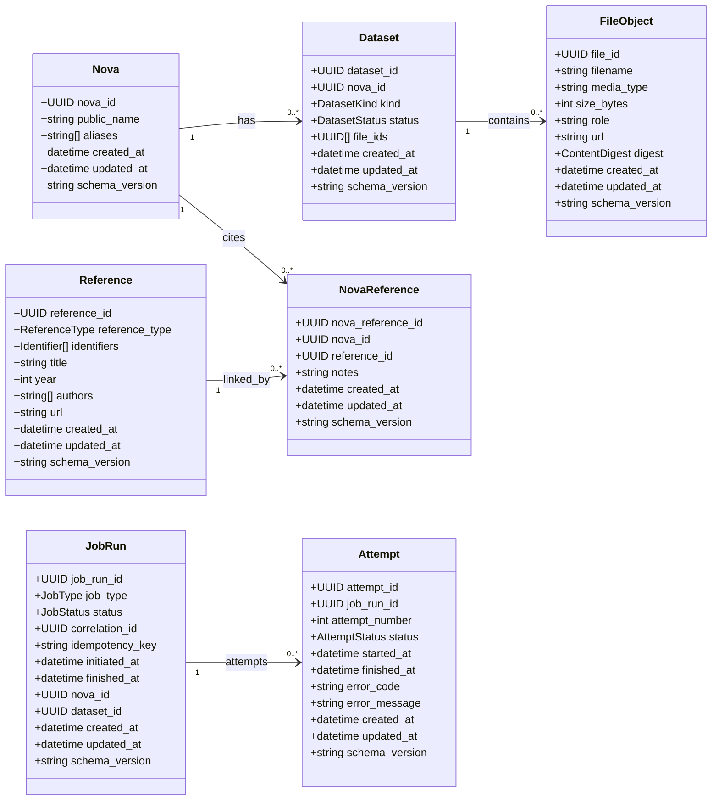

```mermaid
classDiagram
  direction LR

  class Nova {
    +UUID nova_id
    +string public_name
    +string[] aliases
    +datetime created_at
    +datetime updated_at
    +string schema_version
  }

  class Dataset {
    +UUID dataset_id
    +UUID nova_id
    +DatasetKind kind
    +DatasetStatus status
    +UUID[] file_ids
    +datetime created_at
    +datetime updated_at
    +string schema_version
  }

  class FileObject {
    +UUID file_id
    +string filename
    +string media_type
    +int size_bytes
    +string role
    +string url
    +ContentDigest digest
    +datetime created_at
    +datetime updated_at
    +string schema_version
  }

  class Reference {
    +UUID reference_id
    +ReferenceType reference_type
    +Identifier[] identifiers
    +string title
    +int year
    +string[] authors
    +string url
    +datetime created_at
    +datetime updated_at
    +string schema_version
  }

  class NovaReference {
    +UUID nova_reference_id
    +UUID nova_id
    +UUID reference_id
    +string notes
    +datetime created_at
    +datetime updated_at
    +string schema_version
  }

  class JobRun {
    +UUID job_run_id
    +JobType job_type
    +JobStatus status
    +UUID correlation_id
    +string idempotency_key
    +datetime initiated_at
    +datetime finished_at
    +UUID nova_id
    +UUID dataset_id
    +datetime created_at
    +datetime updated_at
    +string schema_version
  }

  class Attempt {
    +UUID attempt_id
    +UUID job_run_id
    +int attempt_number
    +AttemptStatus status
    +datetime started_at
    +datetime finished_at
    +string error_code
    +string error_message
    +datetime created_at
    +datetime updated_at
    +string schema_version
  }

  %% Relationships / cardinalities
  Nova "1" --> "0..*" Dataset : has
  Dataset "1" --> "0..*" FileObject : contains
  Nova "1" --> "0..*" NovaReference : cites
  Reference "1" --> "0..*" NovaReference : linked_by
  JobRun "1" --> "0..*" Attempt : attempts
```
