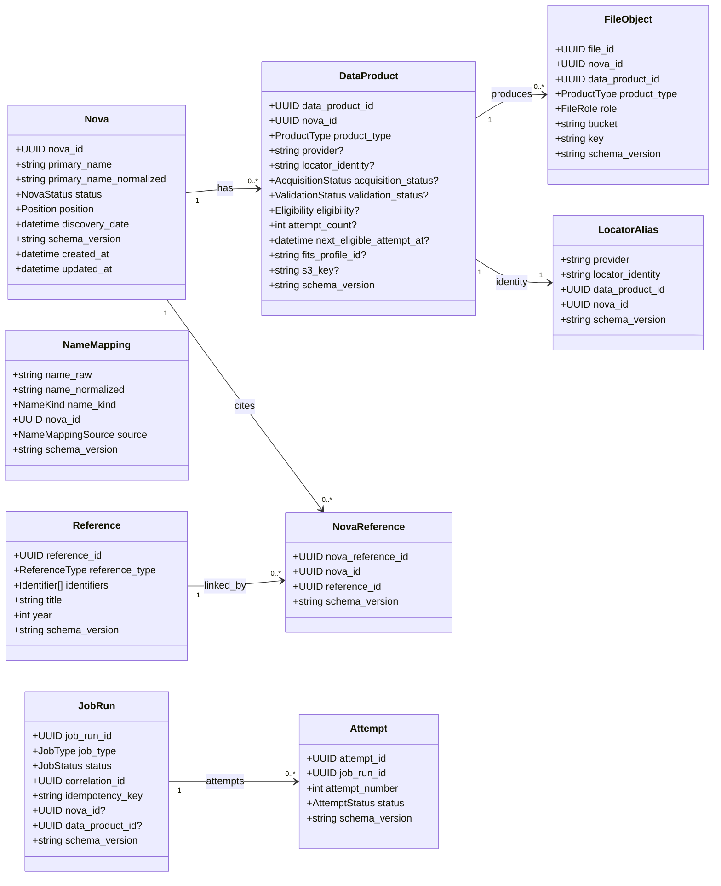

```mermaid
classDiagram
  direction LR

  %% ============================
  %% Core Domain
  %% ============================

  class Nova {
    +UUID nova_id
    +string primary_name
    +string primary_name_normalized
    +NovaStatus status
    +Position position
    +datetime discovery_date
    +string schema_version
    +datetime created_at
    +datetime updated_at
  }

  class NameMapping {
    +string name_raw
    +string name_normalized
    +NameKind name_kind
    +UUID nova_id
    +NameMappingSource source
    +string schema_version
  }

  %% ============================
  %% Data Products
  %% ============================

  class DataProduct {
    +UUID data_product_id
    +UUID nova_id
    +ProductType product_type
    +string provider?
    +string locator_identity?
    +AcquisitionStatus acquisition_status?
    +ValidationStatus validation_status?
    +Eligibility eligibility?
    +int attempt_count?
    +datetime next_eligible_attempt_at?
    +string fits_profile_id?
    +string s3_key?
    +string schema_version
  }

  class LocatorAlias {
    +string provider
    +string locator_identity
    +UUID data_product_id
    +UUID nova_id
    +string schema_version
  }

  class FileObject {
    +UUID file_id
    +UUID nova_id
    +UUID data_product_id
    +ProductType product_type
    +FileRole role
    +string bucket
    +string key
    +string schema_version
  }

  %% ============================
  %% References
  %% ============================

  class Reference {
    +UUID reference_id
    +ReferenceType reference_type
    +Identifier[] identifiers
    +string title
    +int year
    +string schema_version
  }

  class NovaReference {
    +UUID nova_reference_id
    +UUID nova_id
    +UUID reference_id
    +string schema_version
  }

  %% ============================
  %% Operational
  %% ============================

  class JobRun {
    +UUID job_run_id
    +JobType job_type
    +JobStatus status
    +UUID correlation_id
    +string idempotency_key
    +UUID nova_id?
    +UUID data_product_id?
    +string schema_version
  }

  class Attempt {
    +UUID attempt_id
    +UUID job_run_id
    +int attempt_number
    +AttemptStatus status
    +string schema_version
  }

  %% ============================
  %% Relationships
  %% ============================

  Nova "1" --> "0..*" DataProduct : has
  Nova "1" --> "0..*" NovaReference : cites
  Reference "1" --> "0..*" NovaReference : linked_by
  DataProduct "1" --> "0..*" FileObject : produces
  DataProduct "1" --> "1" LocatorAlias : identity
  JobRun "1" --> "0..*" Attempt : attempts
```
