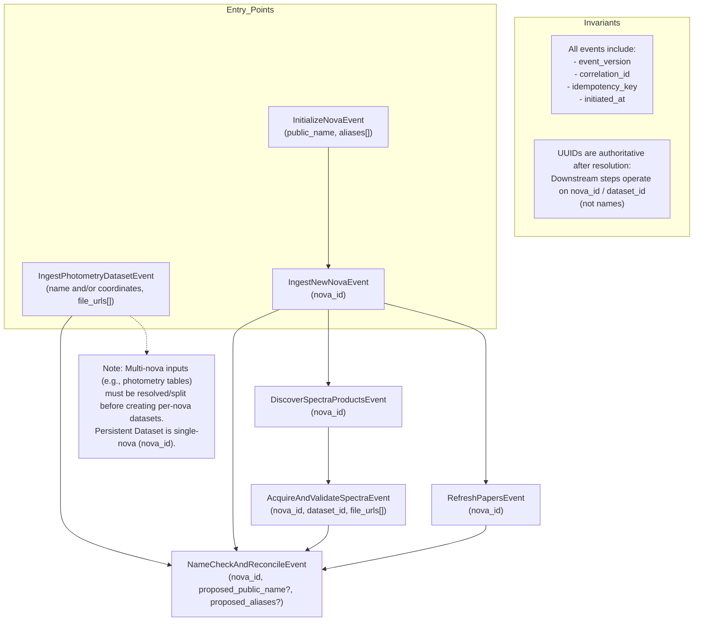

```mermaid
flowchart TD
  %% -----------------------------
  %% Contract invariants
  %% -----------------------------
  subgraph Invariants
    I1["All events include:
- event_version
- correlation_id
- idempotency_key
- initiated_at"]
    I2["UUIDs are authoritative after resolution:
Downstream steps operate on nova_id / dataset_id
(not names)"]
  end

  %% -----------------------------
  %% Entry points
  %% -----------------------------
  subgraph Entry_Points
    EN1["InitializeNovaEvent
(public_name, aliases[])"]
    EN2["IngestPhotometryDatasetEvent
(name and/or coordinates, file_urls[])"]
    EN3["IngestNewNovaEvent
(nova_id)"]
  end

  %% -----------------------------
  %% Resolution / governance
  %% -----------------------------
  NR["NameCheckAndReconcileEvent
(nova_id, proposed_public_name?, proposed_aliases?)"]

  %% -----------------------------
  %% Spectra discovery pipeline
  %% -----------------------------
  DSP["DiscoverSpectraProductsEvent
(nova_id)"]
  DVS["AcquireAndValidateSpectraEvent
(nova_id, dataset_id, file_urls[])"]

  %% -----------------------------
  %% Papers pipeline
  %% -----------------------------
  RP["RefreshPapersEvent
(nova_id)"]

  %% -----------------------------
  %% Main flows
  %% -----------------------------
  EN1 --> EN3
  EN3 --> NR

  EN3 --> DSP
  DSP --> DVS
  DVS --> NR

  EN3 --> RP
  RP --> NR

  EN2 --> NR

  %% -----------------------------
  %% Notes
  %% -----------------------------
  N1["Note: Multi-nova inputs (e.g., photometry tables)
must be resolved/split before creating per-nova datasets.
Persistent Dataset is single-nova (nova_id)."]

  EN2 -.-> N1
```
