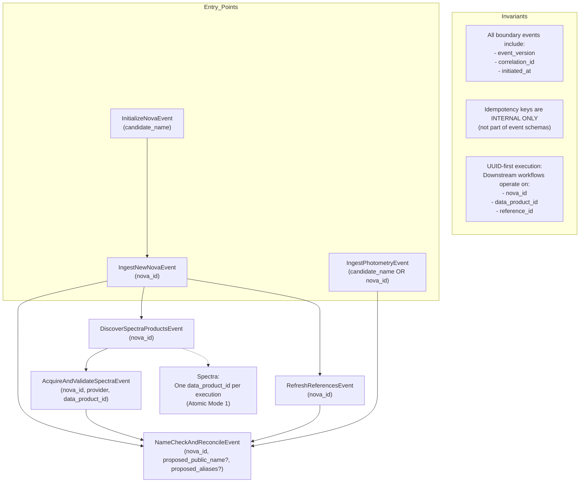

```mermaid
flowchart TD

  %% ==============================
  %% Contract Invariants
  %% ==============================

  subgraph Invariants
    I1["All boundary events include:
- event_version
- correlation_id
- initiated_at"]
    I2["Idempotency keys are INTERNAL ONLY
(not part of event schemas)"]
    I3["UUID-first execution:
Downstream workflows operate on:
- nova_id
- data_product_id
- reference_id"]
  end

  %% ==============================
  %% Entry Points
  %% ==============================

  subgraph Entry_Points
    EN1["InitializeNovaEvent
(candidate_name)"]

    EN2["IngestPhotometryEvent
(candidate_name OR nova_id)"]

    EN3["IngestNewNovaEvent
(nova_id)"]
  end

  %% ==============================
  %% Identity & Governance
  %% ==============================

  NR["NameCheckAndReconcileEvent
(nova_id, proposed_public_name?, proposed_aliases?)"]

  %% ==============================
  %% Spectra Pipeline
  %% ==============================

  DSP["DiscoverSpectraProductsEvent
(nova_id)"]

  DVS["AcquireAndValidateSpectraEvent
(nova_id, provider, data_product_id)"]

  %% ==============================
  %% Reference Pipeline
  %% ==============================

  RR["RefreshReferencesEvent
(nova_id)"]

  %% ==============================
  %% Main Flows
  %% ==============================

  EN1 --> EN3
  EN3 --> NR

  EN3 --> DSP
  DSP --> DVS
  DVS --> NR

  EN3 --> RR
  RR --> NR

  EN2 --> NR

  %% ==============================
  %% Notes
  %% ==============================

  N1["Spectra:
One data_product_id per execution
(Atomic Mode 1)"]

  DSP -.-> N1
```
