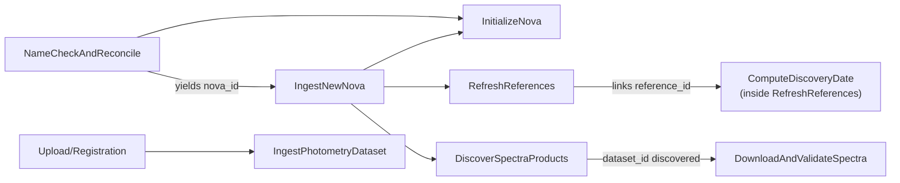

```mermaid
flowchart LR
  NC[NameCheckAndReconcile] --> IN[InitializeNova]
  NC -->|yields nova_id| NEW[IngestNewNova]

  NEW --> IN
  NEW --> RR[RefreshReferences]
  NEW --> DSP[DiscoverSpectraProducts]

  RR -->|links reference_id| RR2["ComputeDiscoveryDate</br>(inside RefreshReferences)"]
  DSP -->|dataset_id discovered| DVS[DownloadAndValidateSpectra]

  UP[Upload/Registration] --> IPD[IngestPhotometryDataset]

```
