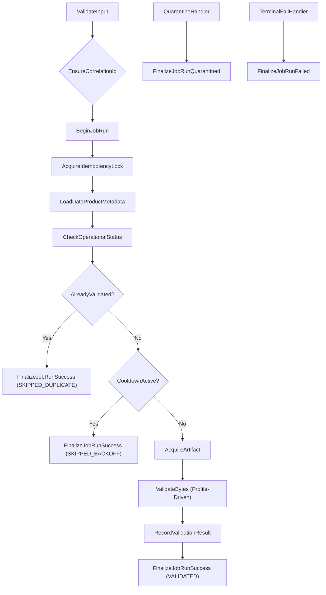

```mermaid
flowchart TD
  A[ValidateInput] --> B{EnsureCorrelationId}
  B --> C[BeginJobRun]
  C --> D[AcquireIdempotencyLock]
  D --> E[LoadDataProductMetadata]
  E --> F[CheckOperationalStatus]

  F --> G{AlreadyValidated?}
  G -- Yes --> H["FinalizeJobRunSuccess (SKIPPED_DUPLICATE)"]

  G -- No --> I{CooldownActive?}
  I -- Yes --> J["FinalizeJobRunSuccess (SKIPPED_BACKOFF)"]

  I -- No --> K[AcquireArtifact]
  K --> L["ValidateBytes (Profile-Driven)"]
  L --> M[RecordValidationResult]
  M --> N["FinalizeJobRunSuccess (VALIDATED)"]

  Q[QuarantineHandler] --> R[FinalizeJobRunQuarantined]
  TF[TerminalFailHandler] --> FF[FinalizeJobRunFailed]

```
