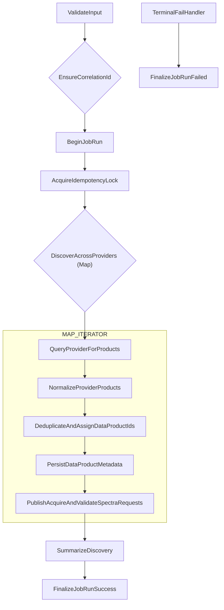

```mermaid
flowchart TD
  A[ValidateInput] --> B{EnsureCorrelationId}
  B --> C[BeginJobRun]
  C --> D[AcquireIdempotencyLock]
  D --> E{"DiscoverAcrossProviders (Map)"}

  subgraph MAP_ITERATOR
    F[QueryProviderForProducts]
    G[NormalizeProviderProducts]
    H[DeduplicateAndAssignDataProductIds]
    I[PersistDataProductMetadata]
    J[PublishAcquireAndValidateSpectraRequests]

    F --> G --> H --> I --> J
  end

  E --> F
  J --> K[SummarizeDiscovery]
  K --> L[FinalizeJobRunSuccess]

  TF[TerminalFailHandler] --> FF[FinalizeJobRunFailed]
```
