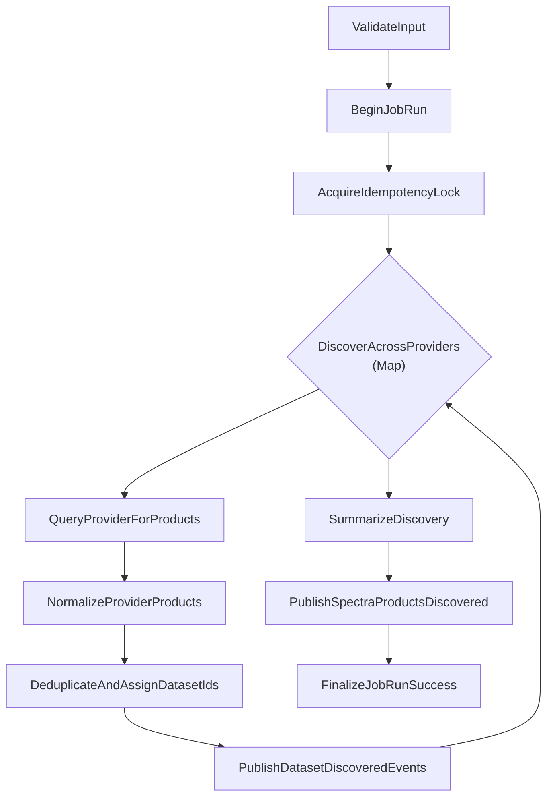

```mermaid
flowchart TD
  A[ValidateInput] --> B[BeginJobRun] --> C[AcquireIdempotencyLock]
  C --> M{"DiscoverAcrossProviders</br> (Map)"}
  M --> Q[QueryProviderForProducts]
  Q --> N[NormalizeProviderProducts]
  N --> D[DeduplicateAndAssignDatasetIds]
  D --> E[PublishDatasetDiscoveredEvents]
  E --> M
  M --> S[SummarizeDiscovery]
  S --> P[PublishSpectraProductsDiscovered]
  P --> F[FinalizeJobRunSuccess]

```
