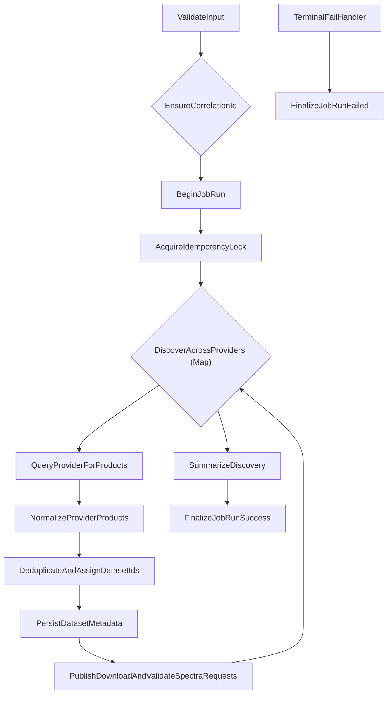

```mermaid
flowchart TD
  A[ValidateInput] --> B{EnsureCorrelationId}
  B --> C[BeginJobRun]
  C --> D[AcquireIdempotencyLock]
  D --> E{"DiscoverAcrossProviders (Map)"}

  E --> F[QueryProviderForProducts]
  F --> G[NormalizeProviderProducts]
  G --> H[DeduplicateAndAssignDatasetIds]
  H --> I[PersistDatasetMetadata]
  I --> J[PublishDownloadAndValidateSpectraRequests]
  J --> E

  E --> K[SummarizeDiscovery]
  K --> L[FinalizeJobRunSuccess]

  TF[TerminalFailHandler] --> FF[FinalizeJobRunFailed]

```
