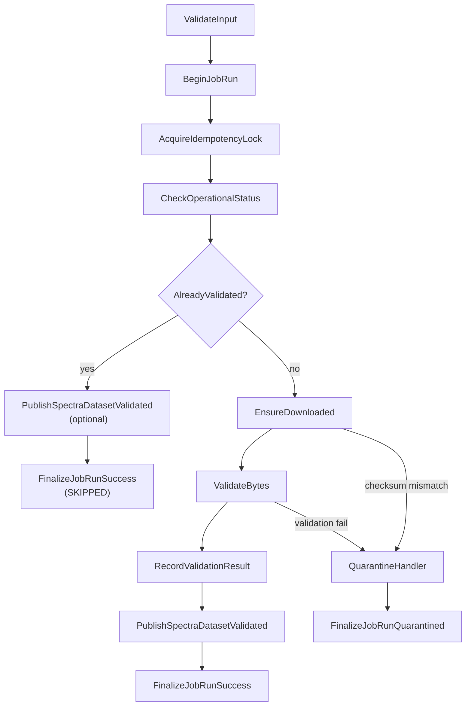

```mermaid
flowchart TD
  A[ValidateInput] --> B[BeginJobRun] --> C[AcquireIdempotencyLock]
  C --> D[CheckOperationalStatus]
  D --> E{AlreadyValidated?}

  E -- yes --> P["PublishSpectraDatasetValidated</br> (optional)"] --> S["FinalizeJobRunSuccess</br> (SKIPPED)"]
  E -- no --> DL[EnsureDownloaded] --> V[ValidateBytes] --> R[RecordValidationResult]
  R --> P2[PublishSpectraDatasetValidated] --> S2[FinalizeJobRunSuccess]

  DL -->|checksum mismatch| Q[QuarantineHandler] --> SQ[FinalizeJobRunQuarantined]
  V -->|validation fail| Q

```
