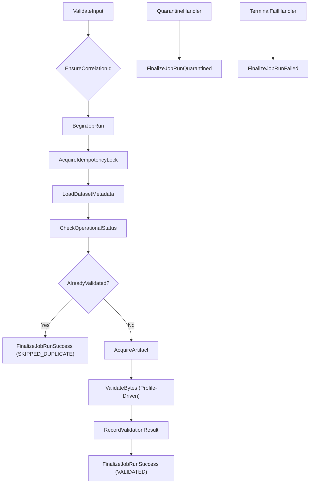

```mermaid
flowchart TD
  A[ValidateInput] --> B{EnsureCorrelationId}
  B --> C[BeginJobRun]
  C --> D[AcquireIdempotencyLock]
  D --> E[LoadDatasetMetadata]
  E --> F[CheckOperationalStatus]
  F --> G{AlreadyValidated?}

  G -- Yes --> H["FinalizeJobRunSuccess (SKIPPED_DUPLICATE)"]

  G -- No --> I[AcquireArtifact]
  I --> J["ValidateBytes (Profile-Driven)"]
  J --> K[RecordValidationResult]
  K --> L["FinalizeJobRunSuccess (VALIDATED)"]

  Q[QuarantineHandler] --> R[FinalizeJobRunQuarantined]
  TF[TerminalFailHandler] --> FF[FinalizeJobRunFailed]

```
