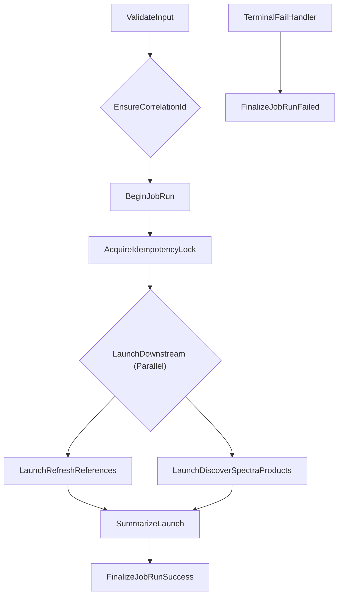

```mermaid
flowchart TD
  A[ValidateInput] --> B{EnsureCorrelationId}
  B --> C[BeginJobRun]
  C --> D[AcquireIdempotencyLock]
  D --> E{"LaunchDownstream (Parallel)"}

  E --> F[LaunchRefreshReferences]
  E --> G[LaunchDiscoverSpectraProducts]
  F --> H[SummarizeLaunch]
  G --> H
  H --> I[FinalizeJobRunSuccess]

  T[TerminalFailHandler] --> U[FinalizeJobRunFailed]

```
