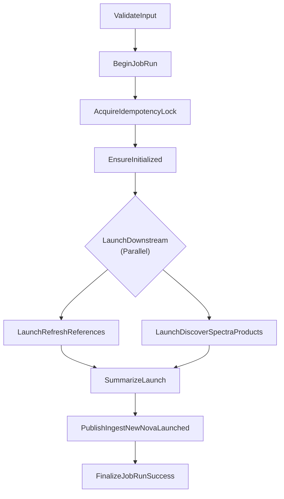

```mermaid
flowchart TD
  A[ValidateInput] --> B[BeginJobRun] --> C[AcquireIdempotencyLock]
  C --> D[EnsureInitialized]
  D --> P{"LaunchDownstream</br> (Parallel)"}
  P --> R[LaunchRefreshReferences]
  P --> S[LaunchDiscoverSpectraProducts]
  R --> M[SummarizeLaunch] --> E[PublishIngestNewNovaLaunched] --> F[FinalizeJobRunSuccess]
  S --> M

```
