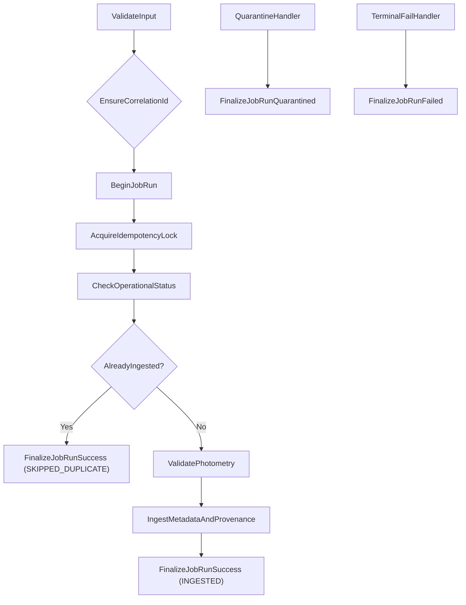

```mermaid
flowchart TD
  A[ValidateInput] --> B{EnsureCorrelationId}
  B --> C[BeginJobRun]
  C --> D[AcquireIdempotencyLock]
  D --> E[CheckOperationalStatus]
  E --> F{AlreadyIngested?}

  F -- Yes --> G["FinalizeJobRunSuccess (SKIPPED_DUPLICATE)"]
  F -- No --> H[ValidatePhotometry]
  H --> I[IngestMetadataAndProvenance]
  I --> J["FinalizeJobRunSuccess (INGESTED)"]

  Q[QuarantineHandler] --> R[FinalizeJobRunQuarantined]
  TF[TerminalFailHandler] --> FF[FinalizeJobRunFailed]

```
