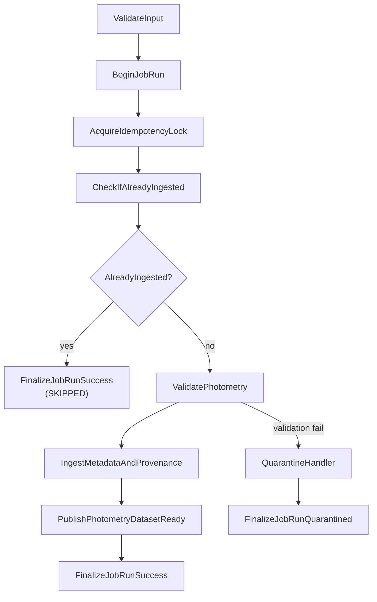

```mermaid
flowchart TD
  A[ValidateInput] --> B[BeginJobRun] --> C[AcquireIdempotencyLock]
  C --> D[CheckIfAlreadyIngested]
  D --> E{AlreadyIngested?}
  E -- yes --> S["FinalizeJobRunSuccess</br>(SKIPPED)"]
  E -- no --> V[ValidatePhotometry] --> I[IngestMetadataAndProvenance]
  I --> P[PublishPhotometryDatasetReady] --> F[FinalizeJobRunSuccess]
  V -->|validation fail| Q[QuarantineHandler] --> QF[FinalizeJobRunQuarantined]

```
