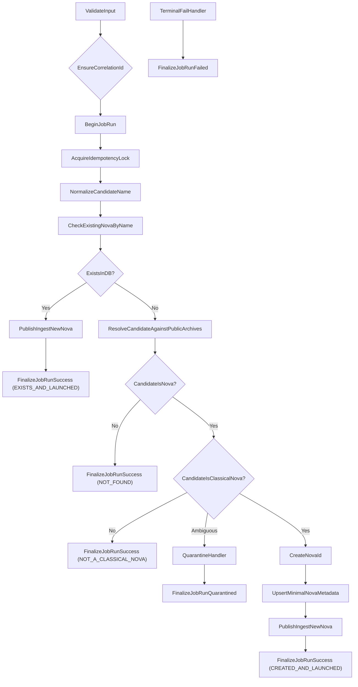

```mermaid
flowchart TD
  A[ValidateInput] --> B{EnsureCorrelationId}
  B --> C[BeginJobRun]
  C --> D[AcquireIdempotencyLock]
  D --> E[NormalizeCandidateName]
  E --> F[CheckExistingNovaByName]
  F --> G{ExistsInDB?}

  G -- Yes --> H[PublishIngestNewNova]
  H --> I["FinalizeJobRunSuccess (EXISTS_AND_LAUNCHED)"]

  G -- No --> J[ResolveCandidateAgainstPublicArchives]
  J --> K{CandidateIsNova?}

  K -- No --> L["FinalizeJobRunSuccess (NOT_FOUND)"]

  K -- Yes --> M{CandidateIsClassicalNova?}
  M -- No --> N["FinalizeJobRunSuccess (NOT_A_CLASSICAL_NOVA)"]

  M -- Ambiguous --> Q[QuarantineHandler]
  Q --> R[FinalizeJobRunQuarantined]

  M -- Yes --> O[CreateNovaId]
  O --> P[UpsertMinimalNovaMetadata]
  P --> H2[PublishIngestNewNova]
  H2 --> S["FinalizeJobRunSuccess (CREATED_AND_LAUNCHED)"]

  %% Terminal failure path (workflow-level)
  T[TerminalFailHandler] --> U[FinalizeJobRunFailed]
```
