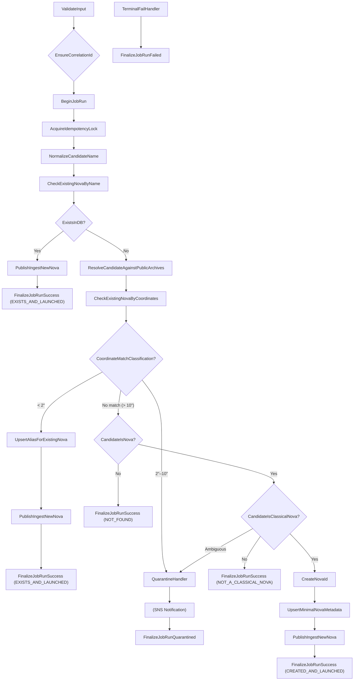

```mermaid
    flowchart TD
    A[ValidateInput] --> B{EnsureCorrelationId}
    B --> C[BeginJobRun]
    C --> D[AcquireIdempotencyLock]
    D --> E[NormalizeCandidateName]
    E --> F[CheckExistingNovaByName]
    F --> G{ExistsInDB?}

    G -- Yes --> H[PublishIngestNewNova]
    H --> I["FinalizeJobRunSuccess (EXISTS_AND_LAUNCHED)"]

    G -- No --> J[ResolveCandidateAgainstPublicArchives]

    J --> CC[CheckExistingNovaByCoordinates]
    CC --> CM{CoordinateMatchClassification?}

    CM -- "< 2&quot;" --> UA[UpsertAliasForExistingNova]
    UA --> H2[PublishIngestNewNova]
    H2 --> I2["FinalizeJobRunSuccess (EXISTS_AND_LAUNCHED)"]

    CM -- "2&quot;–10&quot;" --> Q[QuarantineHandler]
    Q --> SS["(SNS Notification)"]
    SS --> R[FinalizeJobRunQuarantined]

    CM -- "No match (&gt; 10&quot;)" --> K{CandidateIsNova?}
    K -- No --> L["FinalizeJobRunSuccess (NOT_FOUND)"]

    K -- Yes --> M{CandidateIsClassicalNova?}
    M -- No --> N["FinalizeJobRunSuccess (NOT_A_CLASSICAL_NOVA)"]

    M -- Ambiguous --> Q
    M -- Yes --> O[CreateNovaId]
    O --> P[UpsertMinimalNovaMetadata]
    P --> H3[PublishIngestNewNova]
    H3 --> S["FinalizeJobRunSuccess (CREATED_AND_LAUNCHED)"]

    TF[TerminalFailHandler] --> FF[FinalizeJobRunFailed]
```
