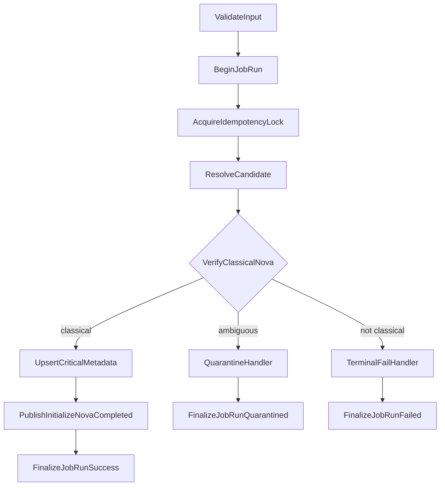

```mermaid
flowchart TD
  A[ValidateInput] --> B[BeginJobRun]
  B --> C[AcquireIdempotencyLock]
  C --> D[ResolveCandidate]
  D --> E{VerifyClassicalNova}
  E -- classical --> F[UpsertCriticalMetadata]
  F --> G[PublishInitializeNovaCompleted]
  G --> H[FinalizeJobRunSuccess]

  E -- ambiguous --> Q[QuarantineHandler]
  Q --> HQ[FinalizeJobRunQuarantined]

  E -- not classical --> T[TerminalFailHandler]
  T --> HT[FinalizeJobRunFailed]
```
