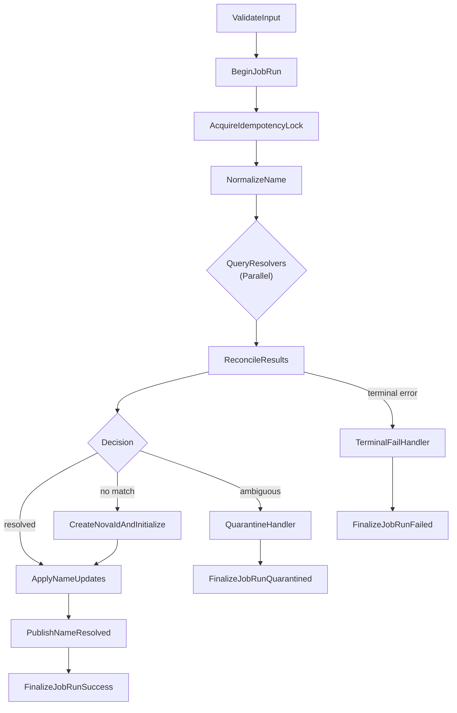

```mermaid
flowchart TD
    A[ValidateInput] --> B[BeginJobRun]
    B --> C[AcquireIdempotencyLock]
    C --> D[NormalizeName]
    D --> P{"QueryResolvers</br> (Parallel)"}
    P --> R[ReconcileResults]
    R --> X{Decision}

    X -- resolved --> U[ApplyNameUpdates] --> E[PublishNameResolved] --> S[FinalizeJobRunSuccess]
    X -- no match --> N[CreateNovaIdAndInitialize] --> U
    X -- ambiguous --> Q[QuarantineHandler] --> SQ[FinalizeJobRunQuarantined]

    R -->|terminal error| T[TerminalFailHandler] --> ST[FinalizeJobRunFailed]
```
