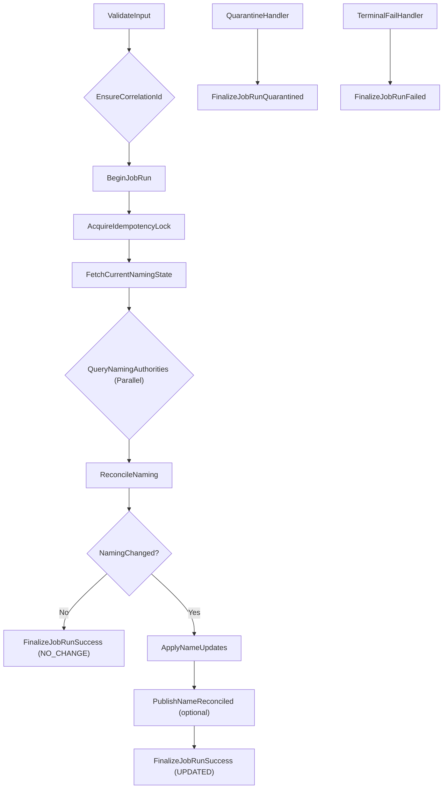

```mermaid
flowchart TD
  A[ValidateInput] --> B{EnsureCorrelationId}
  B --> C[BeginJobRun]
  C --> D[AcquireIdempotencyLock]
  D --> E[FetchCurrentNamingState]
  E --> F{"QueryNamingAuthorities (Parallel)"}
  F --> G[ReconcileNaming]
  G --> H{NamingChanged?}

  H -- No --> I["FinalizeJobRunSuccess (NO_CHANGE)"]
  H -- Yes --> J[ApplyNameUpdates]
  J --> K["PublishNameReconciled (optional)"]
  K --> L["FinalizeJobRunSuccess (UPDATED)"]

  Q[QuarantineHandler] --> R[FinalizeJobRunQuarantined]
  T[TerminalFailHandler] --> U[FinalizeJobRunFailed]
```
