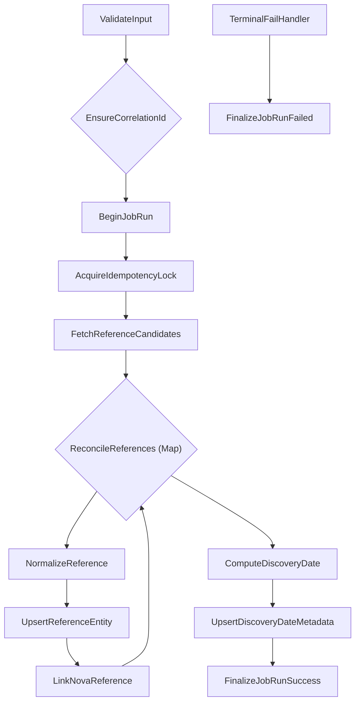

```mermaid
flowchart TD
  A[ValidateInput] --> B{EnsureCorrelationId}
  B --> C[BeginJobRun]
  C --> D[AcquireIdempotencyLock]
  D --> E[FetchReferenceCandidates]
  E --> M{"ReconcileReferences (Map)"}

  M --> N[NormalizeReference]
  N --> O[UpsertReferenceEntity]
  O --> P[LinkNovaReference]
  P --> M

  M --> R[ComputeDiscoveryDate]
  R --> S[UpsertDiscoveryDateMetadata]
  S --> T[FinalizeJobRunSuccess]

  TF[TerminalFailHandler] --> FF[FinalizeJobRunFailed]

```
