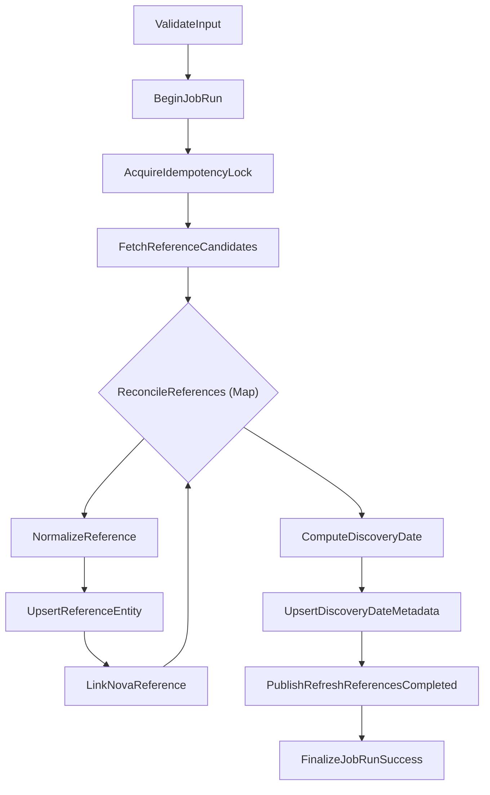

```mermaid
flowchart TD
  A[ValidateInput] --> B[BeginJobRun] --> C[AcquireIdempotencyLock]
  C --> D[FetchReferenceCandidates]
  D --> M{"ReconcileReferences (Map)"}
  M --> N[NormalizeReference]
  N --> U[UpsertReferenceEntity]
  U --> L[LinkNovaReference]
  L --> M
  M --> DD[ComputeDiscoveryDate]
  DD --> UD[UpsertDiscoveryDateMetadata]
  UD --> P[PublishRefreshReferencesCompleted]
  P --> S[FinalizeJobRunSuccess]

```
