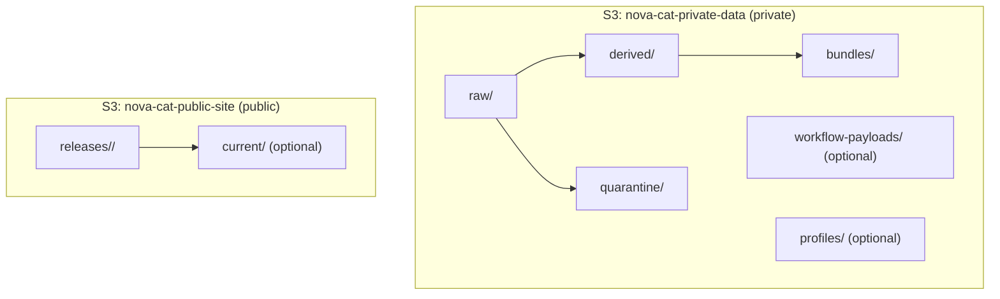

# S3 Layout (Epic 3 — V2)

This document defines Nova Cat's S3 bucket strategy and object prefixes.

Goals:

- Separate **private scientific data** from **public site assets**
- Keep raw bytes immutable
- Track derived artifacts and quarantine context
- Enable deterministic rebuilds of per-nova bundles
- Align object keys with `nova_id` and `data_product_id`
- Reflect atomic spectra product model (no dataset abstraction)

---

# Buckets

## 1. Private Data Bucket (default)

Bucket (illustrative): `nova-cat-private-data`

Contains:

- Raw downloaded bytes (FITS, archives, expanded members)
- Photometry ingest uploads
- Quarantine objects (bytes + context snapshot)
- Derived artifacts (normalized representations, plots)
- Per-nova bundle artifacts
- Optional workflow payload snapshots

This bucket is private and never directly exposed.

---

## 2. Public Site Bucket

Bucket (illustrative): `nova-cat-public-site`

Contains:

- Static site releases (immutable)
- Public derived assets that are curated and approved

---

# Private Bucket Prefix Conventions

All keys are deterministic and UUID-first.

---

## 1. Raw Spectra (Atomic Products)

Each spectra product is identified by `data_product_id`.

```
raw/spectra/<nova_id>/<data_product_id>/primary.fits
raw/spectra/<nova_id>/<data_product_id>/source.json
```

If acquired as archive:

```
raw/spectra/<nova_id>/<data_product_id>/archive.zip
raw/spectra/<nova_id>/<data_product_id>/unzipped/<relative_path>
```

Rules:

- Raw bytes are immutable.
- Re-acquisition overwrites only if validation has not succeeded.
- `source.json` contains small provenance snapshot (provider, locator, timestamp).

---

## 2. Spectra Quarantine

Quarantine stores bytes + validation context together.

```
quarantine/spectra/<nova_id>/<data_product_id>/<timestamp>/primary.fits
quarantine/spectra/<nova_id>/<data_product_id>/<timestamp>/context.json
```

`context.json` should include:

- validation_status
- quarantine_reason_code
- header_signature_hash (if available)
- fits_profile_id (if selected)
- locator_identity
- log references (CloudWatch pointers)

Multiple quarantine attempts may exist for the same product.

---

## 3. Derived Spectra Artifacts

Internal canonical/normalized outputs.

```
derived/spectra/<nova_id>/<data_product_id>/normalized/spectrum.parquet
derived/spectra/<nova_id>/<data_product_id>/normalized/metadata.json
derived/spectra/<nova_id>/<data_product_id>/plots/preview.png
```

Rules:

- Derived artifacts are reproducible from raw bytes.
- Metadata documents unit conversions and normalization decisions.

---

## 4. Photometry Ingestion

Photometry differs from spectra:

- There is exactly **one** `PHOTOMETRY_TABLE` data product per nova.
- Individual ingest files are transient inputs.

### 4A. Photometry Uploads (API-driven)

```
raw/photometry/uploads/<ingest_file_id>/original/<filename>
```

If the uploaded file contains multiple novae:

```
raw/photometry/uploads/<ingest_file_id>/split/<nova_id>/<filename>
```

Optional manifest:

```
raw/photometry/uploads/<ingest_file_id>/manifest.json
```

---

## 4B. Canonical Photometry Table (Per Nova)

Stable location for the current photometry table:


```
derived/photometry/<nova_id>/photometry_table.parquet
derived/photometry/<nova_id>/metadata.json
derived/photometry/<nova_id>/plots/lightcurve.png
```


Rules:

- Exactly one canonical photometry table exists per nova.
- Routine ingestion rebuilds and overwrites the canonical table.
- The canonical table represents the current schema version.
- No snapshot is created during routine ingestion.

---

## 4C. Photometry Schema-Change Snapshots (Forward-Compatible)

Snapshots are created **only when the photometry schema version changes**.

When a schema migration occurs:

1. The previous canonical table is copied to an immutable snapshot location.
2. A new canonical table is written at the standard canonical key.

Recommended snapshot layout:

```
derived/photometry/<nova_id>/snapshots/schema=<old_schema_version>/photometry_table.parquet
derived/photometry/<nova_id>/snapshots/schema=<old_schema_version>/metadata.json
```

Optional timestamp disambiguation:

```
derived/photometry/<nova_id>/snapshots/schema=<old_schema_version>/at=<timestamp>/photometry_table.parquet
```


Important:

- Snapshots represent schema boundaries, not ingestion history.
- S3 bucket versioning is optional and not relied upon for application semantics.
- MVP may defer implementation of schema migrations while documenting the structure.

---


## 5. Per-Nova Bundle Artifacts

Bundles are rebuilt only when new data arrives.

```
bundles/<nova_id>/full.zip
bundles/<nova_id>/manifest.json
```

`manifest.json` should include:

- bundle_build_id
- created_at
- included `data_product_id`s (spectra)
- photometry table key
- checksums of included files

---

## 6. Optional Workflow Payload Snapshots

Only used if boundary payloads exceed safe Step Functions size.

```
workflow-payloads/<workflow_name>/<job_run_id>/input.json
workflow-payloads/<workflow_name>/<job_run_id>/output.json
```

---

# FITS Profile Assets

Profiles remain **code artifacts by default**:

- `docs/specs/spectra-fits-profiles.md`
- Provider adapter + validation logic in code

If runtime-managed profile definitions are later required:

```
profiles/fits/<profile_id>/<version>/profile.yaml
profiles/fits/<profile_id>/<version>/tests/<sample>.fits
```

Default: keep profiles in repo for deterministic deployments.

---

# Public Site Bucket Layout

## Release-Based Publishing (Immutable)

```
releases/<release_id>/index.html
releases/<release_id>/assets/...
releases/<release_id>/nova/<nova_id>/...
```

Optional "current" pointer:

```
current/...
```

This may be implemented via redirect or object copy.

---

# Examples

Spectra raw FITS:

```
raw/spectra/4e9b0e88-.../2c7d1f4d-.../primary.fits
```

Spectra quarantine context:

```
quarantine/spectra/4e9b0e88-.../2c7d1f4d-.../2026-02-21T20:45:10Z/context.json
```

Photometry table:

```
derived/photometry/4e9b0e88-.../photometry_table.parquet
```

Bundle:

```
bundles/4e9b0e88-.../full.zip
bundles/4e9b0e88-.../manifest.json
```

---

# Mermaid Diagram

## Bucket Overview



---

# Key Design Principles

- Spectra are atomic (`data_product_id`-scoped).
- Photometry is singleton-per-nova.
- Raw bytes are immutable.
- Quarantine preserves full diagnostic context.
- Derived artifacts are reproducible.
- Bundles are deterministic.
- UUID-first layout ensures stable rebuild logic.
